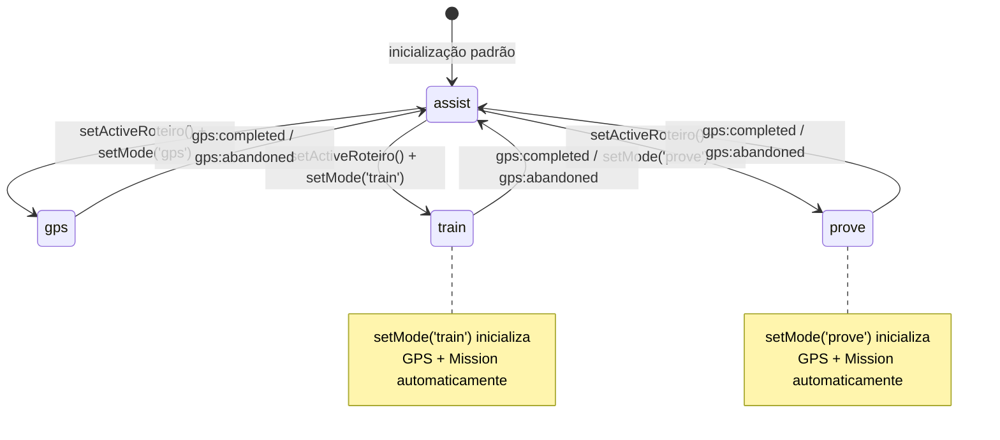

# Design Document — Aura DAP Hardening

## Visão Geral

Este documento define as mudanças técnicas necessárias para endurecer a arquitetura modular da Aura DAP. A modularização da spec `aura-dap-restructure` foi bem-sucedida — os 8 módulos existem, o `content.js` é orquestrador puro e o `background.js` está consolidado. O que falta é governança completa, robustez operacional e preparação para evolução.

As mudanças são cirúrgicas: nenhum módulo é reescrito do zero. Cada alteração é um patch no módulo responsável, preservando a arquitetura existente.

---

## Arquitetura

### Máquina de Estado Completa (após este spec)



### Fluxo de Configuração (AURA_CONFIG)

```
manifest.json
  └── background.scripts: ["aura_config.js", "background.js"]
        └── aura_config.js define window.AURA_CONFIG = { authToken, endpoints }
              └── background.js lê AURA_CONFIG na inicialização
                    └── AURA_ENDPOINTS = Object.freeze({ ... })
```

### Catálogo de Eventos de Analytics (estado final)

| Evento | Emissor | Campos obrigatórios |
|--------|---------|---------------------|
| `assist_prompt_sent` | AuraAssistEngine | `prompt_length`, `tenant_id`, `timestamp` |
| `assist_response_received` | AuraAssistEngine | `has_gps`, `has_spotlight`, `tenant_id`, `timestamp` |
| `gps_start` | AuraGpsEngine | `roteiro_id`, `timestamp`, `mode`, `tenant_id` |
| `gps_step_started` | AuraGpsEngine | `step_id`, `step_index`, `roteiro_id`, `tenant_id`, `timestamp` |
| `step_complete` | AuraGpsEngine | `step_id`, `step_index`, `validation_type`, `duration_sec` |
| `step_error` | AuraGpsEngine | `step_id`, `step_index`, `validation_type` |
| `session_abandoned` | AuraGpsEngine | `step_index_at_abandon`, `steps_total` |
| `mission_start` | AuraMissionEngine | `roteiro_id`, `mode`, `base_xp`, `steps_total`, `timestamp` |
| `hint_requested` | AuraMissionEngine | `step_id`, `step_index`, `hints_total_session` |
| `mission_complete` | AuraMissionEngine | `roteiro_id`, `mode`, `score_final`, `xp_final`, `hints_used`, `errors_count`, `duration_sec` |

**Removido:** `AuraMissionEngine` não emite mais `step_error` (duplicação eliminada).

---

## Componentes e Interfaces

### 1. AuraState — Maestro Completo

**Problema atual:** `setMode('train')` chama apenas o módulo registrado para `train` (que é o `AuraGpsEngine`). O `AuraMissionEngine` precisa ser chamado manualmente pelo orquestrador.

**Solução:** Introduzir `setActiveRoteiro()` e lógica de modo composto para `train`/`prove`.

```js
// Interface pública atualizada
window.AuraState = {
  // Existentes (sem mudança de assinatura)
  mode, session, getMode(), resetSession(), registerModule(),

  // Atualizado: aceita opções para modos compostos
  setMode(newMode, options),
  // options = { roteiro?, scoringConfig? }
  // Para train/prove: inicializa GPS + Mission automaticamente

  // Novo: armazena roteiro e scoring na sessão antes de setMode
  setActiveRoteiro(roteiro, scoringConfig),

  // Novo: leitura segura do roteiro ativo
  getActiveRoteiro(),
  getActiveScoringConfig()
}
```

**Lógica de `setMode` para modos compostos:**

```js
function setMode(newMode, options) {
  // 1. Teardown do modo atual (existente)
  // 2. Atualiza _mode
  // 3. Para 'train' e 'prove': inicialização composta
  if (newMode === 'train' || newMode === 'prove') {
    var roteiro = (options && options.roteiro) || _activeRoteiro;
    var scoring = (options && options.scoringConfig) || _activeScoringConfig;
    // GPS primeiro (registra listeners de passo)
    if (global.AuraGpsEngine) global.AuraGpsEngine.init(roteiro);
    // Mission depois (escuta eventos do GPS)
    if (global.AuraMissionEngine) global.AuraMissionEngine.init(scoring);
    return; // não chama o registry genérico para esses modos
  }
  // 4. Para outros modos: comportamento existente via registry
  var newModule = _moduleRegistry[newMode];
  if (newModule) newModule.init();
}
```

**Teardown de `train`/`prove` ao voltar para `assist`:**

```js
// No teardown do modo anterior, para train/prove:
// AuraMissionEngine.teardown() → AuraGpsEngine.teardown()
// (ordem inversa da inicialização)
```

---

### 2. Step_Model — Campos Adicionados

**Arquivo:** `contracts/step_model.json`

Campos novos (todos opcionais):

```json
{
  "scenario_id": {
    "type": "string",
    "description": "Reservado para uso futuro em fluxos de roleplay adaptativo. Identifica o cenário ao qual o passo pertence.",
    "optional": true
  },
  "branch_id": {
    "type": "string",
    "description": "Reservado para uso futuro em fluxos de roleplay adaptativo. Identifica o ramo de decisão.",
    "optional": true
  },
  "timeout_penalty_type": {
    "type": "string",
    "enum": ["none", "soft", "hard"],
    "default": "soft",
    "description": "Tipo de penalidade aplicada quando o timeout expira no modo prove. 'none': sem penalidade. 'soft': penalidade reduzida (timeout_penalty). 'hard': penalidade igual a error_penalty.",
    "optional": true
  }
}
```

**Propagação de `steps_total`:** No `AuraGpsEngine.init()`, após normalizar os passos:

```js
if (global.AuraState && global.AuraState.session) {
  global.AuraState.session.steps_total = _passos.length;
}
```

---

### 3. AuraGpsEngine — Patches de Endurecimento

**3.1 Proteção contra reentrada**

```js
function init(roteiro, options) {
  // NOVO: teardown explícito antes de qualquer inicialização
  if (_isActive) {
    console.warn('[AuraGpsEngine] init() chamado com sessão ativa — executando teardown preventivo.');
    teardown();
  }
  _isActive = true;
  // ... resto do init existente
}

function teardown() {
  _isActive = false;
  // ... resto do teardown existente
}

function isActive() { return _isActive; }
```

**3.2 Evento `gps:step_timeout` + reinício do validador**

```js
// Em _falharPasso() — renomeado para _timeoutPasso():
function _timeoutPasso(index) {
  var step = _passos[index];

  // Limpa validador atual
  if (typeof _cleanupValidator === 'function') {
    _cleanupValidator();
    _cleanupValidator = null;
  }

  // NOVO: emite step_timeout antes de step_failed
  _emitCustomEvent('gps:step_timeout', {
    step: step,
    stepIndex: index,
    timeout_sec: step ? step.timeout_sec : 30
  });

  // Analytics: step_error (timeout é um tipo de erro)
  _emitAnalytics('step_error', {
    step_id: step ? step.id : null,
    step_index: index,
    validation_type: step ? step.validation_type : null
  });

  _emitCustomEvent('gps:step_failed', { step: step, stepIndex: index });

  // NOVO: reinicia o validador para permitir nova tentativa
  _cleanupValidator = _registrarValidador(step, index);

  // NOVO: reinicia o timeout
  var timeoutMs = (step ? step.timeout_sec : 30) * 1000;
  _timeoutHandle = setTimeout(function () {
    _timeoutPasso(index);
  }, timeoutMs);
}
```

**3.3 Delay mínimo em `element_absent`**

```js
function _validadorElementAbsent(selector, onValidado) {
  var _validado = false;
  var _delayHandle = null;

  function _verificar() {
    if (_validado) return;
    if (selector && !document.querySelector(selector)) {
      // NOVO: delay mínimo de 500ms para evitar falso positivo
      if (_delayHandle) return;
      _delayHandle = setTimeout(function () {
        // Verifica novamente após o delay
        if (!document.querySelector(selector)) {
          _validado = true;
          obs.disconnect();
          onValidado();
        } else {
          _delayHandle = null; // elemento apareceu — continua observando
        }
      }, 500);
    }
  }

  var obs = new MutationObserver(_verificar);
  obs.observe(document.body, { childList: true, subtree: true });
  _verificar();

  return function () {
    obs.disconnect();
    if (_delayHandle) clearTimeout(_delayHandle);
  };
}
```

**3.4 Suporte a `onBranchDecision` e evento `gps:branch_point`**

```js
// init() aceita options:
function init(roteiro, options) {
  _options = options || {};
  // _options.onBranchDecision = function(step, nextIndex) { return newIndex; }
  // ...
}

// Em _avancarPasso(), após validação:
function _avancarPasso() {
  var step = _passos[_stepIndex];
  // ... analytics step_complete existente ...

  // NOVO: verifica branch_id
  if (step && step.branch_id) {
    _emitCustomEvent('gps:branch_point', {
      step: step,
      stepIndex: _stepIndex,
      branch_id: step.branch_id,
      scenario_id: step.scenario_id || null
    });
    // Dá um tick para listeners externos redirecionarem
    var proximoDefault = _stepIndex + 1;
    setTimeout(function () {
      var proximo = proximoDefault;
      if (typeof _options.onBranchDecision === 'function') {
        var redirect = _options.onBranchDecision(step, proximoDefault);
        if (typeof redirect === 'number') proximo = redirect;
      }
      if (proximo >= _passos.length) { _concluir(); }
      else { _iniciarPasso(proximo); }
    }, 0);
    return;
  }

  var proximo = _stepIndex + 1;
  if (proximo >= _passos.length) { _concluir(); }
  else { _iniciarPasso(proximo); }
}
```

---

### 4. AuraMissionEngine — Patches de Endurecimento

**4.1 Dots de progresso com `steps_total` real**

```js
function init(scoringConfig) {
  // ...
  // NOVO: lê steps_total do AuraState.session
  _stepsTotal = (global.AuraState && global.AuraState.session && global.AuraState.session.steps_total)
    ? global.AuraState.session.steps_total
    : 0;

  _criarHud(_stepsTotal); // passa total para o HUD
  // ...

  // NOVO: emite mission_start
  _emitAnalytics('mission_start', {
    roteiro_id:  (global.AuraState && global.AuraState.session && global.AuraState.session.roteiro_id) || null,
    mode:        mode,
    base_xp:     _scoringConfig.base_xp || 0,
    steps_total: _stepsTotal,
    timestamp:   new Date().toISOString()
  });
}
```

**4.2 Abandono coordenado via AuraState**

```js
// No botão "Abandonar" do HUD:
btnAbandonar.addEventListener('click', function () {
  // ANTES: chamava AuraGpsEngine.teardown() diretamente
  // DEPOIS: delega ao AuraState
  if (global.AuraState && typeof global.AuraState.setMode === 'function') {
    global.AuraState.setMode('assist');
  }
});
```

**4.3 Penalidades distintas para timeout vs erro**

```js
// Novo listener para gps:step_timeout
function _onStepTimeout(e) {
  if (!_active) return;
  var mode = global.AuraState ? global.AuraState.getMode() : 'train';

  if (mode === 'prove') {
    var penalidade = (_scoringConfig.timeout_penalty !== undefined)
      ? _scoringConfig.timeout_penalty
      : 10; // default menor que error_penalty (15)
    _xp = Math.max(0, _xp - penalidade);
    _atualizarHud(_stepsTotal);
  } else {
    // train: encorajamento sem penalidade
    if (global.AuraUI) {
      global.AuraUI.exibirBalao('Sem pressa! Você consegue. Tente novamente. 💪', []);
    }
  }
}

// _onStepFailed: remove emissão de step_error (GPS já emite)
function _onStepFailed(e) {
  if (!_active) return;
  var penalidade = (_scoringConfig.error_penalty !== undefined)
    ? _scoringConfig.error_penalty
    : 15;
  _xp = Math.max(0, _xp - penalidade);
  _errorsCount++;
  _atualizarHud(_stepsTotal);
  // REMOVIDO: _emitAnalytics('step_error', ...) — GPS já emite
}
```

**4.4 `getScore()` exposto**

```js
global.AuraMissionEngine = {
  init:     init,
  teardown: teardown,
  // NOVO:
  getScore: function () {
    return {
      xp:          _xp,
      hintsUsed:   _hintsUsed,
      errorsCount: _errorsCount,
      durationSec: _sessionStart ? Math.round((Date.now() - _sessionStart) / 1000) : 0
    };
  }
};
```

**4.5 `onOutcomeEvaluated` para extensibilidade**

```js
function init(scoringConfig) {
  _onOutcomeEvaluated = (scoringConfig && typeof scoringConfig.onOutcomeEvaluated === 'function')
    ? scoringConfig.onOutcomeEvaluated
    : null;
  // ...
}

function _onCompleted(e) {
  // ... cálculo de score existente ...
  if (typeof _onOutcomeEvaluated === 'function') {
    _onOutcomeEvaluated({ xp: scoreFinal, hintsUsed: _hintsUsed, errorsCount: _errorsCount }, mode);
  }
  // ... exibe resumo padrão se onOutcomeEvaluated não foi fornecido ...
}
```

---

### 5. AuraAssistEngine — Novos Eventos de Analytics

```js
// Em dispararAnalise():
_emitAnalytics('assist_prompt_sent', {
  prompt_length: prompt.length,
  tenant_id:     'senior_default', // lido de AuraState.session.tenant_id quando disponível
  timestamp:     new Date().toISOString()
});

// Em _handleMessage() ao processar AURA_RESPONSE:
_emitAnalytics('assist_response_received', {
  has_gps:      temGPS,
  has_spotlight: !!(payload.seletor_css || payload.elemento_id),
  tenant_id:    'senior_default',
  timestamp:    new Date().toISOString()
});
```

---

### 6. Background Script — Configuração Formal

**Novo arquivo:** `extension/aura_config.js` (carregado antes de `background.js`)

```js
// aura_config.js — Injetar antes de background.js via manifest.json
// Para desenvolvimento local: deixar como está.
// Para produção: substituir este arquivo ou injetar via build pipeline.
var AURA_CONFIG = {
  authToken: '', // Injetar via CI/CD ou build step
  endpoints: {
    analyze:   'http://localhost:8000/analyze',
    missions:  'http://localhost:8000/api/missoes',
    gps:       'http://localhost:8000/api/gps-roteiro',
    analytics: 'http://localhost:8000/api/analytics/evento'
  }
};
```

**`background.js` atualizado:**

```js
// Lê AURA_CONFIG (definido em aura_config.js, carregado antes)
var _cfg = (typeof AURA_CONFIG !== 'undefined') ? AURA_CONFIG : {};
var _cfgEndpoints = _cfg.endpoints || {};

const AURA_AUTH_TOKEN = _cfg.authToken || '';

const AURA_ENDPOINTS = Object.freeze({
  analyze:   _cfgEndpoints.analyze   || 'http://localhost:8000/analyze',
  missions:  _cfgEndpoints.missions  || 'http://localhost:8000/api/missoes',
  gps:       _cfgEndpoints.gps       || 'http://localhost:8000/api/gps-roteiro',
  analytics: _cfgEndpoints.analytics || 'http://localhost:8000/api/analytics/evento'
});

// Aviso se endpoint não é localhost nem https
Object.values(AURA_ENDPOINTS).forEach(function(url) {
  if (!url.startsWith('https://') && !url.startsWith('http://localhost')) {
    console.warn('[Aura BG] Endpoint com protocolo não seguro detectado:', url);
  }
});

// Diagnóstico (sem expor token)
function getConfig() {
  return { endpoints: Object.assign({}, AURA_ENDPOINTS) };
}

// Catálogo canônico de event_types aceitos
const ANALYTICS_EVENT_TYPES = new Set([
  'assist_prompt_sent', 'assist_response_received',
  'gps_start', 'gps_step_started', 'step_complete', 'step_error',
  'session_abandoned', 'mission_start', 'hint_requested', 'mission_complete'
]);

// No handler analytics_event:
if (request.action === 'analytics_event') {
  var eventType = request.payload && request.payload.event_type;
  if (!ANALYTICS_EVENT_TYPES.has(eventType)) {
    sendResponse({ ok: false, reason: 'event_type_unknown' });
    return true;
  }
  _analyticsQueue.push({ payload: request.payload, attempts: 0 });
  _flushAnalyticsQueue();
  sendResponse({ ok: true });
  return true;
}
```

**`manifest.json` — declaração de ordem de carregamento:**

```json
{
  "background": {
    "scripts": ["aura_config.js", "background.js"],
    "_config_injection_note": "aura_config.js deve ser substituído ou gerado pelo build pipeline para ambientes de produção. Nunca commitar tokens reais neste arquivo."
  }
}
```

---

### 7. Testes de Integração

**Arquivo:** `extension/tests/integration.test.js` (novo arquivo)

Estrutura dos testes:

```
describe('AuraState — Transições de Modo')
  ✓ assist → gps: teardown assist, init gps
  ✓ assist → train: teardown assist, init gps + mission
  ✓ assist → prove: teardown assist, init gps + mission
  ✓ gps → assist: teardown gps, init assist
  ✓ train → assist: teardown mission + gps, init assist
  ✓ prove → assist: teardown mission + gps, init assist
  ✓ setMode() sequencial não deixa módulos duplicados

describe('AuraGpsEngine — Endurecimento')
  ✓ init() duplo sem teardown não duplica listeners
  ✓ timeout emite gps:step_timeout antes de gps:step_failed
  ✓ timeout reinicia validador (nova tentativa possível)
  ✓ element_absent aguarda 500ms antes de validar
  ✓ isActive() retorna true durante sessão, false após teardown

describe('AuraMissionEngine — Endurecimento')
  ✓ dots de progresso refletem steps_total do AuraState.session
  ✓ abandono chama AuraState.setMode('assist'), não GPS.teardown()
  ✓ timeout em prove aplica timeout_penalty (10), não error_penalty (15)
  ✓ timeout em train exibe encorajamento sem penalidade
  ✓ getScore() retorna objeto com xp, hintsUsed, errorsCount, durationSec

describe('Fluxo GPS Fim a Fim')
  ✓ Magic Link ?aura_gps= → AURA_FETCH_GPS → AURA_GPS_EXPLICIT_RESPONSE → setMode('gps') → init → validação → completed → assist

describe('Analytics — Catálogo Canônico')
  ✓ assist_prompt_sent emitido ao disparar análise
  ✓ assist_response_received emitido ao processar AURA_RESPONSE
  ✓ gps_start inclui tenant_id
  ✓ gps_step_started emitido a cada passo
  ✓ mission_start emitido ao init do AuraMissionEngine
  ✓ step_error não duplicado entre GPS e Mission
  ✓ background rejeita event_type desconhecido
```

---

## Modelos de Dados

### Step_Model Atualizado (`contracts/step_model.json`)

Campos adicionados (todos opcionais, sem quebrar compatibilidade):

```json
{
  "scenario_id":          { "type": "string", "optional": true },
  "branch_id":            { "type": "string", "optional": true },
  "timeout_penalty_type": { "type": "string", "enum": ["none","soft","hard"], "default": "soft", "optional": true }
}
```

### AuraState.session Atualizado

```js
{
  mode:            'assist',
  roteiro_id:      null,
  step_index:      0,
  steps_total:     0,      // NOVO: propagado pelo AuraGpsEngine.init()
  tenant_id:       'senior_default', // NOVO: usado em analytics
  xp:              0,
  hints_used:      0,
  errors_count:    0,
  session_start:   null,
  mode_start:      null,
  // Internos (não expostos via getter):
  _activeRoteiro:      null,  // armazenado por setActiveRoteiro()
  _activeScoringConfig: null  // armazenado por setActiveRoteiro()
}
```

### ScoringConfig Atualizado

```js
{
  base_xp:          0,
  no_help_bonus:    50,
  error_penalty:    15,   // existente
  timeout_penalty:  10,   // NOVO: penalidade menor para timeout
  onOutcomeEvaluated: null // NOVO: hook opcional para roleplay
}
```

---

## Propriedades de Correção

### Propriedade 1: Maestro completo para modos compostos

*Para qualquer* chamada a `setMode('train')` ou `setMode('prove')` com um roteiro ativo, o `AuraGpsEngine` e o `AuraMissionEngine` devem estar ambos inicializados ao final da transição — e nenhum dos dois deve estar ativo após `setMode('assist')`.

**Valida: Requisitos 1.1, 1.2, 1.3, 1.7**

---

### Propriedade 2: Reentrada segura no GPS

*Para qualquer* número de chamadas consecutivas a `AuraGpsEngine.init()` sem `teardown()` entre elas, o número de listeners ativos no `document` para eventos GPS deve ser igual ao de uma única chamada a `init()`.

**Valida: Requisitos 3.1, 3.2, 7.6**

---

### Propriedade 3: Delay mínimo em `element_absent`

*Para qualquer* passo com `validation_type = 'element_absent'` onde o seletor está ausente no DOM no momento do `init()`, o evento `gps:step_validated` não deve ser emitido antes de 500ms após o início do passo.

**Valida: Requisitos 3.5, 7.7**

---

### Propriedade 4: Penalidades distintas por tipo de falha

*Para qualquer* sessão em modo `prove`, a penalidade de XP aplicada por `gps:step_timeout` deve ser estritamente menor que a penalidade aplicada por `gps:step_failed`, quando ambas usam os valores default.

**Valida: Requisitos 4.4, 7.5**

---

### Propriedade 5: Catálogo de analytics sem duplicação

*Para qualquer* fluxo GPS completo, o evento `step_error` deve ser emitido exatamente uma vez por falha de passo — pelo `AuraGpsEngine` — e nunca pelo `AuraMissionEngine`.

**Valida: Requisitos 5.6, 5.8**

---

### Propriedade 6: Branching não quebra fluxo sequencial

*Para qualquer* roteiro com passos que têm `branch_id` definido, quando `onBranchDecision` não é fornecido, o fluxo deve avançar sequencialmente como se `branch_id` não existisse.

**Valida: Requisitos 8.2, 8.7**

---

## Tratamento de Erros

### `setMode('train')` sem roteiro ativo
Se `setActiveRoteiro()` não foi chamado antes de `setMode('train')`, o `AuraState` deve logar um aviso e não inicializar o GPS (evita crash). O modo é atualizado para `train` mas os motores não são iniciados.

### `AuraGpsEngine.init()` com roteiro vazio
Comportamento existente preservado: log de aviso, retorno antecipado, `_isActive` permanece `false`.

### `AuraMissionEngine.init()` fora de `train`/`prove`
Comportamento existente preservado: retorno antecipado sem criar HUD.

### `onBranchDecision` lança exceção
O `AuraGpsEngine` captura a exceção, loga o erro e avança para o próximo passo sequencial como fallback.

### `AURA_CONFIG` com token vazio
O `background.js` opera normalmente — o backend rejeitará com 401 se o token for obrigatório. Nenhum crash na extensão.

---

## Estratégia de Testes

### Testes Unitários (existentes — sem mudança)
`extension/tests/regression.test.js` — 6 testes de regressão das funcionalidades existentes. Todos devem continuar passando após este spec.

### Testes de Integração (novos)
`extension/tests/integration.test.js` — cobre os 7 grupos descritos na seção de componentes acima.

### Framework
Jest com `jest-environment-jsdom` (já instalado). Sem novas dependências.

### Testes de Propriedade (opcionais)
As 6 propriedades de correção acima podem ser implementadas com `fast-check` como testes de propriedade opcionais em `extension/tests/property.test.js`. Marcados com `*` no tasks.md.
