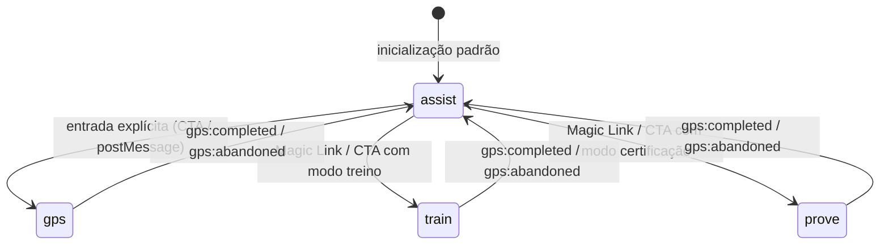
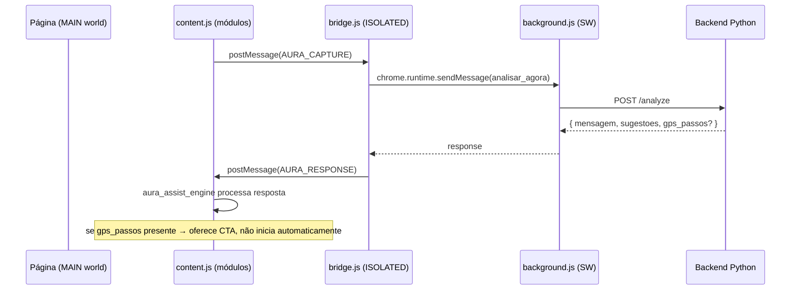

# Design Document — Aura DAP Restructure

## Overview

A extensão Aura DAP atualmente concentra toda a lógica em um único `content.js` monolítico (~936 linhas). Assistente conversacional, motor GPS, gamificação, spotlight, DOM mapper e feedback coexistem no mesmo escopo de função, acoplados por variáveis compartilhadas e sem fronteiras explícitas.

Este design define a reorganização modular da extensão em oito módulos lógicos com responsabilidades claras, a introdução de um estado global explícito (`aura_mode`), a separação do GPS como fluxo intencional independente, e a consolidação do fluxo de comunicação Background → Bridge → Content.

O backend Python é afetado minimamente: apenas o contrato do Step_Model é formalizado em `contracts/step_model.json` e o endpoint de analytics `/api/analytics/event` é adicionado. Nenhum redesign visual completo é realizado.

---

## Architecture

### Visão Geral dos Modos



### Fluxo de Comunicação



### Estrutura de Arquivos Resultante

```
extension/
  content.js              ← entry point: importa e inicializa módulos
  modules/
    aura_state.js         ← estado global, aura_mode, setAuraMode()
    aura_ui.js            ← balões, badge, drag, animação lottie
    aura_dom_mapper.js    ← captura DOM interativo para IA
    aura_spotlight.js     ← backdrop, sonar highlight, scroll
    aura_assist_engine.js ← proatividade, idle timer, input, disparo IA
    aura_gps_engine.js    ← carregamento roteiro, steps, validação, eventos
    aura_mission_engine.js← HUD, XP, hints, penalidades, resumo
    aura_feedback.js      ← barra de feedback de qualidade IA
  bridge.js               ← sem mudança de responsabilidade
  background.js           ← consolidado: ações, endpoints, token centralizados
contracts/
  step_model.json         ← contrato canônico do Step_Model
```

> Nota: Como a extensão opera em `world: "MAIN"` sem bundler, os módulos são carregados via `<script>` injetado sequencialmente ou via IIFE com namespace global `window.AuraModules`. O `content.js` atua como orquestrador.

---

## Components and Interfaces

### aura_state

Único módulo que lê e escreve `aura_mode` e o estado compartilhado da sessão.

```js
// Interface pública
window.AuraState = {
  mode: 'assist',           // 'assist' | 'gps' | 'train' | 'prove'
  session: {},              // estado da sessão corrente
  setMode(newMode),         // transição limpa entre modos
  getMode(),
  resetSession()
}
```

`setMode(newMode)` é responsável por:
1. Chamar `teardown()` do módulo ativo atual
2. Atualizar `mode`
3. Chamar `init()` do novo módulo

### aura_ui

Gerencia todos os elementos visuais compartilhados: balão principal, badge, chat stack, drag do container, animação lottie.

```js
window.AuraUI = {
  exibirBalao(texto, opcoes, mostrarFeedback),
  exibirBaloesSequenciais(mensagens),
  esconderBalao(),
  ativarBadge(),
  desativarBadge(),
  tocarAnimacao()
}
```

### aura_dom_mapper

Encapsula a lógica de captura de elementos interativos visíveis para envio ao backend.

```js
window.AuraDomMapper = {
  capturar()  // → string com lista de elementos mapeados
}
```

### aura_spotlight

Encapsula backdrop, sonar highlight e scroll para elemento. Suporta iframes do Senior X.

```js
window.AuraSpotlight = {
  aplicar(seletorOuId, isSeletor),
  remover(),
  encontrarElemento(seletor)  // busca em document + iframes
}
```

### aura_assist_engine

Proatividade, idle timer, balões sequenciais, input de pergunta, disparo de análise IA.

```js
window.AuraAssistEngine = {
  init(),
  teardown(),
  dispararAnalise(textoOpcional),
  resetarProatividade()
}
```

Ao receber `AURA_RESPONSE` com `gps_passos`, apresenta CTA explícito ao usuário — não inicia GPS automaticamente.

### aura_gps_engine

Carregamento de roteiro, execução de passos, validação por `validation_type`, emissão de eventos.

```js
window.AuraGpsEngine = {
  init(roteiro),       // carrega e inicia o roteiro
  teardown(),
  // Eventos emitidos via CustomEvent no document:
  // 'gps:step_validated', 'gps:step_failed', 'gps:completed', 'gps:abandoned'
}
```

Validadores por tipo:

| validation_type   | Estratégia de validação                                      |
|-------------------|--------------------------------------------------------------|
| `click`           | listener `click` no `target_selector`                        |
| `right_click`     | listener `contextmenu` no `target_selector`                  |
| `double_click`    | listener `dblclick` no `target_selector`                     |
| `type`            | listener `input` + comparação com `expected_state.value`     |
| `enter`           | listener `keydown` (Enter) com foco no `target_selector`     |
| `url_change`      | MutationObserver + comparação com `expected_state.url_pattern` |
| `element_present` | polling/MutationObserver para `expected_state.selector`      |
| `element_absent`  | polling/MutationObserver para ausência de `expected_state.selector` |
| `visual_state`    | fallback para `click` com log de aviso                       |

### aura_mission_engine

HUD, cálculo de XP, hints com custo, penalidades, resumo de performance. Escuta eventos do GPS.

```js
window.AuraMissionEngine = {
  init(scoringConfig),
  teardown(),
  // Escuta: 'gps:step_validated', 'gps:step_failed', 'gps:completed'
}
```

### aura_feedback

Barra de feedback de qualidade de resposta da IA (👍/👎).

```js
window.AuraFeedback = {
  criar(prompt, resposta)  // → HTMLElement
}
```

### background.js (consolidado)

```js
// Constantes centralizadas no topo
const AURA_AUTH_TOKEN = /* lido de config injetada */;
const AURA_ENDPOINTS = {
  analyze:  'http://localhost:8000/analyze',
  missions: 'http://localhost:8000/api/missoes',
  gps:      'http://localhost:8000/api/gps-roteiro',
  analytics:'http://localhost:8000/api/analytics/event'
};

// Ações reconhecidas: 'analisar_agora', 'fetch_mission', 'pre_capture', 'fetch_gps_explicit', 'analytics_event'
// Ação removida: 'buscar_gps' (consolidada em 'analisar_agora' ou 'fetch_gps_explicit')
// Ação desconhecida: retorna { error: 'unknown_action' }
```

---

## Data Models

### Step_Model (contrato canônico)

Definido em `contracts/step_model.json` e compartilhado entre backend Python e Content_Script.

```json
{
  "id": "string",
  "title": "string",
  "intent": "string",
  "ancora": "string",
  "tooltip": "string",
  "acao": "string",
  "target_selector": "string",
  "label": "string",
  "validation_type": "click | right_click | double_click | type | enter | url_change | element_present | element_absent | visual_state",
  "expected_state": {
    "value": "string?",
    "url_pattern": "string?",
    "selector": "string?"
  },
  "timeout_sec": 30,
  "hint": "string",
  "difficulty": "easy | medium | hard",
  "xp_value": 10,
  "xp_penalty_per_hint": 5
}
```

Valores padrão aplicados pelo `aura_gps_engine` quando campo obrigatório ausente:

| Campo               | Padrão         |
|---------------------|----------------|
| `validation_type`   | `"click"`      |
| `timeout_sec`       | `30`           |
| `xp_value`          | `10`           |
| `xp_penalty_per_hint` | `5`          |
| `difficulty`        | `"medium"`     |
| `hint`              | `""`           |

### AuraState.session

```js
{
  mode: 'assist',           // modo corrente
  roteiro_id: null,         // id do roteiro GPS ativo
  step_index: 0,            // índice do passo corrente
  xp: 0,                    // XP acumulado na sessão
  hints_used: 0,            // hints solicitados na sessão
  errors_count: 0,          // erros detectados na sessão
  session_start: null,      // timestamp de início
  mode_start: null          // timestamp de início do modo corrente
}
```

### Analytics_Event

```js
{
  event_type: 'gps_start | mission_start | step_complete | hint_requested | step_error | session_abandoned | mission_complete',
  timestamp: ISO8601,
  tenant_id: string,
  payload: { /* campos específicos por tipo */ }
}
```

---

## Correctness Properties

*A property is a characteristic or behavior that should hold true across all valid executions of a system — essentially, a formal statement about what the system should do. Properties serve as the bridge between human-readable specifications and machine-verifiable correctness guarantees.*

### Property 1: Exclusividade de modo

*Para qualquer* sequência de chamadas a `setAuraMode(mode)`, em nenhum momento dois modos distintos devem estar ativos simultaneamente — `aura_mode` deve sempre conter exatamente um dos valores válidos: `assist`, `gps`, `train`, `prove`.

**Validates: Requirements 1.1, 1.5, 1.6**

---

### Property 2: GPS não inicia automaticamente a partir de resposta IA

*Para qualquer* resposta do backend que contenha `gps_passos`, o `aura_mode` não deve mudar de `assist` sem uma ação explícita do usuário — a presença de `gps_passos` na resposta não é condição suficiente para transição de modo.

**Validates: Requirements 2.2, 2.4**

---

### Property 3: Step_Model com campos ausentes não falha silenciosamente

*Para qualquer* objeto de passo recebido do backend com um ou mais campos obrigatórios ausentes, o `aura_gps_engine` deve aplicar o valor padrão definido para aquele campo e continuar a execução — nunca lançar exceção não tratada nem ignorar o passo.

**Validates: Requirements 3.4**

---

### Property 4: Validação orientada a tipo — round trip de ação

*Para qualquer* passo com `validation_type` definido e `target_selector` válido, simular a ação correspondente ao tipo (click, type, enter, etc.) deve resultar na emissão do evento `gps:step_validated` — e não simular a ação não deve emitir esse evento.

**Validates: Requirements 5.1, 5.2, 5.3, 5.4, 5.5, 5.6, 5.7**

---

### Property 5: Instrumentação GPS pela Mission sem acoplamento

*Para qualquer* sessão em `aura_mode` `train` ou `prove`, todos os eventos `gps:step_validated`, `gps:step_failed` e `gps:completed` emitidos pelo GPS devem ser recebidos pelo `aura_mission_engine` — e em `aura_mode` `gps` (sem missão), esses mesmos eventos não devem acionar lógica de XP ou HUD.

**Validates: Requirements 6.1, 6.2, 4.5**

---

### Property 6: Hints desabilitados ou limitados em modo prove

*Para qualquer* sessão em `aura_mode` `prove`, o número de hints concedidos deve ser ≤ 1 por sessão — e em `aura_mode` `train`, hints devem ser permitidos com custo de XP.

**Validates: Requirements 6.3, 6.4**

---

### Property 7: Analytics events contêm campos obrigatórios

*Para qualquer* evento de analytics emitido pelo sistema, o payload deve conter todos os campos obrigatórios definidos para aquele `event_type` — nenhum campo obrigatório deve estar ausente ou nulo.

**Validates: Requirements 9.1, 9.2, 9.3, 9.4, 9.5, 9.6**

---

### Property 8: Validação de origem de mensagens

*Para qualquer* mensagem recebida via `window.addEventListener("message")`, mensagens cuja `event.origin` difere de `window.location.origin` devem ser ignoradas — e mensagens sem o campo `type` esperado devem ser descartadas silenciosamente.

**Validates: Requirements 10.3, 10.4, 10.5**

---

### Property 9: Background retorna erro para ação desconhecida

*Para qualquer* mensagem enviada ao background com uma `action` não reconhecida, a resposta deve ser `{ error: "unknown_action" }` sem lançar exceção.

**Validates: Requirements 8.7**

---

## Error Handling

### Campos ausentes no Step_Model
O `aura_gps_engine` valida cada passo ao carregá-lo, aplicando defaults antes de iniciar a execução. Um aviso é emitido no console com o campo e o valor padrão aplicado.

### validation_type não reconhecido
O `aura_gps_engine` registra aviso no console e trata o passo como `click` (fallback). Não interrompe a sessão.

### Falha no endpoint de analytics
O background enfileira o evento em memória (array local) e retenta no próximo ciclo de atividade do service worker. Eventos não entregues após 3 tentativas são descartados com log de aviso.

### Transição de modo com estado sujo
`setAuraMode()` chama `teardown()` do módulo ativo antes de iniciar o novo. Se `teardown()` lançar exceção, o erro é capturado, logado, e a transição prossegue para evitar travamento permanente.

### Bridge com extensão recarregada
O bridge já trata `chrome.runtime.lastError`. Após a reestruturação, o content script também trata respostas `undefined` do bridge com mensagem de fallback ao usuário.

### Magic Link com missão inválida
Se `fetch_mission` retornar erro ou payload inválido, o `aura_assist_engine` exibe mensagem de erro no balão e permanece em `aura_mode: assist`.

---

## Testing Strategy

### Abordagem Dual

A estratégia combina testes unitários para exemplos concretos e testes baseados em propriedades para validação universal.

**Testes unitários** cobrem:
- Exemplos específicos de transição de modo (`assist → gps`, `gps → assist`)
- Casos de borda: Step_Model com todos os campos ausentes, `validation_type` inválido
- Integração entre módulos: GPS emite evento → Mission recebe e atualiza XP
- Magic Link: URL com `aura_mission` dispara carregamento correto

**Testes de propriedade** cobrem as 9 propriedades definidas acima, com mínimo de 100 iterações cada.

### Biblioteca de Testes de Propriedade

**JavaScript**: [fast-check](https://github.com/dubzzz/fast-check) — compatível com Jest/Vitest, sem dependências pesadas, adequado para lógica de módulos isolados.

### Configuração dos Testes de Propriedade

Cada teste de propriedade deve:
- Usar `fc.assert(fc.property(...))` com `{ numRuns: 100 }` mínimo
- Incluir comentário de rastreabilidade no formato:
  `// Feature: aura-dap-restructure, Property N: <texto da propriedade>`

### Exemplos de Estrutura

```js
// Feature: aura-dap-restructure, Property 1: Exclusividade de modo
fc.assert(fc.property(
  fc.constantFrom('assist', 'gps', 'train', 'prove'),
  fc.constantFrom('assist', 'gps', 'train', 'prove'),
  (modeA, modeB) => {
    AuraState.setMode(modeA);
    AuraState.setMode(modeB);
    return ['assist','gps','train','prove'].filter(m => m === AuraState.getMode()).length === 1;
  }
), { numRuns: 100 });
```

```js
// Feature: aura-dap-restructure, Property 3: Step_Model com campos ausentes não falha
fc.assert(fc.property(
  fc.record({ intent: fc.string() }), // passo mínimo sem campos obrigatórios
  (partialStep) => {
    const normalized = AuraGpsEngine.normalizeStep(partialStep);
    return normalized.validation_type !== undefined
      && normalized.timeout_sec !== undefined
      && normalized.xp_value !== undefined;
  }
), { numRuns: 100 });
```

### Testes de Regressão (Requirement 11)

Para cada funcionalidade preservada, um teste de exemplo específico:
- Clique no mascote → balão exibido com input
- Resposta com `seletor_css` → spotlight aplicado
- URL com `aura_mission` → missão carregada
- Idle 15s → balões sequenciais proativos exibidos
- Troca de URL SPA → estado proativo resetado
- Spotlight dentro de iframe → funciona corretamente
