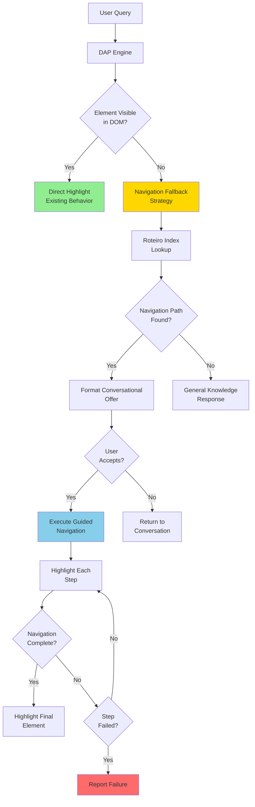
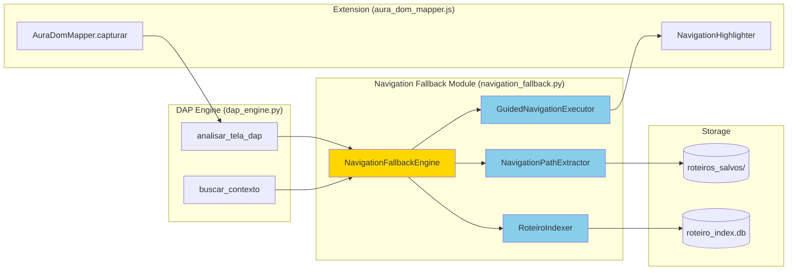

# Design Document: AURA Smart Navigation Fallback

## Overview

The AURA Smart Navigation Fallback feature implements a hierarchical fallback strategy that enables AURA to guide users to UI elements that are not currently visible in the DOM. When a user requests access to a feature that requires navigation through nested menus or collapsed sections, AURA will search saved roteiros to extract navigation paths and offer step-by-step guided navigation.

This design maintains the existing direct highlight behavior for visible elements while adding intelligent fallback capabilities for hidden elements, ensuring no performance regression for the common case.

## Architecture

### High-Level Architecture



### Component Architecture



## Components and Interfaces

### 1. NavigationFallbackEngine

**Responsibility:** Orchestrates the hierarchical fallback strategy and coordinates between components.

**Location:** `navigation_fallback.py`

**Interface:**
```python
class NavigationFallbackEngine:
    def __init__(self, roteiro_indexer: RoteiroIndexer):
        self.indexer = roteiro_indexer
        self.path_extractor = NavigationPathExtractor()
        self.executor = GuidedNavigationExecutor()
    
    async def handle_invisible_element(
        self,
        user_query: str,
        dom_context: str,
        tenant_id: str
    ) -> dict:
        """
        Main entry point for navigation fallback.
        
        Returns:
            dict: {
                "mensagem": str,  # Conversational offer or general response
                "navigation_path": list[dict] | None,  # Navigation steps if found
                "requires_confirmation": bool,
                "fallback_type": str  # "navigation" | "general"
            }
        """
        pass
    
    async def execute_guided_navigation(
        self,
        navigation_path: list[dict],
        confirmation: bool
    ) -> dict:
        """
        Execute step-by-step guided navigation.
        
        Returns:
            dict: {
                "success": bool,
                "completed_steps": int,
                "failed_step": int | None,
                "error_message": str | None
            }
        """
        pass
```

**Integration Point:** Called by `dap_engine.py::analisar_tela_dap()` when element visibility check fails.

### 2. RoteiroIndexer

**Responsibility:** Indexes roteiro navigation paths for fast lookup and maintains the index.

**Location:** `navigation_fallback.py`

**Interface:**
```python
class RoteiroIndexer:
    def __init__(self, roteiros_dir: str = "roteiros_salvos", index_db: str = "roteiro_index.db"):
        self.roteiros_dir = roteiros_dir
        self.index_db = index_db
        self.cache = {}  # In-memory cache for frequently accessed paths
    
    def build_index(self) -> None:
        """
        Build or rebuild the complete roteiro index.
        Scans all roteiro files and extracts navigation paths.
        """
        pass
    
    def update_index(self, roteiro_file: str) -> None:
        """
        Update index for a specific roteiro file.
        Called when roteiros are modified.
        """
        pass
    
    def search(self, query: str, tenant_id: str) -> list[dict]:
        """
        Search for navigation paths matching the query.
        
        Returns:
            list[dict]: [
                {
                    "roteiro_name": str,
                    "navigation_path": list[dict],
                    "confidence_score": float,
                    "path_length": int
                }
            ]
        """
        pass
    
    def invalidate_cache(self, roteiro_file: str = None) -> None:
        """
        Invalidate cache entries for modified roteiros.
        """
        pass
```

**Data Model (SQLite Schema):**
```sql
CREATE TABLE navigation_index (
    id INTEGER PRIMARY KEY AUTOINCREMENT,
    roteiro_name TEXT NOT NULL,
    target_element TEXT NOT NULL,  -- Final destination element label
    navigation_path TEXT NOT NULL,  -- JSON array of navigation steps
    breadcrumb TEXT NOT NULL,       -- Human-readable path (e.g., "Senior Flow > SIGN > Nova Gestão")
    tenant_id TEXT NOT NULL,
    path_length INTEGER NOT NULL,
    created_at TIMESTAMP DEFAULT CURRENT_TIMESTAMP,
    updated_at TIMESTAMP DEFAULT CURRENT_TIMESTAMP
);

CREATE INDEX idx_target_element ON navigation_index(target_element);
CREATE INDEX idx_tenant_id ON navigation_index(tenant_id);
CREATE INDEX idx_breadcrumb ON navigation_index(breadcrumb);
```

### 3. NavigationPathExtractor

**Responsibility:** Parses roteiro JSON files to extract hierarchical navigation sequences.

**Location:** `navigation_fallback.py`

**Interface:**
```python
class NavigationPathExtractor:
    def extract_navigation_path(self, roteiro_data: dict) -> dict:
        """
        Extract navigation path from roteiro JSON.
        
        Args:
            roteiro_data: Parsed roteiro JSON
        
        Returns:
            dict: {
                "breadcrumb": str,  # "Senior Flow > SIGN > Nova Gestão"
                "steps": list[dict],  # Navigation steps
                "target_element": str  # Final destination
            }
        """
        pass
    
    def _parse_step(self, passo: dict) -> dict | None:
        """
        Parse a single passo to extract navigation information.
        
        Returns:
            dict | None: {
                "step_id": int,
                "action": str,  # "clique", "hover", etc.
                "element": {
                    "label": str,
                    "selector_hint": str,
                    "description": str
                },
                "tooltip": str  # From pedagogia.tooltip_dap
            }
        """
        pass
    
    def _build_breadcrumb(self, steps: list[dict]) -> str:
        """
        Build human-readable breadcrumb from navigation steps.
        Example: "Senior Flow > SIGN > Nova Gestão"
        """
        pass
```

**Navigation Step Data Model:**
```python
{
    "step_id": 1,
    "action": "clique",
    "element": {
        "label": "Senior Flow",
        "selector_hint": "[id='menu-item-Senior Flow']",
        "description": "Menu item na barra lateral esquerda",
        "coordinates": {
            "x_pct": 0.0148,
            "y_pct": 0.7058
        }
    },
    "tooltip": "Senior Flow > SIGN > Nova Gestão",
    "wait_for_dom": true,  # Wait for DOM changes after this step
    "timeout_ms": 2000
}
```

### 4. GuidedNavigationExecutor

**Responsibility:** Executes step-by-step guided navigation with visual highlights.

**Location:** `navigation_fallback.py`

**Interface:**
```python
class GuidedNavigationExecutor:
    def __init__(self):
        self.current_step = 0
        self.navigation_state = "idle"  # "idle" | "executing" | "waiting" | "completed" | "failed"
    
    async def execute_navigation(
        self,
        navigation_path: list[dict],
        dom_context: str
    ) -> dict:
        """
        Execute the complete navigation sequence.
        
        Returns:
            dict: {
                "success": bool,
                "completed_steps": int,
                "failed_step": int | None,
                "error_message": str | None,
                "partial_path": list[str]  # Successfully completed steps
            }
        """
        pass
    
    async def execute_step(
        self,
        step: dict,
        dom_context: str
    ) -> dict:
        """
        Execute a single navigation step.
        
        Returns:
            dict: {
                "success": bool,
                "element_found": bool,
                "dom_changed": bool,
                "error": str | None
            }
        """
        pass
    
    def _wait_for_dom_stabilization(self, timeout_ms: int = 2000) -> bool:
        """
        Wait for DOM changes to stabilize after an interaction.
        """
        pass
    
    def _highlight_element(self, element: dict) -> None:
        """
        Send highlight command to extension for current step element.
        """
        pass
```

### 5. NavigationHighlighter (Extension)

**Responsibility:** Provides visual feedback during guided navigation.

**Location:** `extension/modules/navigation_highlighter.js`

**Interface:**
```javascript
class NavigationHighlighter {
    constructor() {
        this.currentHighlight = null;
        this.highlightStyle = {
            border: '3px solid #FFD700',
            boxShadow: '0 0 10px rgba(255, 215, 0, 0.8)',
            zIndex: '10000'
        };
    }
    
    highlightStep(elementSelector, stepInfo) {
        /**
         * Highlight the current navigation step element.
         * 
         * @param {string} elementSelector - CSS selector or data-aura-map ID
         * @param {object} stepInfo - Step information for tooltip
         * @returns {boolean} - Success status
         */
    }
    
    clearHighlight() {
        /**
         * Remove current highlight.
         */
    }
    
    showStepTooltip(element, tooltip) {
        /**
         * Display tooltip with step information.
         */
    }
}
```

## Data Models

### Navigation Path Model

```python
{
    "roteiro_name": "Senior_Flow_-_SIGN_-_Cancelar_Envelopes",
    "breadcrumb": "Senior Flow > SIGN > Nova Gestão",
    "target_element": "Nova Gestão de Envelopes",
    "confidence_score": 0.92,
    "path_length": 3,
    "steps": [
        {
            "step_id": 1,
            "action": "clique",
            "element": {
                "label": "Senior Flow",
                "selector_hint": "[id='menu-item-Senior Flow']",
                "description": "Menu item na barra lateral esquerda"
            },
            "tooltip": "Senior Flow",
            "wait_for_dom": true,
            "timeout_ms": 2000
        },
        {
            "step_id": 2,
            "action": "clique",
            "element": {
                "label": "SIGN",
                "selector_hint": "[aria-label='Grupo de menus SIGN']",
                "description": "Submenu do Senior Flow"
            },
            "tooltip": "Senior Flow > SIGN",
            "wait_for_dom": true,
            "timeout_ms": 2000
        },
        {
            "step_id": 3,
            "action": "clique",
            "element": {
                "label": "Nova Gestão",
                "selector_hint": "[href*='nova-gestao']",
                "description": "Opção dentro do menu SIGN"
            },
            "tooltip": "Senior Flow > SIGN > Nova Gestão",
            "wait_for_dom": true,
            "timeout_ms": 2000
        }
    ]
}
```

### Roteiro Index Cache Model

```python
{
    "cache_key": "sign_nova_gestao",  # Normalized search key
    "navigation_paths": [
        {
            "roteiro_name": str,
            "breadcrumb": str,
            "path_length": int,
            "confidence_score": float
        }
    ],
    "last_accessed": float,  # Timestamp
    "access_count": int
}
```

## Integration with Existing DAP Engine

### Modified `dap_engine.py::analisar_tela_dap()`

```python
async def analisar_tela_dap(
    image_b64: str,
    url: str,
    prompt_usuario: str,
    dom_context: str = "",
    user_name: str = "Utilizador",
    tenant_id: str = "senior_default",
    historico: list = None
) -> dict:
    # ... existing guardrail validation ...
    
    # Check element visibility (NEW)
    element_visible = _check_element_visibility(prompt_usuario, dom_context)
    
    if element_visible:
        # Existing direct highlight flow (no changes)
        return await _direct_highlight_flow(...)
    else:
        # NEW: Navigation fallback flow
        fallback_engine = NavigationFallbackEngine(roteiro_indexer)
        fallback_result = await fallback_engine.handle_invisible_element(
            user_query=prompt_usuario,
            dom_context=dom_context,
            tenant_id=tenant_id
        )
        
        if fallback_result["fallback_type"] == "navigation":
            return {
                "mensagem": fallback_result["mensagem"],
                "elemento_id": None,
                "seletor_css": None,
                "navigation_path": fallback_result["navigation_path"],
                "requires_confirmation": True,
                "sugestoes": ["Sim, me guie", "Não, obrigado"],
                "confidence_score": fallback_result.get("confidence_score", 0.0),
                "source_reference": fallback_result.get("roteiro_name")
            }
        else:
            # General knowledge response
            return await _gemini_vision_fallback(...)
```

### Element Visibility Check

```python
def _check_element_visibility(prompt_usuario: str, dom_context: str, timeout_ms: int = 500) -> bool:
    """
    Check if the requested element is visible in the current DOM.
    
    Args:
        prompt_usuario: User query
        dom_context: Current DOM context from AuraDomMapper
        timeout_ms: Maximum time for check (default 500ms)
    
    Returns:
        bool: True if element is visible, False otherwise
    """
    start_time = time.time()
    
    # Extract potential element references from user query
    element_keywords = _extract_element_keywords(prompt_usuario)
    
    # Search for keywords in DOM context
    for keyword in element_keywords:
        if keyword.lower() in dom_context.lower():
            elapsed_ms = (time.time() - start_time) * 1000
            if elapsed_ms < timeout_ms:
                return True
    
    return False
```

## Performance Optimization Strategies

### 1. Roteiro Index Optimization

**Strategy:** Build inverted index for O(log n) lookup performance.

**Implementation:**
- Use SQLite FTS5 (Full-Text Search) for text matching
- Maintain in-memory cache for top 100 most accessed paths
- Implement LRU eviction policy for cache

**Expected Performance:**
- Index build time: < 5 seconds for 1000 roteiros
- Lookup time: < 200ms for 95% of queries
- Cache hit rate: > 80% for frequent queries

### 2. Incremental Index Updates

**Strategy:** Update only modified roteiros instead of full rebuild.

**Implementation:**
```python
def watch_roteiros_directory(self):
    """
    Watch roteiros_salvos/ for file changes using watchdog.
    """
    from watchdog.observers import Observer
    from watchdog.events import FileSystemEventHandler
    
    class RoteiroChangeHandler(FileSystemEventHandler):
        def on_modified(self, event):
            if event.src_path.endswith('.json'):
                self.indexer.update_index(event.src_path)
                self.indexer.invalidate_cache(event.src_path)
    
    observer = Observer()
    observer.schedule(RoteiroChangeHandler(), self.roteiros_dir, recursive=False)
    observer.start()
```

### 3. Query Optimization

**Strategy:** Normalize and cache search queries.

**Implementation:**
```python
def _normalize_query(self, query: str) -> str:
    """
    Normalize query for consistent cache keys.
    - Convert to lowercase
    - Remove accents
    - Remove stop words
    - Stem words
    """
    query = query.lower()
    query = unidecode(query)  # Remove accents
    query = ' '.join([word for word in query.split() if word not in STOP_WORDS])
    return query
```

### 4. Parallel Search

**Strategy:** Search multiple roteiros in parallel using asyncio.

**Implementation:**
```python
async def search_parallel(self, query: str, tenant_id: str) -> list[dict]:
    """
    Search roteiros in parallel for faster results.
    """
    roteiro_files = self._get_roteiro_files(tenant_id)
    
    tasks = [
        self._search_roteiro(file, query)
        for file in roteiro_files
    ]
    
    results = await asyncio.gather(*tasks)
    return self._rank_results(results)
```

## Error Handling

### Navigation Failure Scenarios

1. **Element Not Found**
   - **Detection:** Element selector not found in DOM after step execution
   - **Response:** "Não consegui encontrar o elemento '[label]' no passo [N]. A estrutura da interface pode ter mudado."
   - **Action:** Stop navigation, report partial progress

2. **Timeout Waiting for DOM**
   - **Detection:** DOM stabilization timeout exceeded
   - **Response:** "O sistema está demorando para responder no passo [N]. Tente navegar manualmente para '[breadcrumb]'."
   - **Action:** Stop navigation, provide manual guidance

3. **UI Structure Mismatch**
   - **Detection:** Expected element hierarchy not found
   - **Response:** "A estrutura da interface mudou desde que este roteiro foi criado. Caminho esperado: '[breadcrumb]'."
   - **Action:** Stop navigation, suggest manual navigation

4. **No Navigation Path Found**
   - **Detection:** No matching roteiros in index
   - **Response:** Fall back to general knowledge response from Gemini Vision
   - **Action:** Continue conversation without navigation offer

### Error Response Format

```python
{
    "success": false,
    "error_type": "element_not_found" | "timeout" | "structure_mismatch" | "no_path_found",
    "error_message": str,
    "failed_step": int | None,
    "completed_steps": int,
    "partial_path": list[str],  # Successfully completed breadcrumb
    "suggestion": str  # Manual navigation guidance
}
```

## Testing Strategy

### Unit Tests

1. **RoteiroIndexer Tests**
   - Test index building from sample roteiros
   - Test search with various queries
   - Test cache hit/miss scenarios
   - Test incremental updates

2. **NavigationPathExtractor Tests**
   - Test parsing of valid roteiro JSON
   - Test handling of malformed roteiros
   - Test breadcrumb generation
   - Test step extraction

3. **GuidedNavigationExecutor Tests**
   - Test step-by-step execution with mocked DOM
   - Test timeout handling
   - Test failure recovery
   - Test partial navigation completion

4. **Element Visibility Check Tests**
   - Test with visible elements
   - Test with hidden elements
   - Test performance (< 500ms)

### Integration Tests

1. **End-to-End Navigation Flow**
   - Test complete flow from query to guided navigation
   - Test user confirmation handling
   - Test navigation success scenarios
   - Test navigation failure scenarios

2. **DAP Engine Integration**
   - Test fallback activation when element not visible
   - Test direct highlight preservation for visible elements
   - Test performance (no regression for direct highlight)

3. **Extension Integration**
   - Test highlight rendering
   - Test step tooltip display
   - Test DOM change detection

### Performance Tests

1. **Index Build Performance**
   - Measure time to index 1000 roteiros
   - Target: < 5 seconds

2. **Search Performance**
   - Measure lookup time for various queries
   - Target: < 200ms for 95% of queries

3. **Navigation Execution Performance**
   - Measure time per navigation step
   - Target: < 2 seconds per step (including DOM stabilization)

4. **Element Visibility Check Performance**
   - Measure check time
   - Target: < 500ms

## Deployment Considerations

### Database Migration

```python
def migrate_to_navigation_index():
    """
    Create navigation index database and populate from existing roteiros.
    """
    indexer = RoteiroIndexer()
    indexer.build_index()
    logger.info(f"Navigation index built with {indexer.get_index_size()} entries")
```

### Configuration

```python
# config.py or .env
NAVIGATION_FALLBACK_ENABLED = True
ROTEIRO_INDEX_DB = "roteiro_index.db"
ROTEIRO_INDEX_CACHE_SIZE = 100
NAVIGATION_STEP_TIMEOUT_MS = 2000
ELEMENT_VISIBILITY_CHECK_TIMEOUT_MS = 500
```

### Monitoring

```python
# Add metrics for monitoring
NAVIGATION_METRICS = {
    "fallback_activations": 0,
    "navigation_successes": 0,
    "navigation_failures": 0,
    "average_navigation_time_ms": 0,
    "cache_hit_rate": 0.0,
    "index_size": 0
}
```

## Future Enhancements

1. **Machine Learning for Path Ranking**
   - Train model to rank navigation paths based on user success rates
   - Use historical navigation data to improve confidence scores

2. **Adaptive Navigation**
   - Learn from failed navigations to update roteiro index
   - Suggest roteiro updates when UI structure changes detected

3. **Multi-Language Support**
   - Support navigation in multiple languages
   - Translate breadcrumbs and tooltips

4. **Voice-Guided Navigation**
   - Add audio narration for each navigation step
   - Integrate with edge-tts for voice synthesis

5. **Navigation Recording**
   - Allow users to record new navigation paths
   - Automatically update roteiro index with user-recorded paths
