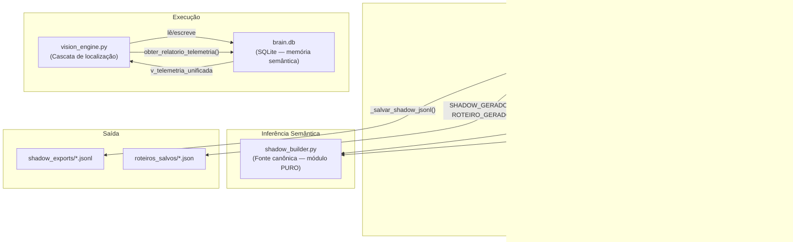

# Documento de Design — Consolidação da Captura Cognitiva

## Visão Geral

Esta feature consolida quatro eixos de melhoria arquitetural no Senior Training OS sem quebrar nenhum contrato do pipeline captura → roteiro → vídeo/SCORM/PDF:

1. **Separação captura/enriquecimento** — o loop síncrono de captura em `capture_dual_output.py` deixa de chamar Gemini Vision durante a interação do usuário. O enriquecimento semântico passa a ocorrer em etapa posterior, via `enriquecer_eventos_com_gemini()`.
2. **Consolidação semântica** — as funções de inferência duplicadas em `capture_hybrid_shadow.py` são removidas e substituídas por imports das funções unificadas em `shadow_builder.py`, que se torna a única fonte canônica de inferência semântica.
3. **Reordenação da cascata** — `vision_engine.py` corrige a posição do Sniper Semântico (antes de Coordenadas) e integra o Template Matching como camada `1_T` na cascata principal `encontrar_e_clicar()`.
4. **Telemetria unificada** — `brain.db` recebe a view `v_telemetria_unificada` e o `vision_engine.py` expõe `obter_relatorio_telemetria()` como superfície pública de consulta.

Nenhuma interface pública é alterada: `_montar_evento_shadow()`, `_salvar_shadow_jsonl()` e `encontrar_e_clicar()` preservam assinaturas e semântica observável.

## Arquitetura

### Diagrama de Componentes (após refatoração)



### Fluxo de Captura (antes vs. depois)

**Antes (problemático):**
```
loop de captura → on_capturar_elemento() → _analisar_elemento_com_gemini() [BLOQUEANTE 1-2s]
                                         → _montar_evento_shadow()
```

**Depois (correto):**
```
loop de captura → on_capturar_elemento() → monta Evento_Bruto (mecânico, sem IA)
                                         → appenda em lista eventos_brutos

encerramento da sessão → enriquecer_eventos_com_gemini(eventos_brutos)
                       → fallback heurístico se Gemini indisponível
                       → _montar_evento_shadow() para cada evento enriquecido
                       → _salvar_shadow_jsonl()
```

### Fluxo da Cascata Vision Engine (antes vs. depois)

**Antes (ordem incorreta):**
```
0 Brain → 0.5 Menu → 1 Foco → 1.5 Heurísticas → 2 Coordenadas → 2_S Sniper → 3 Hint → 4 Frames → 5 Gemini
```

**Depois (ordem correta):**
```
0 Brain → 0.5 Menu → 1 Foco → 1.5 Heurísticas → 1_T Template → 2_S Sniper → 2 Coords → 3 Hint → 4 Frames → 5 Gemini
```

## Componentes e Interfaces

### 1. `shadow_builder.py` — Consolidação Semântica

#### Novas funções unificadas

As quatro funções privadas existentes (`_infer_semantic_action_from_capture`, `_infer_business_entity_from_capture`, `_infer_pattern_from_capture`, `_is_noise_event`) são mantidas intactas para retrocompatibilidade. Quatro novas funções públicas unificadas são adicionadas como wrappers que aceitam tanto a assinatura posicional original quanto um dict `hints` opcional:

```python
def inferir_acao_semantica(
    acao: str,
    label: str,
    seletor: str,
    tag: str,
    valor_input: str = "",
    hints: dict | None = None,
) -> str:
    """
    Função unificada de inferência de ação semântica.
    Substitui _infer_semantic_action_from_capture() e infer_semantic_action_from_hints().
    Retorna sempre um valor do vocabulário controlado:
      fill | search | confirm | delete | save | open | navigate | select | close
    """
    # Se hints fornecido, extrai campos adicionais para enriquecer a inferência
    if hints:
        acao = acao or hints.get("acao", "")
        label = label or hints.get("text_hint", "")
        seletor = seletor or hints.get("seletor_css", "")
        tag = tag or hints.get("tag", "")
        valor_input = valor_input or hints.get("valor_input", "")
    return _infer_semantic_action_from_capture(acao, label, seletor, tag, valor_input)


def inferir_entidade_negocio(
    label: str,
    seletor: str,
    tag: str,
    contexto_tela: str = "",
    hints: dict | None = None,
) -> str:
    """Substitui _infer_business_entity_from_capture() e infer_business_entity_from_hints()."""
    if hints:
        label = label or hints.get("text_hint", "")
        seletor = seletor or hints.get("seletor_css", "")
        tag = tag or hints.get("tag", "")
        contexto_tela = contexto_tela or hints.get("page_title", "")
    return _infer_business_entity_from_capture(label, seletor, tag, contexto_tela)


def inferir_padrao_interacao(
    acao: str,
    label: str,
    seletor: str,
    tag: str,
    capture_scope: str,
    hints: dict | None = None,
) -> str:
    """Substitui _infer_pattern_from_capture() e infer_pattern_from_hints()."""
    if hints:
        acao = acao or hints.get("acao", "")
        label = label or hints.get("text_hint", "")
        seletor = seletor or hints.get("seletor_css", "")
        tag = tag or hints.get("tag", "")
        capture_scope = capture_scope or hints.get("capture_scope", "shell")
    return _infer_pattern_from_capture(acao, label, seletor, tag, capture_scope)


def classificar_ruido(
    label: str,
    seletor: str,
    acao: str,
    tag: str,
    capture_scope: str,
    valor_input: str = "",
    hints: dict | None = None,
) -> bool:
    """Substitui _is_noise_event() e is_noise_event()."""
    if hints:
        label = label or hints.get("text_hint", "")
        seletor = seletor or hints.get("seletor_css", "")
        acao = acao or hints.get("acao", "")
        tag = tag or hints.get("tag", "")
        valor_input = valor_input or hints.get("valor_input", "")
    return _is_noise_event(label, seletor, acao, tag, capture_scope, valor_input)
```

#### Aliases de retrocompatibilidade

As funções antigas permanecem no módulo sem alteração. Nenhum código existente que as importe precisará ser modificado durante a transição.

#### Restrição de pureza

O módulo não pode importar: `playwright`, `google.genai`, `openai`, `pinecone`, `asyncio`, `subprocess`. Qualquer import de `utils` já existente é permitido.

---

### 2. `capture_dual_output.py` — Separação Captura/Enriquecimento

#### Mudança no `on_capturar_elemento()`

A chamada a `_analisar_elemento_com_gemini()` é removida do handler. O evento bruto é montado apenas com dados mecânicos:

```python
# Estrutura do Evento_Bruto (sem campos semânticos)
evento_bruto = {
    "id_acao": meu_id_acao,
    "acao": acao,
    "elemento_alvo": {
        "label_curto": label,
        "coordenadas_relativas": coords,
        "seletor_hint": dados["seletor"],
        "iframe_hint": iframe_id if iframe_id != "Pagina Principal" else None,
        "html_hint": dados.get("html_snapshot", "")[:300],
        "screenshot_referencia": screenshot_b64,
        "tipo_elemento": dados.get("tag", "button"),
        "confianca_captura": "media",   # padrão — será atualizado no enriquecimento
        "descricao_visual": "",          # vazio — preenchido no enriquecimento
        "contexto_tela": "",             # vazio — preenchido no enriquecimento
    },
    "valor_input": valor_input,
    # Campos semânticos ausentes ou com valores padrão:
    "intencao_semantica": "",
    "semantic_action": "",
    "descricao_visual": "",
}
```

#### Nova função `enriquecer_eventos_com_gemini()`

```python
async def enriquecer_eventos_com_gemini(
    eventos_brutos: list[dict],
) -> list[dict]:
    """
    Recebe lista de Evento_Bruto e retorna lista de Evento_Enriquecido.
    Chamada APÓS o encerramento da sessão de captura, nunca durante.

    - Se gemini_client for None: usa fallback heurístico do shadow_builder para todos.
    - Se Gemini falhar para evento específico: registra logger.warning e usa fallback.
    - Nunca lança exceção.
    - Emite CAPTURA_SEM_GEMINI:N no stdout se Gemini não disponível.
    """
    eventos_enriquecidos = []
    gemini_falhou_count = 0

    for evento in eventos_brutos:
        alvo = evento.get("elemento_alvo", {})
        label = alvo.get("label_curto", "")
        acao = evento.get("acao", "clique")
        screenshot_b64 = alvo.get("screenshot_referencia")
        screenshot_bytes = base64.b64decode(screenshot_b64) if screenshot_b64 else None

        analise = None
        if gemini_client and screenshot_bytes:
            try:
                analise = await _analisar_elemento_com_gemini(
                    screenshot_bytes,
                    alvo.get("html_hint", ""),
                    label,
                    alvo.get("coordenadas_relativas", {}),
                    acao,
                )
            except Exception as e:
                id_acao = evento.get("id_acao", "?")
                logger.warning(f"Gemini falhou para id_acao={id_acao}: {e}")
                gemini_falhou_count += 1

        if analise is None:
            # Fallback heurístico via shadow_builder
            gemini_falhou_count += 1
            analise = {
                "intencao": inferir_acao_semantica(
                    acao, label,
                    alvo.get("seletor_hint", ""),
                    alvo.get("tipo_elemento", ""),
                    evento.get("valor_input", ""),
                ),
                "descricao_visual": f"Elemento '{label}'",
                "contexto_tela": "Desconhecido",
                "tipo_elemento": alvo.get("tipo_elemento", "button"),
                "confianca": "baixa",
            }

        evento_enriquecido = dict(evento)
        evento_enriquecido["intencao_semantica"] = analise["intencao"]
        evento_enriquecido["elemento_alvo"] = dict(alvo)
        evento_enriquecido["elemento_alvo"]["descricao_visual"] = analise["descricao_visual"]
        evento_enriquecido["elemento_alvo"]["contexto_tela"] = analise["contexto_tela"]
        evento_enriquecido["elemento_alvo"]["tipo_elemento"] = analise.get("tipo_elemento", "button")
        evento_enriquecido["elemento_alvo"]["confianca_captura"] = analise.get("confianca", "media")
        eventos_enriquecidos.append(evento_enriquecido)

    if not gemini_client or gemini_falhou_count == len(eventos_brutos):
        print(f"CAPTURA_SEM_GEMINI:{len(eventos_brutos)}", flush=True)

    return eventos_enriquecidos
```

#### Fluxo de encerramento da sessão

```python
# Ao fechar o navegador (fim do loop de captura):
eventos_enriquecidos = await enriquecer_eventos_com_gemini(cliques_capturados)
shadow_final = [
    _montar_evento_shadow(
        id_acao=e["id_acao"],
        acao=e["acao"],
        label=e["elemento_alvo"]["label_curto"],
        dados={"seletor": e["elemento_alvo"]["seletor_hint"], ...},
        analise={"intencao": e["intencao_semantica"], ...},
        ...
    )
    for e in eventos_enriquecidos
]
caminho_shadow = _salvar_shadow_jsonl(nome_aula, objetivo_aula, shadow_final)
```

---

### 3. `capture_hybrid_shadow.py` — Remoção de Duplicatas

As quatro funções locais são removidas e substituídas por imports do `shadow_builder`:

```python
# ANTES (remover):
def infer_semantic_action_from_hints(payload: dict) -> str: ...
def infer_pattern_from_hints(payload: dict) -> str: ...
def is_noise_event(payload: dict) -> bool: ...
def infer_business_entity_from_hints(payload) -> str: ...

# DEPOIS (adicionar no bloco de imports):
from shadow_builder import (
    utc_now,
    inferir_acao_semantica,
    inferir_entidade_negocio,
    inferir_padrao_interacao,
    classificar_ruido,
)
```

Os call sites dentro do arquivo são atualizados para usar as novas assinaturas com `hints=payload`. Exemplo:

```python
# Antes:
semantic_action = infer_semantic_action_from_hints(payload)

# Depois:
semantic_action = inferir_acao_semantica("", "", "", "", hints=payload)
```

---

### 4. `vision_engine.py` — Reordenação da Cascata e Telemetria

#### Correção da ordem na cascata `encontrar_e_clicar()`

O problema atual é que o bloco de Coordenadas Capturadas (camada 2) aparece **antes** da geração de candidatos e do Sniper Semântico (camada 2_S) no código. A correção move o bloco de Coordenadas para **depois** do Sniper.

Ordem atual no código (incorreta):
```
1.5 Heurísticas → screenshot_atual_tm → 1_T Template → 2 Coordenadas → gerar_candidatos → 2_S Sniper → 3 Hint → 4 Frames → 5 Gemini
```

Ordem correta após refatoração:
```
1.5 Heurísticas → screenshot_atual_tm → 1_T Template → gerar_candidatos → 2_S Sniper → 2 Coordenadas → 3 Hint → 4 Frames → 5 Gemini
```

A mudança é cirúrgica: o bloco `if coords_relativas and coords_relativas.get("x_pct"):` é movido para depois do bloco `2_sniper`, mantendo toda a lógica interna intacta.

#### Nova função `obter_relatorio_telemetria()`

```python
def obter_relatorio_telemetria() -> dict:
    """
    Consulta v_telemetria_unificada e retorna métricas consolidadas da cascata.

    Retorno em caso de sucesso:
    {
        "camadas": [
            {
                "camada": "0_brain",
                "acertos_total": 42,
                "falhas_total": 3,
                "taxa_sucesso": 0.933,
                "ultima_execucao_ts": 1718000000000
            },
            ...
        ],
        "taxa_hitl_1h": 0.05  # ou null se dados insuficientes
    }

    Retorno em caso de erro:
    {"camadas": [], "erro": "<mensagem>"}
    """
    try:
        with sqlite3.connect(DB_PATH, timeout=5) as conn:
            conn.row_factory = sqlite3.Row
            rows = conn.execute(
                "SELECT * FROM v_telemetria_unificada ORDER BY camada"
            ).fetchall()
            camadas = [dict(r) for r in rows]
        taxa_hitl = _calcular_taxa_hitl_1h()
        return {"camadas": camadas, "taxa_hitl_1h": taxa_hitl}
    except Exception as e:
        logger.warning(f"[Telemetria] obter_relatorio_telemetria falhou: {e}")
        return {"camadas": [], "erro": str(e)}
```

---

### 5. `brain.db` — View SQL e Migração Idempotente

#### View `v_telemetria_unificada`

Adicionada ao bloco `_init_db()` com `CREATE VIEW IF NOT EXISTS` (idempotente):

```sql
CREATE VIEW IF NOT EXISTS v_telemetria_unificada AS
SELECT
    tc.camada,
    tc.acertos                                                    AS acertos_total,
    tc.falhas                                                     AS falhas_total,
    CASE
        WHEN (tc.acertos + tc.falhas) > 0
        THEN CAST(tc.acertos AS REAL) / (tc.acertos + tc.falhas)
        ELSE NULL
    END                                                           AS taxa_sucesso,
    tc.ultima_atualizacao_ts                                      AS ultima_execucao_ts
FROM telemetria_camadas tc;
```

A view é criada dentro do bloco `try/except` existente em `_init_db()`, garantindo que uma falha de permissão não quebre a importação do módulo.

## Modelos de Dados

### Evento_Bruto (novo — produzido pelo loop de captura)

```python
{
    "id_acao": int,                    # sequencial, gerado pelo lock
    "acao": str,                       # clique | preencher_campo | digitar_e_enter | ...
    "valor_input": str,                # valor digitado (se aplicável)
    # Campos semânticos AUSENTES ou com valores padrão vazios:
    "intencao_semantica": "",
    "semantic_action": "",
    "elemento_alvo": {
        "label_curto": str,            # texto capturado do elemento
        "coordenadas_relativas": {
            "x_pct": float,
            "y_pct": float,
            "w_pct": float,
            "h_pct": float,
        },
        "seletor_hint": str,           # seletor CSS capturado pelo JS
        "iframe_hint": str | None,
        "html_hint": str,              # outerHTML[:300]
        "screenshot_referencia": str | None,  # base64 JPEG
        "tipo_elemento": str,          # tag HTML
        "confianca_captura": "media",  # padrão antes do enriquecimento
        "descricao_visual": "",        # vazio — preenchido no enriquecimento
        "contexto_tela": "",           # vazio — preenchido no enriquecimento
    },
}
```

### Evento_Enriquecido (produzido por `enriquecer_eventos_com_gemini()`)

Mesma estrutura do Evento_Bruto, com os campos semânticos preenchidos:

```python
{
    # ... todos os campos do Evento_Bruto ...
    "intencao_semantica": str,         # preenchido por Gemini ou fallback heurístico
    "elemento_alvo": {
        # ... campos mecânicos preservados ...
        "descricao_visual": str,       # preenchido por Gemini ou fallback
        "contexto_tela": str,          # preenchido por Gemini ou fallback
        "tipo_elemento": str,          # refinado por Gemini ou mantido do bruto
        "confianca_captura": str,      # "alta" | "media" | "baixa"
    },
}
```

### Evento_Shadow (produzido por `_montar_evento_shadow()` — sem alteração)

Estrutura existente preservada integralmente. Campos obrigatórios:

```
id_acao, captured_at, acao, capture_scope, is_noise, intencao_semantica,
semantic_action, business_entity, business_target, pattern_detectado,
elemento_alvo, technical
```

### Schema `brain.db` (após migração)

```sql
-- Tabelas existentes (sem alteração):
memoria_semantica (hash_intencao PK, intencao, seletor, coords, iframe,
                   hits, falhas_consecutivas, hitl_corrigido,
                   ultima_atualizacao, ultima_estrategia_vencedora)

telemetria_camadas (camada PK, acertos, falhas,
                    ultima_atualizacao, ultima_atualizacao_ts)

telemetria_execucoes (id AUTOINCREMENT, camada, acertou,
                      intencao_semantica, ts)

-- Nova view (adicionada de forma idempotente):
v_telemetria_unificada (camada, acertos_total, falhas_total,
                        taxa_sucesso, ultima_execucao_ts)
```

## Propriedades de Corretude

*Uma propriedade é uma característica ou comportamento que deve ser verdadeiro em todas as execuções válidas de um sistema — essencialmente, uma declaração formal sobre o que o sistema deve fazer. Propriedades servem como ponte entre especificações legíveis por humanos e garantias de corretude verificáveis por máquina.*

### Propriedade 1: Separação de campos semânticos no Evento_Bruto

*Para qualquer* lista de `Evento_Bruto` gerada pelo loop de captura (sem chamar `enriquecer_eventos_com_gemini()`), nenhum evento deve conter `intencao_semantica`, `semantic_action` ou `descricao_visual` preenchidos com valores não-padrão (não-vazios).

**Valida: Requisitos 1.1, 1.2**

---

### Propriedade 2: Completude e vocabulário do enriquecimento

*Para qualquer* lista de `N >= 1` eventos brutos, `enriquecer_eventos_com_gemini()` deve retornar exatamente `N` eventos, cada um com `semantic_action` pertencente ao conjunto `{"fill", "search", "confirm", "delete", "save", "open", "navigate", "select", "close"}`, independentemente de `gemini_client` estar disponível ou não.

**Valida: Requisitos 1.3, 1.4, 1.5**

---

### Propriedade 3: Vocabulário controlado de `inferir_acao_semantica()`

*Para qualquer* combinação de strings `(acao, label, seletor, tag, valor_input)` — incluindo strings vazias, strings com caracteres especiais, strings muito longas e strings Unicode — `inferir_acao_semantica()` deve retornar um valor pertencente ao conjunto `{"fill", "search", "confirm", "delete", "save", "open", "navigate", "select", "close"}`.

**Valida: Requisitos 2.1, 2.2, 5.1, 5.7**

---

### Propriedade 4: Determinismo de `inferir_acao_semantica()`

*Para quaisquer* inputs idênticos, `inferir_acao_semantica()` deve retornar sempre o mesmo resultado (função pura sem estado global mutável).

**Valida: Requisito 2.2**

---

### Propriedade 5: Pureza do módulo `shadow_builder`

*Para qualquer* ambiente de execução sem `playwright`, `google.genai`, `openai`, `pinecone`, `asyncio` ou `subprocess` instalados, a importação de `shadow_builder` não deve lançar `ImportError` nem `ModuleNotFoundError`.

**Valida: Requisitos 2.7, 8.5**

---

### Propriedade 6: Campos obrigatórios do Evento_Shadow

*Para qualquer* combinação válida de parâmetros de `_montar_evento_shadow()`, o dicionário retornado deve conter exatamente as chaves: `id_acao`, `captured_at`, `acao`, `capture_scope`, `is_noise`, `intencao_semantica`, `semantic_action`, `business_entity`, `business_target`, `pattern_detectado`, `elemento_alvo`, `technical`.

**Valida: Requisitos 5.2, 8.2, 8.3**

---

### Propriedade 7: Ordenação do Shadow JSONL

*Para qualquer* lista de eventos com `id_acao` em ordem arbitrária, `_salvar_shadow_jsonl()` deve persistir os eventos em ordem crescente de `id_acao` no arquivo de saída.

**Valida: Requisito 5.3**

---

### Propriedade 8: Invariante de ordem da cascata

*Para qualquer* execução de `encontrar_e_clicar()` que resulte em sucesso na camada `2_coords_capturadas`, os registros em `telemetria_execucoes` devem conter entradas para `1_template_matching` e `2_sniper` com timestamps anteriores ao da camada `2_coords_capturadas`.

**Valida: Requisitos 3.1, 3.2, 3.3, 3.6, 3.7**

---

### Propriedade 9: Telemetria completa por execução

*Para qualquer* execução da cascata, o número de registros inseridos em `telemetria_execucoes` deve ser igual ao número de camadas efetivamente tentadas (incluindo a camada vencedora ou `falha_total`).

**Valida: Requisitos 3.6, 4.2**

---

### Propriedade 10: Idempotência de `_init_db()`

*Para qualquer* `N >= 1` chamadas consecutivas a `_init_db()` no mesmo arquivo `brain.db`, o estado final do banco (tabelas, colunas, view) deve ser idêntico ao estado após a primeira execução bem-sucedida, sem erros e sem duplicação de dados.

**Valida: Requisitos 4.1, 4.5, 8.4**

---

### Propriedade 11: ASCII puro e limite de comprimento em `limpar_nome()`

*Para qualquer* string Unicode de entrada, `limpar_nome()` deve retornar uma string que: (a) contém apenas caracteres ASCII imprimíveis e underscores, (b) não contém os caracteres `/ \ * ? : " < > |`, (c) tem no máximo 40 caracteres, e (d) não começa nem termina com underscore.

**Valida: Requisitos 7.1, P7.1, P7.2, P7.3**

---

### Propriedade 12: Idempotência de `limpar_nome()`

*Para qualquer* string de entrada `s`, `limpar_nome(limpar_nome(s)) == limpar_nome(s)` — aplicar a função duas vezes produz o mesmo resultado que aplicar uma vez.

**Valida: Requisito P7.4**

---

### Propriedade 13: Atomicidade de `safe_write_json()`

*Para qualquer* dicionário serializável `data` e caminho `path`, após `safe_write_json(path, data)` completar sem exceção: (a) o arquivo em `path` deve conter exatamente `data` serializado como JSON válido, e (b) não devem existir arquivos temporários com sufixo `.json.tmp` no mesmo diretório.

**Valida: Requisito P7.6**

---

### Propriedade 14: Contrato do roteiro

*Para qualquer* roteiro gerado pelo pipeline modificado com `N >= 2` passos e pelo menos 50% de seletores preenchidos, `validar_roteiro(roteiro)` deve retornar `(True, motivo)`.

**Valida: Requisitos 8.1, P8.1**

---

### Propriedade 15: Monotonicidade de hits no Brain

*Para qualquer* sequência de `N >= 1` chamadas a `_registrar_sucesso_cache()` com a mesma intenção, o valor de `hits` após a N-ésima chamada deve ser maior ou igual ao valor após a (N-1)-ésima chamada.

**Valida: Requisito P6.1**

---

### Propriedade 16: Invariante de apagamento de memória obsoleta

*Para qualquer* intenção com `falhas_consecutivas >= MAX_FALHAS_CACHE`, `_consultar_cache()` deve retornar `None` (memória obsoleta apagada automaticamente).

**Valida: Requisito P6.2**

## Tratamento de Erros

### `enriquecer_eventos_com_gemini()`

| Situação | Comportamento |
|---|---|
| `gemini_client` é `None` | Usa fallback heurístico para todos os eventos. Emite `CAPTURA_SEM_GEMINI:N`. |
| Gemini falha para evento K | `logger.warning` com `id_acao` e motivo. Usa fallback heurístico para evento K. Continua processando demais. |
| Lista de entrada vazia | Retorna lista vazia sem erro. |
| Screenshot ausente no evento | Usa fallback heurístico diretamente (sem tentar Gemini). |

### `obter_relatorio_telemetria()`

| Situação | Comportamento |
|---|---|
| Banco vazio | Retorna `{"camadas": [], "taxa_hitl_1h": null}` |
| View não existe | `_init_db()` garante criação na inicialização; se ainda assim falhar, retorna `{"camadas": [], "erro": "..."}` |
| Banco corrompido / lock | Captura exceção, retorna `{"camadas": [], "erro": "<mensagem>"}` sem propagar |

### `_init_db()` (view SQL)

| Situação | Comportamento |
|---|---|
| View já existe | `CREATE VIEW IF NOT EXISTS` é no-op — sem erro |
| Sem permissão de escrita | `try/except` existente captura e loga — módulo importa normalmente |
| Banco em uso (lock) | `sqlite3.connect(timeout=5)` aguarda até 5s antes de falhar silenciosamente |

### `template_match()` na cascata

| Situação | Comportamento |
|---|---|
| Score abaixo do threshold | Retorna `None`, cascata prossegue para próxima camada |
| Screenshot de referência ausente | Camada 1_T é pulada silenciosamente |
| Exceção no cálculo NCC | `logger.warning`, camada 1_T registra falha na telemetria, cascata prossegue |

### Retrocompatibilidade de imports em `capture_hybrid_shadow.py`

As funções removidas (`infer_semantic_action_from_hints`, etc.) não são exportadas por nenhum outro módulo do projeto. A remoção é segura. Se algum código externo as importar diretamente, receberá `ImportError` — aceitável pois são funções internas da variante híbrida.

## Estratégia de Testes

### Abordagem Dual

Os testes desta feature combinam testes de exemplo (unitários) e testes de propriedade (Hypothesis), de forma complementar:

- **Testes de exemplo**: verificam comportamentos específicos, casos de borda e contratos de interface.
- **Testes de propriedade**: verificam invariantes universais com centenas de inputs gerados aleatoriamente.

Todos os testes devem executar sem Playwright, Gemini, OpenAI ou Pinecone instalados.

---

### `tests/test_shadow_builder.py`

**Biblioteca PBT**: `hypothesis`

**Fixtures**:
```python
@pytest.fixture
def params_shadow_minimos():
    """Parâmetros mínimos válidos para _montar_evento_shadow()."""
    return {
        "id_acao": 1, "acao": "clique", "label": "Salvar",
        "dados": {"seletor": "[aria-label='Salvar']", "tag": "button", "html_snapshot": ""},
        "analise": {"intencao": "Salvar registro", "descricao_visual": "Botão Salvar",
                    "contexto_tela": "Formulário", "tipo_elemento": "button", "confianca": "alta"},
        "iframe_id": None, "coords": {"x_pct": 0.5, "y_pct": 0.5, "w_pct": 0.05, "h_pct": 0.05},
        "screenshot_b64": None, "page_title": "Senior X", "page_url": "https://...",
        "vp_w": 1920, "vp_h": 1080, "valor_input": "",
    }
```

**Testes de exemplo**:
- `test_inferir_acao_semantica_fill` — `preencher_campo` → `"fill"`
- `test_inferir_acao_semantica_delete` — label com "excluir" → `"delete"`
- `test_inferir_acao_semantica_save` — label com "salvar" → `"save"`
- `test_inferir_acao_semantica_search` — label com "pesquisar" → `"search"`
- `test_inferir_acao_semantica_confirm` — label com "confirmar" → `"confirm"`
- `test_inferir_acao_semantica_open` — `duplo_clique` → `"open"`
- `test_inferir_acao_semantica_navigate` — clique genérico → `"navigate"`
- `test_inferir_entidade_negocio_pasta` — label "pasta" → `"pasta"`
- `test_inferir_entidade_negocio_campo` — tag `input` → `"campo"`
- `test_classificar_ruido_breadcrumb` — seletor com "breadcrumb" → `True`
- `test_classificar_ruido_enter_sem_valor` — `digitar_e_enter` sem valor → `True`
- `test_classificar_ruido_icone_sem_label` — tag `i` sem label → `True`
- `test_classificar_ruido_clique_normal` — clique em botão com label → `False`
- `test_montar_evento_shadow_campos_obrigatorios` — verifica todas as 12 chaves obrigatórias
- `test_salvar_shadow_jsonl_cria_arquivo` — verifica criação em `shadow_exports/`
- `test_salvar_shadow_jsonl_json_valido` — verifica que cada linha é JSON válido
- `test_salvar_shadow_jsonl_ordenado` — verifica ordem crescente de `id_acao`

**Testes de propriedade (Hypothesis)**:

```python
# Feature: consolidacao-captura-cognitiva, Property 3: vocabulário controlado
@given(
    acao=st.text(max_size=50),
    label=st.text(max_size=100),
    seletor=st.text(max_size=200),
    tag=st.text(max_size=20),
    valor_input=st.text(max_size=100),
)
@settings(max_examples=200)
def test_inferir_acao_semantica_vocabulario_controlado(acao, label, seletor, tag, valor_input):
    VOCABULARIO = {"fill", "search", "confirm", "delete", "save", "open", "navigate", "select", "close"}
    resultado = inferir_acao_semantica(acao, label, seletor, tag, valor_input)
    assert resultado in VOCABULARIO

# Feature: consolidacao-captura-cognitiva, Property 6: campos obrigatórios do Evento_Shadow
@given(
    id_acao=st.integers(min_value=1, max_value=9999),
    acao=st.sampled_from(["clique", "preencher_campo", "digitar_e_enter", "duplo_clique"]),
    label=st.text(min_size=1, max_size=40),
)
@settings(max_examples=100)
def test_montar_evento_shadow_campos_obrigatorios_property(id_acao, acao, label, params_shadow_minimos):
    CHAVES_OBRIGATORIAS = {
        "id_acao", "captured_at", "acao", "capture_scope", "is_noise",
        "intencao_semantica", "semantic_action", "business_entity",
        "business_target", "pattern_detectado", "elemento_alvo", "technical",
    }
    params = dict(params_shadow_minimos)
    params["id_acao"] = id_acao
    params["acao"] = acao
    params["label"] = label
    resultado = _montar_evento_shadow(**params)
    assert CHAVES_OBRIGATORIAS.issubset(resultado.keys())
```

---

### `tests/test_vision_engine_brain.py`

**Estratégia de isolamento**: Monkey-patch de `DB_PATH` para `":memory:"` ou arquivo temporário via `tmp_path` do pytest. Nunca usa `brain.db` de produção.

**Fixture**:
```python
@pytest.fixture
def brain_db(tmp_path, monkeypatch):
    """Banco SQLite temporário isolado para cada teste."""
    db_file = str(tmp_path / "test_brain.db")
    monkeypatch.setattr("vision_engine.DB_PATH", db_file)
    import vision_engine
    vision_engine._init_db()
    return db_file
```

**Testes de exemplo**:
- `test_consultar_cache_retorna_none_para_intencao_nova` — intenção não registrada → `None`
- `test_registrar_sucesso_e_consultar` — registra sucesso, consulta retorna `EntradaCache`
- `test_registrar_telemetria_incrementa_acertos` — verifica contadores em `telemetria_camadas`
- `test_registrar_telemetria_incrementa_falhas` — verifica contadores de falha
- `test_obter_relatorio_banco_vazio` — retorna `{"camadas": [], "taxa_hitl_1h": None}`
- `test_obter_relatorio_com_dados` — retorna lista de camadas com métricas corretas
- `test_obter_relatorio_inclui_taxa_hitl_1h` — chave `taxa_hitl_1h` presente no retorno
- `test_init_db_cria_view_telemetria` — verifica que `v_telemetria_unificada` existe após `_init_db()`

**Testes de propriedade (Hypothesis)**:

```python
# Feature: consolidacao-captura-cognitiva, Property 10: idempotência de _init_db()
@given(n=st.integers(min_value=1, max_value=10))
@settings(max_examples=50)
def test_init_db_idempotente(n, tmp_path, monkeypatch):
    db_file = str(tmp_path / "brain_idem.db")
    monkeypatch.setattr("vision_engine.DB_PATH", db_file)
    import vision_engine
    for _ in range(n):
        vision_engine._init_db()
    # Verifica que o schema é consistente após N chamadas
    with sqlite3.connect(db_file) as conn:
        tabelas = {r[0] for r in conn.execute("SELECT name FROM sqlite_master WHERE type='table'").fetchall()}
        views = {r[0] for r in conn.execute("SELECT name FROM sqlite_master WHERE type='view'").fetchall()}
    assert "memoria_semantica" in tabelas
    assert "telemetria_camadas" in tabelas
    assert "telemetria_execucoes" in tabelas
    assert "v_telemetria_unificada" in views

# Feature: consolidacao-captura-cognitiva, Property 15: monotonicidade de hits
@given(n=st.integers(min_value=1, max_value=20))
@settings(max_examples=50)
def test_registrar_sucesso_hits_monotonicos(n, brain_db, monkeypatch):
    import vision_engine
    intencao = "Clicar em Salvar"
    hits_anteriores = 0
    for _ in range(n):
        vision_engine._registrar_sucesso_cache(intencao, seletor="[aria-label='Salvar']")
        cache = vision_engine._consultar_cache(intencao)
        assert cache is not None
        assert cache.hits >= hits_anteriores
        hits_anteriores = cache.hits

# Feature: consolidacao-captura-cognitiva, Property 16: invariante de apagamento
@given(extra=st.integers(min_value=0, max_value=5))
@settings(max_examples=30)
def test_memoria_obsoleta_apagada(extra, brain_db, monkeypatch):
    import vision_engine
    intencao = "Ação que falha sempre"
    vision_engine._registrar_sucesso_cache(intencao, seletor="[id='btn']")
    for _ in range(vision_engine.MAX_FALHAS_CACHE + extra):
        vision_engine._registrar_falha_cache(intencao)
    resultado = vision_engine._consultar_cache(intencao)
    assert resultado is None
```

---

### `tests/test_utils.py`

**Testes de exemplo**:
- `test_limpar_nome_remove_acentos` — "Criação" → "Criacao"
- `test_limpar_nome_remove_caracteres_proibidos` — `/ \ * ? : " < > |` removidos
- `test_limpar_nome_espacos_para_underscore` — "Criar Pasta" → "Criar_Pasta"
- `test_limpar_nome_limite_40_chars` — string de 100 chars → máximo 40
- `test_limpar_nome_sem_underscore_extremidades` — sem `_` no início/fim
- `test_validar_roteiro_menos_de_2_passos` — reprovado
- `test_validar_roteiro_poucos_seletores` — < 50% seletores → reprovado
- `test_validar_roteiro_muita_baixa_confianca` — > 70% baixa → reprovado
- `test_validar_roteiro_valido` — aprovado
- `test_safe_write_json_cria_arquivo` — arquivo criado com conteúdo correto
- `test_safe_write_json_atomico` — sem arquivos `.json.tmp` residuais
- `test_safe_write_json_cria_diretorio` — diretório criado automaticamente
- `test_safe_resolve_path_valido` — caminho dentro do base aceito
- `test_safe_resolve_path_traversal` — `../` lança `ValueError`
- `test_com_retry_sucesso_primeira` — retorna na primeira tentativa
- `test_com_retry_sucesso_apos_falhas` — sucesso após K falhas iniciais
- `test_com_retry_esgota_tentativas` — lança exceção após N tentativas

**Testes de propriedade (Hypothesis)**:

```python
# Feature: consolidacao-captura-cognitiva, Property 11: ASCII puro e limite
@given(s=st.text(max_size=200))
@settings(max_examples=500)
def test_limpar_nome_ascii_puro_e_limite(s):
    resultado = limpar_nome(s)
    assert len(resultado) <= 40
    assert resultado == resultado.encode("ascii", "ignore").decode("ascii")
    for char in r'/\*?:"<>|':
        assert char not in resultado
    if resultado:
        assert not resultado.startswith("_")
        assert not resultado.endswith("_")

# Feature: consolidacao-captura-cognitiva, Property 12: idempotência de limpar_nome()
@given(s=st.text(max_size=200))
@settings(max_examples=300)
def test_limpar_nome_idempotente(s):
    assert limpar_nome(limpar_nome(s)) == limpar_nome(s)

# Feature: consolidacao-captura-cognitiva, Property 13: atomicidade de safe_write_json()
@given(data=st.dictionaries(st.text(max_size=20), st.integers()))
@settings(max_examples=100)
def test_safe_write_json_atomico(data, tmp_path):
    path = str(tmp_path / "output.json")
    safe_write_json(path, data)
    with open(path, "r", encoding="utf-8") as f:
        lido = json.load(f)
    assert lido == data
    # Sem arquivos temporários residuais
    tmp_files = list(tmp_path.glob("*.json.tmp"))
    assert len(tmp_files) == 0
```

---

### Configuração de Testes

**Mínimo de iterações por property test**: 100 (padrão Hypothesis). Testes críticos usam `max_examples=200` ou `max_examples=500`.

**Execução sem dependências externas**:
```bash
# Instalar apenas as dependências de teste:
pip install pytest hypothesis

# Executar todos os testes da feature:
pytest tests/test_shadow_builder.py tests/test_vision_engine_brain.py tests/test_utils.py -v
```

**Variáveis de ambiente necessárias**: nenhuma. Os testes não dependem de `.env`.

## Estratégia de Migração

A migração é projetada para ser incremental e reversível. Cada passo pode ser validado independentemente antes de avançar.

### Passo 1 — Adicionar funções unificadas ao `shadow_builder.py`

**Risco**: Baixo. Apenas adição de novas funções; nenhuma função existente é alterada.

**Validação**: `python -c "from shadow_builder import inferir_acao_semantica; print('OK')"` deve funcionar sem erros.

**Retrocompatibilidade**: As funções antigas (`_infer_semantic_action_from_capture`, etc.) permanecem intactas. Qualquer código que as importe continua funcionando.

---

### Passo 2 — Atualizar `capture_hybrid_shadow.py`

**Risco**: Baixo. Apenas troca de implementação local por import; a lógica é equivalente.

**Validação**: Executar uma captura híbrida curta e verificar que o Shadow JSONL gerado tem a mesma estrutura de antes.

**Rollback**: Reverter o commit do passo 2 restaura as funções locais.

---

### Passo 3 — Adicionar view SQL ao `_init_db()` em `vision_engine.py`

**Risco**: Muito baixo. `CREATE VIEW IF NOT EXISTS` é idempotente e não afeta dados existentes.

**Validação**: `python -c "import vision_engine; print(vision_engine.obter_relatorio_telemetria())"` deve retornar dict com chave `"camadas"`.

**Rollback**: Remover o bloco `CREATE VIEW IF NOT EXISTS` do `_init_db()`. A view pode ser dropada manualmente: `DROP VIEW IF EXISTS v_telemetria_unificada`.

---

### Passo 4 — Adicionar `obter_relatorio_telemetria()` ao `vision_engine.py`

**Risco**: Baixo. Apenas adição de nova função pública; nenhuma função existente é alterada.

**Validação**: Verificar que `app.py` pode chamar a função sem erro.

---

### Passo 5 — Reordenar a cascata em `vision_engine.py`

**Risco**: Médio. Mudança na ordem de execução pode afetar a taxa de sucesso de localização.

**Estratégia de validação**:
1. Executar o robô em modo de replay com um roteiro de referência conhecido.
2. Comparar a telemetria antes e depois: a taxa de sucesso das camadas `2_sniper` e `1_template_matching` deve aumentar; a taxa de `2_coords_capturadas` deve diminuir ou se manter.
3. Verificar que `encontrar_e_clicar()` ainda retorna `True` para os mesmos passos.

**Rollback**: Reverter o commit do passo 5 restaura a ordem anterior.

---

### Passo 6 — Separar captura e enriquecimento em `capture_dual_output.py`

**Risco**: Alto. Mudança no fluxo principal de captura. Deve ser o último passo.

**Estratégia de validação**:
1. Executar uma sessão de captura completa com Gemini disponível.
2. Verificar que `SHADOW_GERADO:<caminho>` e `ROTEIRO_GERADO:<caminho>` são emitidos no stdout.
3. Verificar que o Shadow JSONL gerado tem a mesma estrutura de campos que a versão anterior.
4. Executar uma sessão com `GOOGLE_API_KEY` removida do `.env`.
5. Verificar que `CAPTURA_SEM_GEMINI:N` é emitido e o Shadow JSONL ainda é gerado com fallback heurístico.

**Rollback**: Reverter o commit do passo 6 restaura o comportamento anterior.

---

### Invariantes preservados durante toda a migração

- `SHADOW_GERADO:<caminho>` e `ROTEIRO_GERADO:<caminho>` continuam sendo emitidos no stdout.
- O contrato do roteiro JSON (`metadata`, `configuracao_gravacao`, `passos`) não é alterado.
- `_montar_evento_shadow()` e `_salvar_shadow_jsonl()` preservam assinaturas e semântica.
- `encontrar_e_clicar()` preserva assinatura e tipo de retorno.
- `brain.db` existente não perde dados — apenas recebe a nova view.
