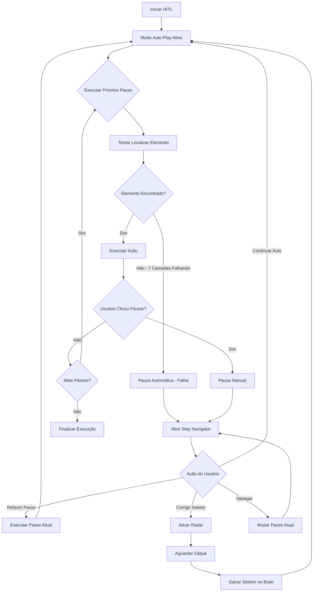

# Design Document

## Overview

Este documento especifica o design técnico para a melhoria do sistema HITL (Human-in-the-Loop) do Senior Training OS. O sistema atual (`validator_hitl.py`) será aprimorado para implementar um modo de operação híbrido com auto-play por padrão, controle manual de pausa, navegação livre entre passos, e esclarecimento dos dois momentos de validação (pré-execução preventiva e pós-execução checkpoint).

A melhoria visa resolver problemas de UX que comprometem a eficácia da validação assistida por humanos, especialmente em roteiros longos onde o analista precisa corrigir apenas passos específicos. O novo design implementa um fluxo mais eficiente onde o sistema executa automaticamente até encontrar falhas reais, permitindo intervenção humana sob demanda.

## Architecture

### Arquitetura Geral

O sistema HITL melhorado mantém a arquitetura existente baseada em Playwright + Python, mas introduz novos componentes de interface e controle de fluxo:

```
┌─────────────────────────────────────────────────────────────────┐
│                    HITL Validator (Enhanced)                    │
├─────────────────────────────────────────────────────────────────┤
│  ┌─────────────────┐  ┌─────────────────┐  ┌─────────────────┐ │
│  │   Auto-Play     │  │  Step Navigator │  │   Radar System  │ │
│  │   Controller    │  │   (Overlay UI)  │  │  (Click Capture)│ │
│  └─────────────────┘  └─────────────────┘  └─────────────────┘ │
├─────────────────────────────────────────────────────────────────┤
│  ┌─────────────────┐  ┌─────────────────┐  ┌─────────────────┐ │
│  │ Pause Button    │  │  Validation     │  │   Persistence   │ │
│  │ (Floating UI)   │  │  Engine         │  │   Manager       │ │
│  └─────────────────┘  └─────────────────┘  └─────────────────┘ │
├─────────────────────────────────────────────────────────────────┤
│                    Existing Components                          │
│  ┌─────────────────┐  ┌─────────────────┐  ┌─────────────────┐ │
│  │  Vision Engine  │  │   Brain DB      │  │  Score Engine   │ │
│  │  (7 Layers)     │  │  (Selectors)    │  │  (Confidence)   │ │
│  └─────────────────┘  └─────────────────┘  └─────────────────┘ │
└─────────────────────────────────────────────────────────────────┘
```

### Fluxo de Execução



## Components and Interfaces

### 1. Auto-Play Controller

**Responsabilidade**: Gerencia o modo de execução automática e controle de pausas.

```python
class AutoPlayController:
    def __init__(self):
        self._is_auto_play: bool = True
        self._pause_requested: bool = False
        self._current_step_index: int = 0
        
    async def execute_continuous(self, steps: List[dict]) -> None:
        """Executa passos continuamente até pausa ou falha"""
        
    def request_pause(self) -> None:
        """Solicita pausa após ação atual"""
        
    def resume_auto_play(self) -> None:
        """Retoma execução automática"""
        
    def is_paused(self) -> bool:
        """Verifica se execução está pausada"""
```

### 2. Step Navigator (Overlay UI)

**Responsabilidade**: Interface visual para navegação e controle de passos quando pausado.

```python
class StepNavigator:
    def __init__(self, page: Page):
        self._page = page
        self._current_step: int = 0
        self._total_steps: int = 0
        self._step_status: Dict[int, str] = {}  # executed, pending, error
        
    async def show_navigator(self, step_info: dict) -> None:
        """Exibe overlay do navegador centralizado"""
        
    async def hide_navigator(self) -> None:
        """Remove overlay do navegador"""
        
    async def update_step_info(self, step_index: int, status: str) -> None:
        """Atualiza informações do passo atual"""
        
    async def wait_for_user_action(self) -> dict:
        """Aguarda decisão do usuário no navegador"""
        
    async def navigate_to_step(self, step_index: int) -> None:
        """Navega para passo específico"""
```

### 3. Floating Pause Button

**Responsabilidade**: Botão flutuante sempre visível para controle manual de pausa.

```python
class FloatingPauseButton:
    def __init__(self, page: Page):
        self._page = page
        self._is_visible: bool = False
        
    async def show_pause_button(self) -> None:
        """Exibe botão de pausa flutuante"""
        
    async def hide_pause_button(self) -> None:
        """Remove botão de pausa"""
        
    async def update_button_state(self, is_paused: bool) -> None:
        """Atualiza visual do botão (pausar/continuar)"""
        
    async def setup_click_handler(self, callback: Callable) -> None:
        """Configura handler para cliques no botão"""
```

### 4. Enhanced Radar System

**Responsabilidade**: Sistema de captura de cliques para correção de seletores.

```python
class EnhancedRadarSystem:
    def __init__(self, page: Page):
        self._page = page
        self._is_active: bool = False
        self._captured_selector: str = ""
        
    async def activate_radar(self) -> None:
        """Ativa modo radar para captura de cliques"""
        
    async def deactivate_radar(self) -> None:
        """Desativa modo radar"""
        
    async def wait_for_click(self) -> str:
        """Aguarda clique do usuário e retorna seletor"""
        
    async def show_visual_feedback(self, element: str) -> None:
        """Exibe feedback visual no elemento clicado"""
```

### 5. Validation Engine

**Responsabilidade**: Gerencia validações preventivas e checkpoints.

```python
class ValidationEngine:
    def __init__(self, gemini_client):
        self._gemini = gemini_client
        self._checkpoint_enabled: bool = True
        self._preventive_enabled: bool = True
        
    async def validate_preventive(self, action: dict, selector: str) -> bool:
        """Validação preventiva antes de executar ação"""
        
    async def validate_checkpoint(self, page: Page, expected_state: str) -> Tuple[bool, str]:
        """Validação checkpoint após executar passo"""
        
    def should_pause_preventive(self, confidence: NivelConfianca, is_auto_play: bool) -> bool:
        """Determina se deve pausar para validação preventiva"""
        
    def should_pause_checkpoint(self, is_auto_play: bool) -> bool:
        """Determina se deve pausar para checkpoint"""
```

### 6. Persistence Manager

**Responsabilidade**: Gerencia persistência de correções e atualização de roteiros.

```python
class PersistenceManager:
    def __init__(self):
        self._corrections: Dict[str, str] = {}  # intencao -> seletor
        
    def save_correction(self, intention: str, selector: str) -> None:
        """Salva correção no mapa in-memory"""
        
    async def persist_to_brain_db(self, intention: str, selector: str) -> None:
        """Persiste seletor no Brain DB"""
        
    async def update_score_engine(self, intention: str) -> None:
        """Atualiza score engine com sucesso"""
        
    def rewrite_roteiro_json(self, json_path: str) -> int:
        """Reescreve roteiro com seletores corrigidos"""
```

## Data Models

### Step Information Model

```python
@dataclass
class StepInfo:
    index: int
    id_passo: int
    tooltip_dap: str
    ancora: str
    acoes_tecnicas: List[dict]
    status: str  # "executed", "pending", "error"
    is_conclusao: bool = False
    screenshot_referencia: Optional[str] = None
```

### User Action Model

```python
@dataclass
class UserAction:
    action_type: str  # "continue_auto", "redo_step", "correct_selector", "skip_to_step", "navigate"
    target_step: Optional[int] = None
    captured_selector: Optional[str] = None
    timestamp: datetime = field(default_factory=datetime.now)
```

### Execution Statistics Model

```python
@dataclass
class ExecutionStats:
    steps_executed: int = 0
    steps_with_error: int = 0
    corrections_saved: int = 0
    manual_pauses: int = 0
    automatic_pauses: int = 0
    interventions: int = 0
```

### Validation Result Model

```python
@dataclass
class ValidationResult:
    is_valid: bool
    confidence: str  # "alta", "media", "baixa"
    observation: str
    screenshot_b64: Optional[str] = None
```

## Correctness Properties

*A property is a characteristic or behavior that should hold true across all valid executions of a system-essentially, a formal statement about what the system should do. Properties serve as the bridge between human-readable specifications and machine-verifiable correctness guarantees.*

### Property 1: Auto-Play Execution Continuity

*For any* valid roteiro without failures, the HITL system should execute continuously in auto-play mode without preventive pauses or checkpoints until completion or manual pause request.

**Validates: Requirements 1.1**

### Property 2: Pause Button Responsiveness

*For any* moment during execution, clicking the pause button should pause the execution immediately after completing the current action and open the Step Navigator.

**Validates: Requirements 1.5**

### Property 3: Navigator Display on Pause

*For any* type of pause (manual or automatic failure), the system should display the Step Navigator as a centered overlay with current step information.

**Validates: Requirements 2.1**

### Property 4: Continue Auto Functionality

*For any* step where the Step Navigator is open, clicking "Continue Auto" should close the navigator and resume automatic execution from the current step.

**Validates: Requirements 2.5**

### Property 5: Step Redo Execution

*For any* step, clicking "Redo Step" should execute all actions of the current step again.

**Validates: Requirements 2.6**

### Property 6: Radar Activation for Selector Correction

*For any* action, clicking "Correct Selector" should activate the Radar system for element remapping.

**Validates: Requirements 2.7**

### Property 7: Step Navigation Accuracy

*For any* valid step number, using "Skip to Step X" should navigate directly to the specified step and update the execution index.

**Validates: Requirements 2.8**

### Property 8: Automatic Pause on Vision Engine Failure

*For any* element that cannot be found after all 7 Vision Engine layers fail, the system should pause automatically and open the Step Navigator with error status.

**Validates: Requirements 3.1**

### Property 9: Automatic Pause on Timeout

*For any* action timeout, the system should pause automatically and open the Step Navigator.

**Validates: Requirements 3.2**

### Property 10: Automatic Pause on Exception

*For any* unhandled execution exception, the system should pause automatically and open the Step Navigator.

**Validates: Requirements 3.3**

### Property 11: Contextual Error Messages

*For any* automatic pause due to failure, the Step Navigator should display a contextual error message describing the specific failure.

**Validates: Requirements 3.4**

### Property 12: Radar Activation and Blocking

*For any* selector correction request, the system should activate the Radar, display the appropriate message, and block execution until user interaction.

**Validates: Requirements 6.1, 6.2**

### Property 13: Selector Capture and Processing

*For any* element clicked while Radar is active, the system should capture the selector using getBestSelector and process it for storage.

**Validates: Requirements 6.3**

### Property 14: Brain DB Persistence

*For any* captured selector, the system should save it to Brain_DB with the intencao_semantica as key and update the score_engine with success=True and confianca_captura=1.0.

**Validates: Requirements 6.4, 6.5**

### Property 15: Action Execution with New Selector

*For any* saved selector, the system should execute the action with the new selector and remove the Radar indicator.

**Validates: Requirements 6.6**

### Property 16: Correction Persistence

*For any* selector correction made during execution, the system should store it in the in-memory corrections map and persist it to Brain_DB.

**Validates: Requirements 9.1, 9.2, 9.6**

### Property 17: Roteiro JSON Update

*For any* execution with corrections, the system should rewrite the roteiro JSON file with corrected selectors and update confidence levels to "alta".

**Validates: Requirements 9.3, 9.4**

## Error Handling

### Failure Categories

1. **Vision Engine Failures**: Quando todas as 7 camadas falham ao localizar um elemento
   - Ação: Pausa automática com Step Navigator
   - Opções: Corrigir seletor, refazer passo, pular para outro passo

2. **Timeout Failures**: Quando uma ação excede o tempo limite
   - Ação: Pausa automática com Step Navigator
   - Opções: Refazer passo, navegar para outro passo

3. **Execution Exceptions**: Exceções não tratadas durante execução
   - Ação: Pausa automática com Step Navigator
   - Log detalhado do erro para debugging

4. **Gemini Vision Failures**: Falhas na validação checkpoint
   - Ação: Continuar execução (não crítico)
   - Log de aviso sem interromper fluxo

5. **Brain DB Failures**: Falhas ao salvar/recuperar seletores
   - Ação: Log de aviso, continuar execução
   - Fallback para seletores originais

### Error Recovery Strategies

```python
class ErrorHandler:
    async def handle_vision_failure(self, action: dict) -> str:
        """Trata falha do Vision Engine"""
        # Pausa automática + Step Navigator com opções de correção
        
    async def handle_timeout(self, action: dict) -> str:
        """Trata timeout de ação"""
        # Pausa automática + opções de retry
        
    async def handle_execution_exception(self, exception: Exception) -> str:
        """Trata exceções de execução"""
        # Log detalhado + pausa automática
        
    def handle_gemini_failure(self, error: Exception) -> None:
        """Trata falhas do Gemini (não críticas)"""
        # Log de aviso, continuar execução
        
    def handle_brain_db_failure(self, error: Exception) -> None:
        """Trata falhas do Brain DB (não críticas)"""
        # Log de aviso, usar seletores originais
```

## Testing Strategy

### Dual Testing Approach

O sistema será testado usando uma combinação de testes unitários e testes baseados em propriedades:

**Unit Tests**: Verificam comportamentos específicos, casos extremos e condições de erro
- Testes de interface do Step Navigator
- Testes de estilos CSS do botão de pausa
- Testes de mensagens específicas
- Testes de integração com componentes existentes

**Property Tests**: Verificam propriedades universais através de múltiplas entradas
- Comportamentos de pausa e retomada
- Navegação entre passos
- Captura e persistência de seletores
- Validações preventivas e checkpoints

### Property Test Configuration

- **Biblioteca**: Hypothesis (Python)
- **Iterações mínimas**: 100 por teste de propriedade
- **Tag format**: **Feature: hitl-validation-improvement, Property {number}: {property_text}**

### Test Categories

1. **Auto-Play Flow Tests**
   - Execução contínua sem falhas
   - Pausa manual via botão
   - Retomada automática

2. **Step Navigator Tests**
   - Exibição em pausas
   - Navegação entre passos
   - Ações de correção

3. **Radar System Tests**
   - Ativação e desativação
   - Captura de seletores
   - Feedback visual

4. **Persistence Tests**
   - Salvamento no Brain DB
   - Atualização do score engine
   - Reescrita do roteiro JSON

5. **Error Handling Tests**
   - Falhas do Vision Engine
   - Timeouts de ação
   - Exceções de execução

### Integration Tests

Testes de integração com componentes existentes:

- **Vision Engine Integration**: Verificar compatibilidade com as 7 camadas
- **Brain DB Integration**: Verificar persistência de seletores
- **Score Engine Integration**: Verificar atualização de confiança
- **Playwright Integration**: Verificar injeção de JavaScript e bindings

### Mock Strategy

Para testes isolados, usar mocks para:
- Playwright Page objects
- Gemini Vision API
- Brain DB operations
- Score Engine updates
- File system operations

### Performance Tests

- **Memory Usage**: Verificar que o sistema não vaza memória durante execuções longas
- **Response Time**: Verificar que pausas e retomadas são responsivas
- **Concurrent Operations**: Verificar que múltiplas operações não interferem

### Regression Tests

Manter compatibilidade com:
- Roteiros existentes
- Brain DB schema
- Score Engine interface
- Dashboard API endpoints