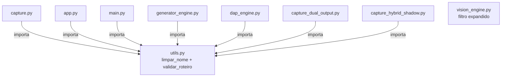

# Design Técnico — Fase 1 de Estabilização do Legado

## Overview

Este documento cobre o design técnico das 9 correções da Fase 1 de Estabilização do Senior Training OS. Todas as mudanças são cirúrgicas: nenhuma altera o schema do roteiro JSON, nenhuma altera o comportamento externo de funções existentes, e todas preservam compatibilidade total com roteiros em `roteiros_salvos/`.

O eixo central das correções é a eliminação de duplicação de código (`limpar_nome`, `validar_roteiro`) e a correção de três bugs de runtime: alucinação de IDs pelo Gemini, coordenadas zeradas no capture, e IDs inválidos no Pinecone. A quarta categoria é a expansão do filtro de seletores no Brain para suportar componentes Angular/PrimeNG.

---

## Architecture

O pipeline permanece inalterado. As mudanças são todas internas aos módulos:



`utils.py` passa a ser a fonte canônica de `limpar_nome` e `validar_roteiro`. Nenhum módulo define mais essas funções localmente. O fluxo de dados do pipeline (captura → roteiro → execução → artefatos) não é alterado.

---

## Components and Interfaces

### Fix 1 — `utils.py`: adicionar `validar_roteiro`

**Arquivo:** `utils.py`  
**Localização:** após a definição de `limpar_nome` (linha ~20)

A função `validar_roteiro` é extraída das implementações idênticas em `capture.py` (`_validar_roteiro`, linha 536) e `app.py` (`_validar_roteiro_app`, linha 209). A lógica é a mesma nos dois módulos — a única diferença são as mensagens de retorno, que serão unificadas na versão canônica.

```python
def validar_roteiro(roteiro: dict) -> tuple[bool, str]:
    """
    Portão de qualidade centralizado. Fonte canônica — não duplicar.
    Critérios:
      - >= 2 passos
      - >= 50% das ações técnicas válidas com seletor_hint preenchido
      - <= 70% das ações técnicas válidas com confianca_captura == 'baixa'
    Ações com acao == 'concluir_video' são ignoradas nos cálculos.
    """
    passos = roteiro.get("passos", [])
    if len(passos) < 2:
        return False, f"Apenas {len(passos)} passo(s) — mapeamento insuficiente."

    total_acoes = acoes_com_seletor = acoes_baixa_conf = 0

    for passo in passos:
        for acao in passo.get("acoes_tecnicas", []):
            if acao.get("acao") == "concluir_video":
                continue
            total_acoes += 1
            alvo = acao.get("elemento_alvo", {})
            if alvo.get("seletor_hint", "").strip():
                acoes_com_seletor += 1
            if alvo.get("confianca_captura") == "baixa":
                acoes_baixa_conf += 1

    if total_acoes == 0:
        return False, "Nenhuma ação técnica válida encontrada."

    pct_seletor = acoes_com_seletor / total_acoes
    pct_baixa   = acoes_baixa_conf  / total_acoes

    if pct_seletor < 0.50:
        return False, f"Apenas {pct_seletor:.0%} das ações tem seletor CSS válido."
    if pct_baixa > 0.70:
        return False, f"{pct_baixa:.0%} das ações com confiança baixa."

    return True, f"{len(passos)} passos, {total_acoes} ações, {pct_seletor:.0%} com seletor."
```

---

### Fix 2 — `capture.py`: centralizar `limpar_nome`

**Arquivo:** `capture.py`  
**Localização:** linha 44 (definição local de `limpar_nome`)

**Antes:**
```python
def limpar_nome(nome: str) -> str:
    return re.sub(r'[\\/*?:"<>|]', "", nome).replace(" ", "_")[:40].strip("_")
```

**Depois:** remover a definição e adicionar ao bloco de imports no topo:
```python
from utils import limpar_nome
```

Nenhuma chamada a `limpar_nome` no módulo precisa ser alterada — a assinatura é idêntica.

---

### Fix 3 — `capture.py`: validação de ID em `_invocar_aura_sync`

**Arquivo:** `capture.py`  
**Função:** `_invocar_aura_sync` (linha 589)  
**Localização exata:** o loop `for i, id_tec in enumerate(passo_ia.get("ids_acoes_tecnicas", [])):`

**Antes:**
```python
for i, id_tec in enumerate(passo_ia.get("ids_acoes_tecnicas", [])):
    acao_bruta = next((item for item in log_mapeador if item["id_acao"] == id_tec), None)
    if acao_bruta:
        passo_mesclado["acoes_tecnicas"].append({...})
```

**Depois:** adicionar `else` com warning antes do `if acao_bruta`:
```python
for i, id_tec in enumerate(passo_ia.get("ids_acoes_tecnicas", [])):
    acao_bruta = next((item for item in log_mapeador if item["id_acao"] == id_tec), None)
    if acao_bruta is None:
        logger.warning(
            f"[Aura] ID alucinado ignorado: id_tec={id_tec!r} não existe no log. "
            f"Aula: {nome_aula!r}"
        )
        continue
    passo_mesclado["acoes_tecnicas"].append({
        "acao": acao_bruta["acao"], "intencao_semantica": acao_bruta["intencao_semantica"],
        "elemento_alvo": acao_bruta["elemento_alvo"], "valor_input": acao_bruta["valor_input"],
        "micro_narracao": micro_narracoes[i] if i < len(micro_narracoes) else "",
    })
```

O `next(..., None)` já estava presente — a mudança é apenas adicionar a verificação explícita com warning e `continue` antes do append, substituindo o `if acao_bruta:` implícito.

---

### Fix 4 — `capture.py`: adicionar `getRectComFallback` ao JS injetado

**Arquivo:** `capture.py`  
**Função:** `_injetar_em_contexto` (linha 127)  
**Localização exata:** dentro de `script_radar`, logo antes da definição de `processarEvento`

**Adição ao script JS** (inserir antes de `const processarEvento = ...`):
```javascript
const getRectComFallback = (el) => {
    let cur = el;
    for (let i = 0; i < 5; i++) {
        if (!cur) break;
        const r = cur.getBoundingClientRect();
        if (r.width > 0 && r.height > 0) return r;
        cur = cur.parentElement;
    }
    return el.getBoundingClientRect();
};
```

**Alteração em `processarEvento`** — substituir a linha de `rect`:

**Antes:**
```javascript
const processarEvento = (target, acao, valor = '') => {
    const rect = target.getBoundingClientRect();
```

**Depois:**
```javascript
const processarEvento = (target, acao, valor = '') => {
    const rect = getRectComFallback(target);
```

Nenhuma outra linha de `processarEvento` é alterada.

---

### Fix 5 — `capture.py`: importar `validar_roteiro` de `utils`

**Arquivo:** `capture.py`  
**Localização:** bloco de imports no topo

Adicionar ao import de utils:
```python
from utils import limpar_nome, validar_roteiro
```

Remover a definição local `_validar_roteiro` (linha 536). Substituir todas as chamadas a `_validar_roteiro(roteiro_final)` por `validar_roteiro(roteiro_final)` — há exatamente uma chamada, dentro de `_invocar_aura_sync`.

---

### Fix 6 — `main.py`: eliminar importação de `app.py`

**Arquivo:** `main.py`  
**Localização:** linhas 48–51 (bloco try/except)

**Antes:**
```python
try:
    from app import limpar_nome
except ImportError:
    def limpar_nome(nome: str) -> str:
        return re.sub(r'[\\/*?:"<>|]', "", nome).replace(" ", "_")[:40].strip("_")
```

**Depois:**
```python
from utils import limpar_nome
```

Nenhuma chamada a `limpar_nome` no módulo precisa ser alterada.

---

### Fix 7 — `app.py`: centralizar `limpar_nome` e `validar_roteiro`

**Arquivo:** `app.py`

**Mudança 1 — imports:** adicionar no bloco de imports existente:
```python
from utils import limpar_nome, validar_roteiro
```

**Mudança 2 — remover definição local** de `limpar_nome` (linha 150):
```python
# REMOVER:
def limpar_nome(nome: str) -> str:
    return re.sub(r'[\\/*?:"<>|]', "", nome).replace(" ", "_")[:40].strip("_")
```

**Mudança 3 — remover definição local** de `_validar_roteiro_app` (linha 209) e substituir todas as chamadas a `_validar_roteiro_app(...)` por `validar_roteiro(...)`. Há exatamente uma chamada no módulo.

---

### Fix 8 — `capture_dual_output.py`: centralizar `limpar_nome`

**Arquivo:** `capture_dual_output.py`  
**Localização:** linha 54

**Antes:**
```python
def limpar_nome(nome: str) -> str:
    return re.sub(r'[\\/*?:"<>|]', "", nome).replace(" ", "_")[:40].strip("_")
```

**Depois:** remover a definição e adicionar ao bloco de imports:
```python
from utils import limpar_nome
```

---

### Fix 9 — `capture_hybrid_shadow.py`: centralizar `limpar_nome` e remover `return` duplicado

**Arquivo:** `capture_hybrid_shadow.py`

**Mudança 1 — centralizar `limpar_nome`** (linha 294):

A implementação local usa limite de 60 chars (divergente do canônico de 40). Isso é um bug silencioso — nomes gerados por este módulo podiam ser mais longos que os de outros módulos para a mesma entrada.

**Antes:**
```python
def limpar_nome(nome):
    return re.sub(r'[\\/*?:"<>|]', "", nome).replace(" ", "_")[:60].strip("_")
```

**Depois:** remover a definição e adicionar ao bloco de imports:
```python
from utils import limpar_nome
```

**Mudança 2 — remover `return fallback` duplicado** em `analisar_semantica_hibrida` (linha ~507):

**Antes:**
```python
if not gemini_client or HYBRID_DISABLE_GEMINI:
    return fallback
    return fallback  # ← linha duplicada — dead code
```

**Depois:**
```python
if not gemini_client or HYBRID_DISABLE_GEMINI:
    return fallback
```

---

### Fix 10 — `generator_engine.py`: centralizar `limpar_nome` e adicionar portão de qualidade

**Arquivo:** `generator_engine.py`

**Mudança 1 — centralizar `limpar_nome`** (linha 19):

**Antes:**
```python
def limpar_nome(nome: str) -> str:
    """Sanitiza o nome para uso como nome de arquivo."""
    return re.sub(r'[\\/*?:"<>|]', "", nome).replace(" ", "_")[:40].strip("_")
```

**Depois:** remover a definição e adicionar ao bloco de imports:
```python
from utils import limpar_nome, validar_roteiro
```

**Mudança 2 — portão de qualidade pós-geração** em `gerar_roteiro_ia_sync`:

**Localização exata:** após o bloco de pós-processamento e persistência (após o `with open(caminho, "w", ...) as f: json.dump(...)`), antes do `return`.

**Inserir:**
```python
    # ── Portão de qualidade semântico (não bloqueia o retorno) ──────────────
    aprovado, motivo_qualidade = validar_roteiro(roteiro_final)
    if not aprovado:
        logger.warning(
            f"[Generator] Portão de qualidade: REPROVADO — {motivo_qualidade}. "
            f"Roteiro salvo em '{caminho}' para revisão manual."
        )
    # ────────────────────────────────────────────────────────────────────────

    return {"status": "sucesso", "arquivo": nome_arquivo, "roteiro": roteiro_final}
```

A função `_validar_estrutura_roteiro` (linha 22) é mantida como verificação estrutural mínima (valida presença de `metadata` e `passos` antes de tentar processar o JSON). O `validar_roteiro` de `utils` é o portão semântico adicional, chamado após a persistência.

---

### Fix 11 — `vision_engine.py`: expandir filtro de seletores no Brain

**Arquivo:** `vision_engine.py`  
**Função:** `_registrar_sucesso_cache` (linha ~142)

**Antes:**
```python
# Descarta seletores muito vagos (nao comecam com text=, [, #)
if seletor and not seletor.startswith(("text=", "[", "#")):
    seletor = None
```

**Depois:**
```python
# Descarta seletores muito vagos — aceita prefixos Angular/PrimeNG e :has-text(
_PREFIXOS_VALIDOS = ("text=", "[", "#", "button.", "p-", "mat-")
if seletor and not seletor.startswith(_PREFIXOS_VALIDOS) and ":has-text(" not in seletor:
    seletor = None
```

Nenhuma outra linha de `_registrar_sucesso_cache` é alterada. As 7 camadas de resiliência do orquestrador não são tocadas.

---

### Fix 12 — `dap_engine.py`: sanitizar ID do vetor Pinecone

**Arquivo:** `dap_engine.py`  
**Função:** `ingestar_para_pinecone` (linha 184)

**Mudança 1 — import:** adicionar ao bloco de imports:
```python
from utils import limpar_nome
```

**Mudança 2 — sanitização do `id_vetor`:**

**Antes:**
```python
id_vetor = f"{nome_aula}_passo_{passo.get('id_passo')}".replace(" ", "_")
```

**Depois:**
```python
id_vetor = f"{limpar_nome(nome_aula)}_passo_{passo.get('id_passo')}"
```

`limpar_nome` remove acentos (via `unicodedata.normalize`), caracteres proibidos e limita a 40 chars — garantindo IDs ASCII puros compatíveis com o Pinecone. O `.replace(" ", "_")` anterior era insuficiente pois não removia acentos nem outros caracteres especiais.

---

## Data Models

Nenhum schema de dados é alterado. O roteiro JSON mantém sua estrutura completa:

```
metadata
  nome_aula, id_treinamento, gerado_por_ia, validado_hitl
configuracao_gravacao
  gravar_video, pasta_destino, voz_ia
passos[]
  id_passo, tipo_passo, peso_narrativo, pause_sugerida
  pedagogia: { ancora, tooltip_dap }
  is_conclusao, alerta_instrutor
  acoes_tecnicas[]
    acao, intencao_semantica, micro_narracao
    elemento_alvo: { label_curto, seletor_hint, iframe_hint, confianca_captura, ... }
    valor_input, validacao_esperada
```

A única mudança de dados é no Pinecone: o `id_vetor` passa a ser ASCII puro (ex: `GED_M01_A01_Setup_de_Pap` em vez de `GED - M01.A01 - Setup de Papéis e Permissões Globais_passo_1`). Vetores existentes com IDs antigos não são afetados — novas ingestões usarão o formato sanitizado.

---

## Correctness Properties

*A property is a characteristic or behavior that should hold true across all valid executions of a system — essentially, a formal statement about what the system should do. Properties serve as the bridge between human-readable specifications and machine-verifiable correctness guarantees.*

### Property 1: `limpar_nome` produz strings ASCII seguras com no máximo 40 chars

*Para qualquer* string de entrada (incluindo strings com acentos, espaços, caracteres proibidos de SO, strings vazias e strings longas), `limpar_nome` deve retornar uma string que: (a) contém apenas caracteres ASCII, (b) não contém nenhum dos chars `\/*?:"<>|`, (c) não contém espaços, (d) tem comprimento máximo de 40 caracteres.

**Validates: Requirements 3.7**

---

### Property 2: `validar_roteiro` aplica os três critérios de qualidade corretamente

*Para qualquer* roteiro gerado aleatoriamente, `validar_roteiro` deve retornar `False` se e somente se pelo menos uma das condições for verdadeira: (a) menos de 2 passos, (b) menos de 50% das ações técnicas válidas têm `seletor_hint` preenchido, (c) mais de 70% das ações técnicas válidas têm `confianca_captura == "baixa"`. Ações com `acao == "concluir_video"` devem ser ignoradas nos cálculos.

**Validates: Requirements 4.2, 4.3, 4.4, 4.5**

---

### Property 3: IDs válidos do `log_mapeador` sempre aparecem no roteiro final

*Para qualquer* `log_mapeador` com N ações e qualquer lista de `ids_acoes_tecnicas` que é subconjunto dos IDs do log, todas as N ações referenciadas devem aparecer no `acoes_tecnicas` do passo correspondente no roteiro final — sem exceção e sem interrupção do processamento.

**Validates: Requirements 1.1, 1.4**

---

### Property 4: IDs ausentes no `log_mapeador` não interrompem o processamento

*Para qualquer* `log_mapeador` e qualquer lista de `ids_acoes_tecnicas` que contém IDs inexistentes no log, o processamento dos IDs válidos deve continuar normalmente, e os IDs inválidos devem ser omitidos do resultado sem lançar exceção.

**Validates: Requirements 1.2, 1.3**

---

### Property 5: Filtro de seletores do Brain aceita prefixos Angular/PrimeNG e `:has-text(`

*Para qualquer* seletor que começa com `text=`, `[`, `#`, `button.`, `p-`, `mat-` ou que contém `:has-text(`, o filtro em `_registrar_sucesso_cache` deve preservar o seletor (não atribuir `None`). Para qualquer seletor que não se enquadra nesses critérios (ex: `div`, `span`, `h1`), o filtro deve descartar o seletor.

**Validates: Requirements 6.1, 6.2, 6.4**

---

### Property 6: `id_vetor` do Pinecone contém apenas caracteres ASCII seguros

*Para qualquer* nome de aula (incluindo nomes com acentos, espaços, caracteres especiais e nomes longos), o `id_vetor` gerado em `ingestar_para_pinecone` deve: (a) conter apenas caracteres ASCII, (b) não conter espaços, (c) seguir o formato `{nome_sanitizado}_passo_{id_passo}`.

**Validates: Requirements 8.2, 8.3, 8.4**

---

### Property 7: `getRectComFallback` retorna rect com dimensões válidas quando existe ancestral com dimensões

*Para qualquer* elemento DOM com `getBoundingClientRect()` retornando `{width: 0, height: 0}` mas com pelo menos um ancestral (até 5 níveis acima) com `width > 0` e `height > 0`, `getRectComFallback` deve retornar o rect do ancestral mais próximo com dimensões válidas.

**Validates: Requirements 5.3, 5.4**

---

## Error Handling

Cada correção tem seu comportamento de erro definido:

**Fix 3 (IDs alucinados):** `logger.warning` com `id_tec` e `nome_aula`. Processamento continua. Nenhuma exceção é lançada.

**Fix 10 (portão de qualidade no generator):** `logger.warning` com o motivo da reprovação. O roteiro é persistido normalmente. O retorno `{"status": "sucesso", ...}` é preservado — o portão não bloqueia o fluxo.

**Fix 11 (filtro de seletores):** seletores inválidos são silenciosamente descartados (`seletor = None`), comportamento idêntico ao atual para os casos não cobertos.

**Fix 12 (ID Pinecone):** `limpar_nome` nunca lança exceção — strings vazias retornam string vazia, o que resulta em `_passo_{id}` como ID. Isso é aceitável e não causa crash no Pinecone.

**Fix 9 (return duplicado):** remoção de dead code — sem impacto em error handling.

---

## Testing Strategy

### Abordagem dual

Cada correção requer testes unitários para exemplos concretos e testes de propriedade para cobertura universal. Os dois são complementares.

**Testes unitários** cobrem:
- Exemplos específicos de `limpar_nome` com strings conhecidas (acentos, chars proibidos, strings longas)
- Exemplos de `validar_roteiro` com roteiros concretos (aprovado, reprovado por cada critério)
- Verificação de que `main.py` não carrega `app` em `sys.modules` após importação
- Verificação de que `analisar_semantica_hibrida` retorna `fallback` quando `gemini_client is None`
- Verificação de que `generator_engine` persiste o roteiro mesmo quando `validar_roteiro` reprova

**Testes de propriedade** cobrem as 7 properties definidas acima.

### Biblioteca de property-based testing

Usar **Hypothesis** (já presente no projeto — evidenciado pelo diretório `.hypothesis/` na raiz).

Configuração mínima: 100 iterações por property (`@settings(max_examples=100)`).

### Formato de tag

Cada teste de propriedade deve incluir um comentário de rastreabilidade:

```
# Feature: legacy-stabilization, Property {N}: {texto_da_property}
```

### Exemplos de implementação

```python
# Feature: legacy-stabilization, Property 1: limpar_nome produz strings ASCII seguras com no máximo 40 chars
@given(st.text(min_size=0, max_size=200))
@settings(max_examples=100)
def test_limpar_nome_ascii_safe(nome):
    resultado = limpar_nome(nome)
    assert len(resultado) <= 40
    assert resultado.isascii()
    assert " " not in resultado
    for c in r'\/*?:"<>|':
        assert c not in resultado
```

```python
# Feature: legacy-stabilization, Property 2: validar_roteiro aplica os três critérios corretamente
@given(roteiros_aleatorios())
@settings(max_examples=100)
def test_validar_roteiro_criterios(roteiro):
    aprovado, motivo = validar_roteiro(roteiro)
    passos = roteiro.get("passos", [])
    acoes_validas = [
        a for p in passos
        for a in p.get("acoes_tecnicas", [])
        if a.get("acao") != "concluir_video"
    ]
    if len(passos) < 2:
        assert not aprovado
    elif acoes_validas:
        pct_seletor = sum(1 for a in acoes_validas if a.get("elemento_alvo", {}).get("seletor_hint", "").strip()) / len(acoes_validas)
        pct_baixa   = sum(1 for a in acoes_validas if a.get("elemento_alvo", {}).get("confianca_captura") == "baixa") / len(acoes_validas)
        if pct_seletor < 0.50 or pct_baixa > 0.70:
            assert not aprovado
```

```python
# Feature: legacy-stabilization, Property 5: filtro de seletores aceita prefixos Angular/PrimeNG
@given(st.sampled_from(["button.p-button", "p-dropdown", "mat-select", "text=Salvar", "[aria-label='x']", "#meu-id", "div:has-text('ok')"]))
@settings(max_examples=100)
def test_filtro_seletores_validos(seletor):
    _PREFIXOS_VALIDOS = ("text=", "[", "#", "button.", "p-", "mat-")
    deve_preservar = seletor.startswith(_PREFIXOS_VALIDOS) or ":has-text(" in seletor
    resultado = None if (seletor and not seletor.startswith(_PREFIXOS_VALIDOS) and ":has-text(" not in seletor) else seletor
    assert resultado == seletor  # todos os casos acima devem ser preservados
```

```python
# Feature: legacy-stabilization, Property 6: id_vetor contém apenas caracteres ASCII seguros
@given(st.text(min_size=1, max_size=100), st.integers(min_value=1, max_value=50))
@settings(max_examples=100)
def test_id_vetor_ascii_seguro(nome_aula, id_passo):
    id_vetor = f"{limpar_nome(nome_aula)}_passo_{id_passo}"
    assert id_vetor.isascii()
    assert " " not in id_vetor
```
