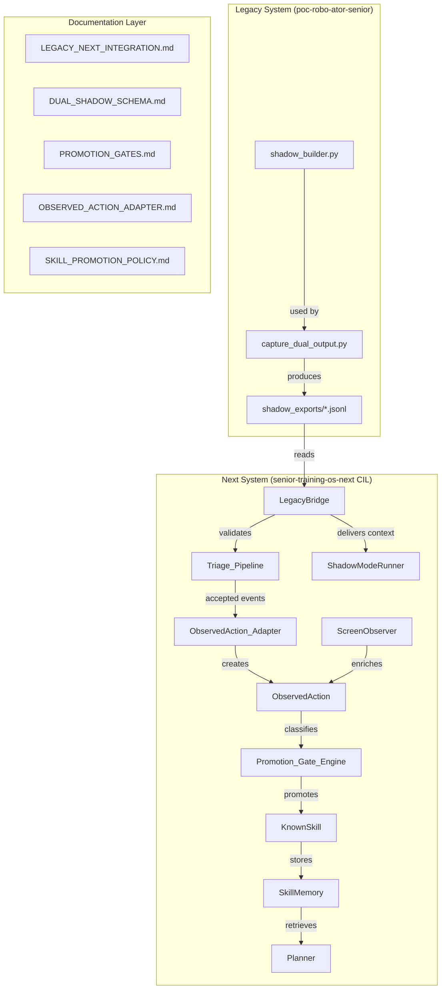
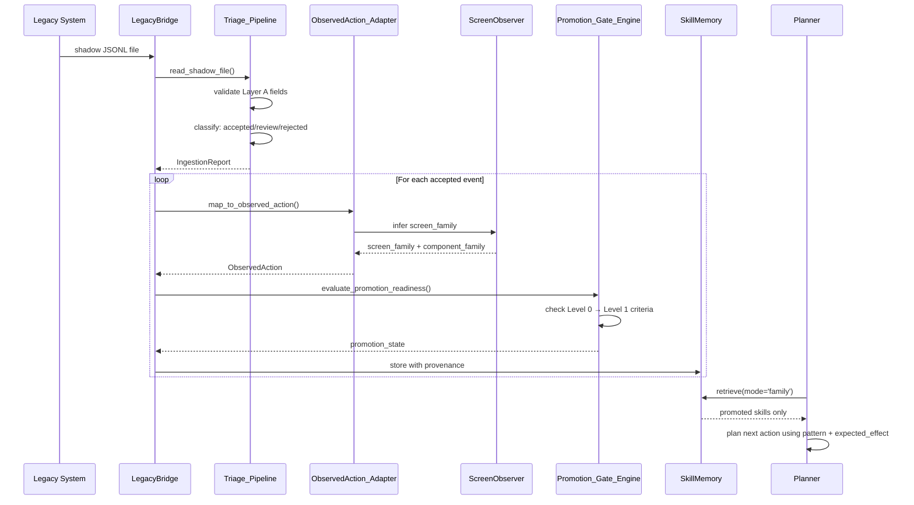

# Design Document: Next-Legacy Diamond Integration

## Overview

This design establishes a formal, governed integration bridge between the Legacy operational system (`poc-robo-ator-senior`) and the Next semantic brain system (`senior-training-os-next` CIL module). The integration enables the Next system to consume real operational evidence from Legacy dual-capture JSONL, convert it into canonical contracts, classify knowledge maturity through explicit promotion gates, and close the feedback loop between the current production factory and the future semantic brain.

### Key Design Principles

1. **Formal Contracts**: Every data exchange between Legacy and Next is governed by explicit, documented contracts
2. **Layered Schema**: Shadow data is organized into three semantic layers (observation, interpretation, quality)
3. **Explicit Governance**: Promotion gates enforce maturity thresholds before knowledge becomes reusable
4. **Effect-Centric**: Expected vs. observed effects are first-class citizens in the integration
5. **Noise Tolerance**: The system gracefully handles imperfect data with clear triage and review workflows

### Integration Scope

**In Scope:**
- Formal ingestion contract between `capture_dual_output.py` and Next system
- Canonical three-layer shadow schema
- Four-level promotion gate system
- Evolved `KnownSkill` and `SkillMemory` with full provenance
- Mature `LegacyBridge` adapter with rich context delivery
- Formal `ObservedAction` adapter with field mapping
- Promotion benchmark policy with quantified thresholds
- Batch ingestion and triage pipeline
- Screen family classification in `ScreenObserver`
- Planner enrichment with dual capture patterns
- Five official integration documentation files

**Out of Scope:**
- Total rewrite of either Legacy or Next system
- Immediate production promotion of all skills
- Implementation of the final generalist brain
- Real-time streaming ingestion (batch-only for now)
- Automatic HITL approval workflows

---

## Architecture

### High-Level Data Flow



### Component Interaction Sequence



---

## Components and Interfaces

### 1. LegacyBridge

**Responsibility**: Adapter between Legacy shadow JSONL and Next canonical contracts.

**Public Interface**:

```python
class LegacyBridge:
    """
    Formal adapter for reading Legacy shadow JSONL and mapping to Next contracts.
    Implements the ingestion contract defined in docs/LEGACY_NEXT_INTEGRATION.md.
    """
    
    def read_shadow_file(self, path: str) -> list[dict]:
        """
        Reads a shadow JSONL file from shadow_exports/, validates each line
        against the canonical shadow schema, and returns validated event dicts.
        
        Args:
            path: Absolute or relative path to shadow JSONL file
            
        Returns:
            List of validated shadow event dicts
            
        Raises:
            FileNotFoundError: If path does not exist
            ValidationError: If any event fails Layer A validation
        """
        pass
    
    def map_to_observed_action(self, shadow_event: dict) -> ObservedAction:
        """
        Converts a validated shadow event to a fully populated ObservedAction contract.
        Delegates field mapping to ObservedAction_Adapter.
        
        Args:
            shadow_event: Validated shadow event dict from read_shadow_file()
            
        Returns:
            ObservedAction with all fields populated from shadow event
        """
        pass
    
    def lookup_by_event_id(self, event_id: int, source_file: str) -> dict | None:
        """
        Retrieves a specific shadow event by its id_acao from a given source file.
        
        Args:
            event_id: The id_acao value to search for
            source_file: Path to shadow JSONL file
            
        Returns:
            Shadow event dict if found, None otherwise
        """
        pass
    
    def lookup_by_skill_candidate_id(self, skill_id: str) -> dict | None:
        """
        Retrieves the originating shadow event for a given skill candidate.
        Uses provenance metadata stored in KnownSkill.
        
        Args:
            skill_id: The skill candidate identifier
            
        Returns:
            Original shadow event dict if found, None otherwise
        """
        pass
    
    def deliver_comparative_context(
        self, 
        shadow_event: dict, 
        observed_action: ObservedAction
    ) -> dict:
        """
        Delivers rich comparative context to ShadowModeRunner for effect comparison.
        
        Args:
            shadow_event: Original shadow event
            observed_action: Mapped ObservedAction
            
        Returns:
            Dict containing:
                - original_shadow: The shadow event
                - mapped_action: The ObservedAction
                - screen_family: Inferred screen family
                - component_family: Inferred component family
                - expected_effect: From validacao_esperada.alvo
                - observed_effect: Inferred from screenshot delta (if available)
        """
        pass
```

**Internal Responsibilities**:
- Schema validation against canonical three-layer schema
- Provenance tracking (source file, event ID, timestamp)
- Structured logging for missing fields
- Integration with Triage_Pipeline for classification

---

### 2. Triage_Pipeline

**Responsibility**: Batch ingestion with noise tolerance and clear diagnostics.

**Public Interface**:

```python
@dataclass
class IngestionReport:
    """Structured report from shadow JSONL ingestion."""
    total_events: int
    accepted_count: int
    review_count: int
    rejected_count: int
    rejected_events: list[dict]  # [{id_acao, reason}, ...]
    review_events: list[dict]    # [{id_acao, missing_fields}, ...]
    source_file: str
    ingested_at: str  # ISO 8601 timestamp


class Triage_Pipeline:
    """
    Batch ingestion pipeline with noise tolerance and structured diagnostics.
    Classifies events as accepted, review, or rejected based on schema validation.
    """
    
    def ingest_shadow_file(self, path: str) -> IngestionReport:
        """
        Reads a shadow JSONL file, classifies each event, returns structured report.
        Tolerates up to 30% review events without raising exception.
        
        Classification rules:
        - accepted: Passes Layer A validation, is_noise=false
        - review: Missing Layer B fields or is_noise=true
        - rejected: Fails Layer A validation (missing id_acao, captured_at, malformed JSON)
        
        Args:
            path: Path to shadow JSONL file
            
        Returns:
            IngestionReport with counts and diagnostic details
            
        Raises:
            ValueError: If review rate exceeds 30%
        """
        pass
    
    def ingest_shadow_directory(self, directory: str) -> list[IngestionReport]:
        """
        Processes multiple shadow JSONL files in a single batch call.
        
        Args:
            directory: Path to directory containing shadow JSONL files
            
        Returns:
            List of IngestionReport, one per file
        """
        pass
    
    def _classify_event(self, event: dict) -> tuple[str, str | None]:
        """
        Internal classification logic.
        
        Returns:
            (classification, reason) where classification is 'accepted', 'review', or 'rejected'
        """
        pass
```

**Logging Strategy**:
- INFO level: Every 10 events processed with running counts
- WARNING level: Each review event with specific missing fields
- ERROR level: Each rejected event with validation failure reason

---

### 3. ObservedAction_Adapter

**Responsibility**: Formal field mapping from shadow JSONL to ObservedAction contract.

**Public Interface**:

```python
class ObservedAction_Adapter:
    """
    Formal adapter implementing the field mapping contract defined in
    docs/OBSERVED_ACTION_ADAPTER.md.
    """
    
    def adapt(self, shadow_event: dict) -> ObservedAction:
        """
        Converts shadow event to ObservedAction with full field mapping.
        
        Field Mapping:
        - elemento_alvo.seletor_hint → raw_target.selector
        - elemento_alvo.screenshot_referencia → screen_before (base64)
        - validacao_esperada.alvo vs observed_effect → state_change
        - elemento_alvo.html_hint + coordenadas_relativas → artifacts
        - elemento_alvo.confianca_captura → confidence (alta=0.9, media=0.6, baixa=0.3)
        - id_acao + source_file + captured_at → provenance
        
        Special handling:
        - If is_noise=true, set confidence=0.1 and review_required=true
        
        Args:
            shadow_event: Validated shadow event dict
            
        Returns:
            ObservedAction with all fields populated
        """
        pass
    
    def _map_confidence(self, confianca_captura: str, is_noise: bool) -> float:
        """Maps Legacy confidence levels to Next confidence scores."""
        pass
    
    def _infer_state_change(
        self, 
        expected_effect: str, 
        observed_effect: str | None
    ) -> dict:
        """Derives state_change from effect comparison."""
        pass
```

---

### 4. Promotion_Gate_Engine

**Responsibility**: Explicit maturity classification and promotion logic.

**Public Interface**:

```python
class Promotion_Gate_Engine:
    """
    Implements the four-level promotion gate system defined in docs/PROMOTION_GATES.md.
    
    Levels:
    - Level 0: raw_shadow (just ingested)
    - Level 1: reviewed_shadow (sufficient context)
    - Level 2: skill_candidate (clear pattern + semantic action)
    - Level 3: promoted_skill (passes benchmark policy)
    """
    
    def evaluate_promotion_readiness(
        self, 
        shadow_record: dict | ObservedAction
    ) -> tuple[int, str]:
        """
        Evaluates which promotion level a record qualifies for.
        
        Args:
            shadow_record: Shadow event dict or ObservedAction
            
        Returns:
            (level, promotion_state) where level is 0-3 and promotion_state is
            'raw_shadow', 'reviewed_shadow', 'skill_candidate', or 'promoted_skill'
        """
        pass
    
    def promote_to_level_1(self, record: dict) -> bool:
        """
        Level 0 → Level 1 criteria:
        - Non-empty screen_family
        - Non-empty component_family
        - is_noise = false
        - confianca_captura in ['media', 'alta']
        - Non-empty intencao_semantica
        
        Returns:
            True if promotion succeeds, False otherwise
        """
        pass
    
    def promote_to_level_2(self, record: dict, history: list[dict]) -> bool:
        """
        Level 1 → Level 2 criteria:
        - Clear semantic_action (not 'navigate' or 'unknown')
        - Non-empty business_entity
        - Non-empty screen_family
        - At least 2 occurrences of same pattern_detectado for same business_target
        
        Args:
            record: Current shadow record
            history: Historical records for pattern frequency analysis
            
        Returns:
            True if promotion succeeds, False otherwise
        """
        pass
    
    def promote_to_level_3(
        self, 
        skill_candidate: KnownSkill, 
        benchmark: PromotionBenchmark
    ) -> bool:
        """
        Level 2 → Level 3 criteria (from Promotion_Benchmark):
        - Success rate >= 70%
        - Semantic target consistency across >= 3 events
        - Pattern stability >= 80%
        - Average confidence >= 0.6
        - Post-HITL correction rate < 20% (if HITL performed)
        - Expected/observed effect coherence >= 60%
        
        Args:
            skill_candidate: KnownSkill at Level 2
            benchmark: PromotionBenchmark with threshold checks
            
        Returns:
            True if promotion succeeds, False otherwise
        """
        pass
    
    def record_gate_failure(
        self, 
        record: dict, 
        level: int, 
        reason: str
    ) -> None:
        """
        Records specific failing criterion in gate_failure_reason field.
        
        Args:
            record: Shadow record or skill candidate
            level: Target promotion level that failed
            reason: Specific criterion that failed
        """
        pass
```

---

### 5. ScreenObserver (Enhanced)

**Responsibility**: Screen family classification with controlled vocabulary.

**Public Interface**:

```python
class ScreenObserver:
    """
    Enhanced screen classification with explicit family vocabulary.
    Integrates with LegacyBridge to enrich ObservedAction contracts.
    """
    
    SCREEN_FAMILIES = [
        "ged_list",
        "ged_form",
        "ged_tree",
        "sign_inbox",
        "sign_envelope",
        "erp_form",
        "erp_list",
        "modal_confirm",
        "modal_form",
        "shell_navigation",
        "unknown"
    ]
    
    def classify_screen(
        self, 
        screenshot: str | bytes, 
        page_title: str, 
        url_hint: str
    ) -> tuple[str, bool]:
        """
        Assigns a screen_family value from controlled vocabulary.
        
        Args:
            screenshot: Base64 image or bytes
            page_title: Page title from shadow event
            url_hint: URL from shadow event
            
        Returns:
            (screen_family, review_required) where screen_family is from
            SCREEN_FAMILIES and review_required=True if confidence is low
        """
        pass
    
    def infer_component_family(
        self, 
        seletor_hint: str, 
        tag: str, 
        label: str
    ) -> str:
        """
        Infers component family from selector and tag hints.
        
        Component families:
        - toolbar_button
        - context_menu_item
        - tree_node
        - form_input
        - checkbox_row
        - table_row
        - modal_button
        - unknown
        
        Args:
            seletor_hint: CSS selector from shadow event
            tag: HTML tag from shadow event
            label: Label text from shadow event
            
        Returns:
            Component family string
        """
        pass
```

---

### 6. SkillMemory (Evolved)

**Responsibility**: Storage and retrieval with full provenance and governance metadata.

**Public Interface**:

```python
class SkillMemory:
    """
    Evolved skill storage with provenance, governance, and flexible retrieval modes.
    """
    
    def store(self, skill: KnownSkill) -> None:
        """
        Stores a KnownSkill with full provenance and governance metadata.
        
        Args:
            skill: KnownSkill with all required fields
        """
        pass
    
    def retrieve(
        self, 
        mode: str, 
        **criteria
    ) -> list[KnownSkill]:
        """
        Retrieves skills using one of three modes:
        
        - 'exact': Strict fingerprint match (requires fingerprint kwarg)
        - 'family': Match by screen_family + component_family
        - 'pattern': Match by pattern_detectado + semantic_action
        
        Only returns skills with promotion_state in ['skill_candidate', 'promoted_skill'].
        
        Args:
            mode: One of 'exact', 'family', 'pattern'
            **criteria: Mode-specific search criteria
            
        Returns:
            List of matching KnownSkill records
        """
        pass
    
    def increment_success(self, skill_id: str) -> None:
        """
        Increments success_count and updates last_seen timestamp.
        
        Args:
            skill_id: Skill identifier
        """
        pass
    
    def increment_failure(self, skill_id: str) -> None:
        """
        Increments failure_count, updates last_seen, and sets review_required=true
        if failure_count exceeds success_count.
        
        Args:
            skill_id: Skill identifier
        """
        pass
```

---

### 7. Planner (Enriched)

**Responsibility**: Action planning enriched with dual capture patterns.

**Enhanced Interface**:

```python
class Planner:
    """
    Planner enriched with pattern_detectado and screen_family from promoted skills.
    """
    
    def plan_next_action(
        self, 
        current_state: dict, 
        goal: str
    ) -> PlannedAction:
        """
        Plans next action using promoted skills with matching screen_family and semantic_action.
        
        Enhancement:
        - Filters candidate actions by screen_family + semantic_action
        - Ranks by promotion_state (promoted_skill > skill_candidate)
        - Uses expected_effect from promoted skill as validation target
        - Logs source_stage and promotion_state at DEBUG level
        
        Args:
            current_state: Current screen state
            goal: Target goal
            
        Returns:
            PlannedAction with validation target from promoted skill
        """
        pass
```

---

## Data Models

### Canonical Shadow Schema (Three Layers)

#### Layer A: Raw Observation

Fields captured directly from user interaction without interpretation:

```python
{
    "id_acao": int,              # Sequential action ID
    "captured_at": str,          # ISO 8601 timestamp
    "acao": str,                 # Raw action type (click, fill, etc.)
    "capture_scope": str,        # "shell" or "module_iframe"
    "seletor_hint": str,         # CSS selector
    "iframe_hint": str | None,   # Iframe identifier
    "html_hint": str,            # HTML snapshot (truncated)
    "coordenadas_relativas": {   # Relative coordinates
        "x_pct": float,
        "y_pct": float,
        "w_pct": float,
        "h_pct": float
    },
    "screenshot_referencia": str | None,  # Base64 screenshot
    "valor_input": str,          # Input value (for fill actions)
    "page_title": str,           # Page title
    "url_hint": str              # Page URL
}
```

#### Layer B: Interpretation

Fields derived from semantic analysis and pattern recognition:

```python
{
    "semantic_action": str,      # Controlled vocabulary: fill, search, confirm, delete, save, open, navigate, select, close
    "business_entity": str,      # Business domain entity: pasta, documento, campo, menu, etc.
    "business_target": str,      # Label/description of target element
    "pattern_detectado": str,    # UI pattern: menu_navigation, form_fill, button_click, table_selection, etc.
    "intencao_semantica": str,   # Human-readable intent
    "screen_family": str,        # Screen classification (from ScreenObserver)
    "component_family": str,     # Component classification (from ScreenObserver)
    "expected_effect": str       # What should change (from validacao_esperada.alvo)
}
```

#### Layer C: Quality Evidence

Fields indicating confidence, noise, and promotion readiness:

```python
{
    "confianca_captura": str,    # "alta", "media", "baixa"
    "is_noise": bool,            # True if event is likely noise
    "missing_signals": list[str], # List of missing Layer B fields
    "observed_effect": str | None, # What actually changed (inferred from screenshot delta)
    "promotion_readiness": bool,  # True if ready for Level 1 promotion
    "review_required": bool       # True if human review needed
}
```

---

### ObservedAction Contract

```python
@dataclass
class ObservedAction:
    """
    Canonical contract representing a single observed user interaction.
    Populated by ObservedAction_Adapter from shadow JSONL events.
    """
    
    # Core identification
    action_id: str                    # Unique identifier
    action_type: str                  # Semantic action (from Layer B)
    
    # Target information
    raw_target: dict                  # {selector, tag, label}
    screen_before: str | None         # Base64 screenshot
    
    # State and effects
    state_change: dict                # {expected, observed, coherent}
    artifacts: dict                   # {html_hint, coords, iframe_hint}
    
    # Quality and confidence
    confidence: float                 # 0.0 to 1.0
    is_noise: bool                    # From Layer C
    review_required: bool             # From Layer C
    
    # Semantic context
    screen_family: str                # From ScreenObserver
    component_family: str             # From ScreenObserver
    pattern: str                      # pattern_detectado
    business_entity: str              # From Layer B
    business_target: str              # From Layer B
    
    # Provenance
    provenance: dict                  # {source_file, event_id, captured_at}
```

---

### KnownSkill Contract (Evolved)

```python
@dataclass
class KnownSkill:
    """
    Evolved contract representing a reusable, promoted skill.
    Includes full provenance and governance metadata.
    """
    
    # Core identification
    skill_id: str                     # Unique identifier
    skill_name: str                   # Human-readable name
    
    # Semantic classification
    semantic_action: str              # From Layer B
    business_entity: str              # From Layer B
    screen_family: str                # From ScreenObserver
    component_family: str             # From ScreenObserver
    pattern: str                      # pattern_detectado
    
    # Effect specification
    expected_effect: str              # Most common expected_effect from contributing events
    
    # Execution data
    selector: str                     # Primary selector
    fallback_selectors: list[str]     # Alternative selectors
    
    # Quality metrics
    success_count: int                # Successful executions
    failure_count: int                # Failed executions
    average_confidence: float         # Average confidence across contributing events
    
    # Governance
    promotion_state: str              # "raw_shadow", "reviewed_shadow", "skill_candidate", "promoted_skill"
    source_stage: str                 # "legacy_import", "dual_shadow", "runtime_learning", "hitl_promoted"
    review_required: bool             # True if needs human review
    
    # Provenance
    provenance: dict                  # {original_event_id, source_file, contributing_events}
    
    # Timestamps
    created_at: str                   # ISO 8601
    last_seen: str                    # ISO 8601
    last_validated_at: str | None     # ISO 8601 or null
```

---

### PromotionBenchmark

```python
@dataclass
class PromotionBenchmark:
    """
    Quantified thresholds for Level 2 → Level 3 promotion.
    Defined in docs/SKILL_PROMOTION_POLICY.md.
    """
    
    min_success_rate: float = 0.70              # 70% success rate
    min_semantic_consistency_events: int = 3    # 3 distinct events
    min_pattern_stability: float = 0.80         # 80% pattern consistency
    min_average_confidence: float = 0.60        # 0.6 average confidence
    max_hitl_correction_rate: float = 0.20      # 20% HITL correction rate
    min_effect_coherence: float = 0.60          # 60% effect coherence
    
    def evaluate(self, skill_candidate: KnownSkill) -> tuple[bool, list[str]]:
        """
        Evaluates all benchmark criteria.
        
        Returns:
            (passes, failing_criteria) where passes is True if all criteria met,
            and failing_criteria is list of criterion names that failed
        """
        pass
```

---

## Correctness Properties

*A property is a characteristic or behavior that should hold true across all valid executions of a system—essentially, a formal statement about what the system should do. Properties serve as the bridge between human-readable specifications and machine-verifiable correctness guarantees.*

Before writing correctness properties, I need to analyze the acceptance criteria for testability using the prework tool.

