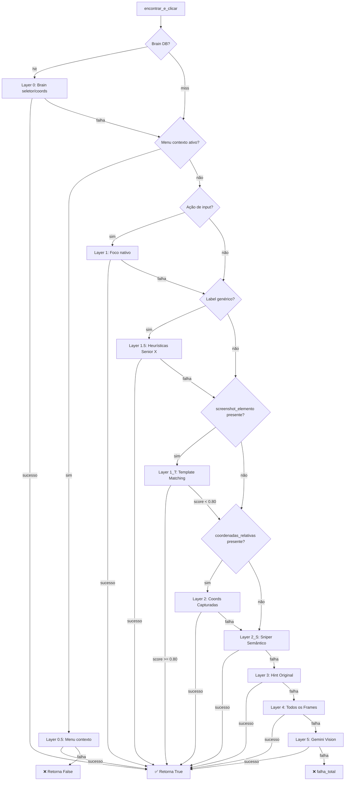

# Design Técnico — Roadmap de Resiliência do Playback

## Visão Geral

Este documento descreve o design técnico para o **Roadmap de Resiliência do Playback** do Senior Training OS. O objetivo central é reduzir drasticamente a taxa de intervenção HITL (Human-In-The-Loop) através de duas mudanças de alto impacto imediato — reordenação da cascata e template matching visual — complementadas por melhorias em qualidade de captura, observabilidade, pipeline de mídia e geração semântica.

### Problema Raiz

O `vision_engine.py` percorre até 9 camadas de fallback durante 60–90 segundos antes de falhar. As coordenadas de clique — que o operador HITL usa com sucesso imediato — estão na Layer 6 da cascata atual. A análise diagnóstica identificou que:

- **60%+ dos casos de HITL** podem ser eliminados apenas reordenando a cascata (coordenadas para Layer 2, timeout Sniper para 800ms)
- **90%+ dos casos** podem ser resolvidos em 200ms com template matching visual como Layer 1

### Impacto Esperado

| Mudança | Redução de HITL | Tempo de Resolução |
|---|---|---|
| Reordenação da cascata (Req 1+2) | ~60% | < 2s |
| Template matching visual (Req 3+4) | ~90% | < 200ms |
| Telemetria + alertas (Req 5+8+9+10) | Observabilidade | — |
| Estabilidade de áudio (Req 11) | Qualidade | — |
| Score de confiabilidade (Req 12) | Reuso | — |

---

## Arquitetura

### Cascata de Seletores — Estado Atual vs. Proposto

```
ESTADO ATUAL                          ESTADO PROPOSTO
─────────────────────────────────     ─────────────────────────────────
Layer 0   : Brain DB (seletor)        Layer 0   : Brain DB (seletor)
Layer 0   : Brain DB (coords)         Layer 0   : Brain DB (coords)
Layer 0.5 : Menu de contexto          Layer 0.5 : Menu de contexto
Layer 1   : Foco nativo (inputs)      Layer 1   : Foco nativo (inputs)
Layer 1.5 : Heurísticas Senior X      Layer 1.5 : Heurísticas Senior X
Layer 2   : Sniper Semântico          Layer 1_T : Template Matching ← NOVO
Layer 3   : Hint Original             Layer 2   : Coords Capturadas  ← MOVIDO
Layer 4   : Todos os Frames           Layer 2_S : Sniper Semântico
Layer 5   : Gemini Vision             Layer 3   : Hint Original
                                      Layer 4   : Todos os Frames
                                      Layer 5   : Gemini Vision
```

### Diagrama de Fluxo da Cascata Proposta



### Módulos Afetados

| Módulo | Mudanças |
|---|---|
| `vision_engine.py` | Cascata reordenada, Template_Matcher, timeout Sniper, telemetria expandida, alertas HITL |
| `capture.py` | Captura de `screenshot_elemento` e `coordenadas_absolutas` |
| `app.py` | Endpoint `/api/metricas` expandido com `vision_layers`, `taxa_hitl_1h`, `top_falhas`, `acoes_requer_revisao` |
| `main.py` | `asyncio.Lock` no manifesto de áudio |
| `generator_engine.py` | Ordenação por `_score_confiabilidade`, filtro `requer_revisao` |
| `brain.db` | Migração de schema: `telemetria_camadas` com `timestamp` e `intencao_semantica` |

---

## Componentes e Interfaces

### Componente 1: Template_Matcher

Novo componente em `vision_engine.py` responsável pelo matching visual entre o screenshot do elemento capturado e a tela atual.

**Interface:**

```python
def template_match(
    referencia: bytes,           # JPEG do elemento capturado no capture
    tela_atual: bytes,           # JPEG da tela atual (capturado uma vez por execução)
    coords_relativas: Optional[dict],  # Para janela de busca regional ±20%
    viewport: dict,              # {"width": int, "height": int}
    threshold: float = 0.80,
) -> Optional[dict]:
    """
    Retorna {"x": int, "y": int, "score": float} se match encontrado,
    ou None se score < threshold.
    
    Estratégia:
    1. Converte referencia e tela_atual para numpy arrays via Pillow
    2. Se coords_relativas fornecido, recorta janela ±20% do viewport
    3. Aplica cv2-like normalized cross-correlation via NumPy
    4. Se score >= threshold na janela regional, retorna coords absolutas
    5. Caso contrário, busca na tela inteira
    6. Retorna None se score < threshold em ambas as buscas
    """
```

**Algoritmo de Similaridade (Pillow + NumPy, sem OpenCV):**

```python
# Pseudo-código do algoritmo NCC (Normalized Cross-Correlation) com NumPy
def _ncc_score(template: np.ndarray, region: np.ndarray) -> float:
    # Normaliza ambas as imagens para média zero, desvio padrão 1
    t = (template - template.mean()) / (template.std() + 1e-8)
    r = (region - region.mean()) / (region.std() + 1e-8)
    # Correlação cruzada normalizada
    return float(np.sum(t * r) / t.size)
```

Para busca de posição (sliding window), usa `np.lib.stride_tricks` para eficiência sem dependência de OpenCV.

**Integração na cascata:**

```python
# Em encontrar_e_clicar(), após Layer 1.5 e antes de Layer 2 (coords):
screenshot_elemento_path = alvo.get("screenshot_elemento")
if screenshot_elemento_path:
    ref_bytes = _resolver_screenshot_ref(screenshot_elemento_path)
    if ref_bytes and screenshot_atual:  # screenshot_atual capturado uma vez
        resultado_tm = template_match(
            referencia=ref_bytes,
            tela_atual=screenshot_atual,
            coords_relativas=coords_relativas,
            viewport=page.viewport_size or {"width": 1920, "height": 1080},
        )
        if resultado_tm:
            coords_tm = {"x": resultado_tm["x"], "y": resultado_tm["y"]}
            if await _clicar_por_coordenadas(page, coords_tm, acao, valor):
                _registrar_telemetria("1_template_matching", True)
                _registrar_estrategia_vencedora(intencao, "1_template_matching")
                return True
        _registrar_telemetria("1_template_matching", False)
```

### Componente 2: Captura de screenshot_elemento

Modificação em `capture.py` na função `on_capturar_elemento`.

**Campos adicionados ao roteiro:**

```json
{
  "elemento_alvo": {
    "coordenadas_absolutas": {"x": 842, "y": 315},
    "coordenadas_relativas": {"x_pct": 0.4385, "y_pct": 0.2917},
    "screenshot_elemento": "audios_gerados/NomeAula/screenshots/elemento_acao_3.jpg"
  }
}
```

**Lógica de captura:**

```python
# Após capturar screenshot_bytes (tela inteira), capturar screenshot do elemento:
screenshot_elemento_ref = None
if locator_elemento and _nome_aula_sessao:
    try:
        elem_bytes = await locator_elemento.screenshot(type="jpeg", quality=85)
        pasta_elem = os.path.join("audios_gerados", limpar_nome(_nome_aula_sessao), "screenshots")
        os.makedirs(pasta_elem, exist_ok=True)
        elem_path = os.path.join(pasta_elem, f"elemento_acao_{meu_id_acao}.jpg")
        with open(elem_path, "wb") as f:
            f.write(elem_bytes)
        screenshot_elemento_ref = elem_path
    except Exception as e:
        logger.warning(f"[FOTO {meu_id_acao}] screenshot_elemento falhou: {e}")
        screenshot_elemento_ref = None
```

**Nota sobre `locator_elemento`:** O evento `on_capturar_elemento` recebe `args` com o seletor capturado. O locator é construído a partir de `dados["seletor"]` via `page_ref.locator(dados["seletor"]).first`.

### Componente 3: Telemetria Expandida

**Migração de schema do `brain.db`:**

```sql
-- Tabela existente (sem alteração de colunas existentes):
-- telemetria_camadas: camada TEXT PRIMARY KEY, acertos INT, falhas INT, ultima_atualizacao TIMESTAMP

-- Migração segura (idempotente via ALTER TABLE):
ALTER TABLE telemetria_camadas ADD COLUMN ultima_atualizacao_ts INTEGER;  -- epoch ms

-- Nova tabela para telemetria por execução (granularidade por ação):
CREATE TABLE IF NOT EXISTS telemetria_execucoes (
    id INTEGER PRIMARY KEY AUTOINCREMENT,
    camada TEXT NOT NULL,
    acertou INTEGER NOT NULL,  -- 0 ou 1
    intencao_semantica TEXT,
    ts INTEGER NOT NULL        -- epoch ms (datetime('now') * 1000)
);
CREATE INDEX IF NOT EXISTS idx_tel_exec_ts ON telemetria_execucoes(ts);
CREATE INDEX IF NOT EXISTS idx_tel_exec_camada ON telemetria_execucoes(camada);
```

**Função `_registrar_telemetria` expandida:**

```python
def _registrar_telemetria(camada: str, acertou: bool, intencao: str = "") -> None:
    # 1. Atualiza contadores agregados (tabela existente)
    # 2. Insere registro granular em telemetria_execucoes com timestamp epoch ms
    # 3. Emite log DEBUG com tempo gasto (para Sniper)
```

### Componente 4: Endpoint /api/metricas Expandido

**Novos campos na resposta:**

```json
{
  "vision_layers": [
    {
      "camada": "1_template_matching",
      "acertos": 142,
      "falhas": 23,
      "taxa_sucesso": 0.8605
    }
  ],
  "taxa_hitl_1h": 0.08,
  "top_falhas": [
    {
      "intencao_semantica": "Clicar em Salvar",
      "total_falhas": 12,
      "ultima_falha_em": "2025-01-15T14:32:00",
      "ultima_camada_tentada": "5_gemini_vision"
    }
  ],
  "acoes_requer_revisao": 3
}
```

**Cálculo de `taxa_hitl_1h`:**

```python
# Consulta telemetria_execucoes para janela de 1 hora:
ts_1h_atras = int(time.time() * 1000) - 3_600_000
total_1h = conn.execute(
    "SELECT COUNT(*) FROM telemetria_execucoes WHERE ts >= ? AND camada = 'falha_total'",
    (ts_1h_atras,)
).fetchone()[0]  # falhas totais
total_acoes_1h = conn.execute(
    "SELECT COUNT(DISTINCT rowid) FROM telemetria_execucoes WHERE ts >= ?",
    (ts_1h_atras,)
).fetchone()[0]
taxa_hitl_1h = total_1h / total_acoes_1h if total_acoes_1h > 5 else None
```

### Componente 5: asyncio.Lock no Manifesto de Áudio

O `_audio_manifest_lock` já existe em `main.py`. O problema é que `_audio_manifest` é um dict global e as escritas concorrentes via `asyncio.gather` podem causar race condition.

**Correção:**

```python
# Já existe:
_audio_manifest: dict[str, str] = {}
_audio_manifest_lock = asyncio.Lock()

# Em gerar_audio() — já usa o lock corretamente:
async with _audio_manifest_lock:
    _audio_manifest[id_unico] = f"audios/audio_{id_unico}.mp3"
```

A análise do código atual mostra que o lock **já está implementado** em `gerar_audio()`. O problema real é que `_audio_manifest` é limpo com `_audio_manifest.clear()` no início de `executar_roteiro()` sem lock, e que o manifesto pode ser salvo antes de todas as tarefas terminarem. A correção é garantir que `salvar_manifesto_audio()` seja chamado **após** `await asyncio.gather(*tarefas_audio)`.

### Componente 6: Score de Confiabilidade no Generator_Engine

**Modificação em `generator_engine.py`:**

```python
def _selecionar_acao_biblioteca(candidatos: list[dict]) -> Optional[dict]:
    # Filtrar ações que requerem revisão
    validos = [a for a in candidatos if not a.get("requer_revisao", False)]
    if not validos:
        return None
    # Ordenar por score decrescente
    validos.sort(key=lambda a: a.get("_score_confiabilidade", 0.0), reverse=True)
    # Garantir threshold mínimo
    melhor = validos[0]
    if melhor.get("_score_confiabilidade", 0.0) < 0.5:
        return None
    return melhor
```

---

## Modelos de Dados

### Roteiro — Campos Adicionados

```json
{
  "passos": [
    {
      "acoes_tecnicas": [
        {
          "acao": "clique",
          "intencao_semantica": "Clicar em Salvar",
          "elemento_alvo": {
            "label_curto": "Salvar",
            "seletor_hint": "[aria-label='Salvar']",
            "coordenadas_absolutas": {
              "x": 842,
              "y": 315
            },
            "coordenadas_relativas": {
              "x_pct": 0.4385,
              "y_pct": 0.2917
            },
            "screenshot_elemento": "audios_gerados/NomeAula/screenshots/elemento_acao_3.jpg",
            "screenshot_referencia": "audios_gerados/NomeAula/screenshots/acao_3.jpg"
          }
        }
      ]
    }
  ]
}
```

**Compatibilidade retroativa:** Todos os campos novos (`coordenadas_absolutas`, `screenshot_elemento`) são opcionais. Roteiros existentes sem esses campos continuam funcionando — o Vision Engine pula as camadas correspondentes silenciosamente.

### Brain DB — Schema Expandido

```sql
-- telemetria_camadas (existente, sem breaking changes):
CREATE TABLE telemetria_camadas (
    camada TEXT PRIMARY KEY,
    acertos INTEGER DEFAULT 0,
    falhas INTEGER DEFAULT 0,
    ultima_atualizacao TIMESTAMP DEFAULT CURRENT_TIMESTAMP
);

-- telemetria_execucoes (nova tabela):
CREATE TABLE telemetria_execucoes (
    id INTEGER PRIMARY KEY AUTOINCREMENT,
    camada TEXT NOT NULL,
    acertou INTEGER NOT NULL,
    intencao_semantica TEXT,
    ts INTEGER NOT NULL
);
```

### Biblioteca de Ações — Campos Relevantes

```json
{
  "_score_confiabilidade": 0.87,
  "requer_revisao": false,
  "intencao_semantica": "Clicar em Salvar",
  "elemento_alvo": { "..." : "..." }
}
```

---

## Propriedades de Corretude

*Uma propriedade é uma característica ou comportamento que deve ser verdadeiro em todas as execuções válidas de um sistema — essencialmente, uma declaração formal sobre o que o sistema deve fazer. Propriedades servem como ponte entre especificações legíveis por humanos e garantias de corretude verificáveis por máquina.*

### Propriedade 1: Ordem da Cascata para Ações com Coordenadas

*Para qualquer* ação com `coordenadas_relativas` preenchidas, a camada `"2_coords_capturadas"` deve ser tentada antes de qualquer camada com prefixo `"2_sniper"`, `"3_"`, `"4_"` ou `"5_"` na sequência de registros de telemetria.

**Valida: Requisitos 1.1, 1.5**

### Propriedade 2: Ausência de Coords Pula Layer 2 Silenciosamente

*Para qualquer* ação sem `coordenadas_relativas` no roteiro, a telemetria de execução não deve conter nenhuma entrada para a camada `"2_coords_capturadas"`.

**Valida: Requisito 1.6**

### Propriedade 3: Self-Match do Template Matcher

*Para qualquer* screenshot de elemento com tamanho > 0 bytes, aplicar o Template_Matcher com a própria imagem como referência e como tela atual deve retornar `score >= 0.95`.

**Valida: Requisito 3.9**

### Propriedade 4: Template Matcher Detecta Elemento Presente

*Para qualquer* par (screenshot_referencia, screenshot_atual) onde o elemento de referência está embutido visivelmente na tela atual, o Template_Matcher deve retornar `score >= 0.80`.

**Valida: Requisito 3.8**

### Propriedade 5: Invariante de Range de Coordenadas Relativas

*Para qualquer* clique capturado pelo Capture_Module com coordenadas absolutas dentro do viewport, as coordenadas relativas calculadas devem satisfazer `0.0 <= x_pct <= 1.0` e `0.0 <= y_pct <= 1.0`.

**Valida: Requisitos 6.2, 6.3**

### Propriedade 6: Invariante de Contagem da Telemetria — Acertos

*Para qualquer* sequência de N execuções de `encontrar_e_clicar` que terminam com sucesso, a soma de `acertos` em `telemetria_camadas` deve ser igual a N.

**Valida: Requisito 5.5**

### Propriedade 7: Invariante de Contagem da Telemetria — Total

*Para qualquer* sequência de N execuções de `encontrar_e_clicar` (com ou sem sucesso), a soma de `acertos` mais o contador de `falha_total` deve ser igual a N.

**Valida: Requisito 5.6**

### Propriedade 8: Invariante de Contagem do Manifesto de Áudio

*Para qualquer* roteiro com N passos (N >= 1), após a conclusão de `asyncio.gather(*tarefas_audio)`, o manifesto de áudio deve conter exatamente N entradas sem duplicatas.

**Valida: Requisitos 11.1, 11.3**

### Propriedade 9: Score de Confiabilidade das Ações Selecionadas

*Para qualquer* ação selecionada pelo Generator_Engine da biblioteca de ações, o score deve satisfazer `0.5 <= _score_confiabilidade <= 1.0` e `requer_revisao == False`.

**Valida: Requisitos 12.1, 12.2, 12.4**

### Propriedade 10: Taxa de HITL Dispara Alerta

*Para qualquer* janela de 1 hora com mais de 5 ações executadas onde `taxa_hitl > 0.20`, deve haver pelo menos um registro de `WARNING` emitido no log do Vision Engine.

**Valida: Requisito 9.5**

---

## Tratamento de Erros

### Template Matcher

| Cenário | Comportamento |
|---|---|
| `screenshot_elemento` ausente ou `None` | Pular camada silenciosamente, continuar para Layer 2 |
| `screenshot_elemento` path inválido ou arquivo não encontrado | `logger.warning`, pular camada, continuar |
| Erro ao capturar screenshot atual da página | `logger.warning`, pular Template_Matcher e Layer 2 (sem screenshot para comparar) |
| Score < threshold | Registrar `"1_template_matching"` como falha na telemetria, continuar para Layer 2 |
| Exceção no cálculo NumPy (ex: imagens de tamanhos incompatíveis) | `logger.warning` com detalhes, pular camada, continuar |

### Captura de screenshot_elemento

| Cenário | Comportamento |
|---|---|
| `locator.screenshot()` timeout | `logger.warning`, armazenar `None` em `screenshot_elemento`, continuar captura |
| Elemento não visível no momento do clique | `logger.warning`, armazenar `None`, continuar |
| Falha ao salvar arquivo em disco | `logger.warning`, armazenar `None`, continuar |
| Pasta de screenshots não existe | `os.makedirs(exist_ok=True)` antes de salvar |

### Telemetria

| Cenário | Comportamento |
|---|---|
| Falha ao escrever em `brain.db` | `logger.warning` silencioso, não interromper execução |
| `brain.db` bloqueado (SQLite lock) | Retry com `timeout=5` no `sqlite3.connect()` |
| Tabela `telemetria_execucoes` não existe | `_init_db()` cria na inicialização; migração idempotente |

### Pipeline de Áudio

| Cenário | Comportamento |
|---|---|
| Geração de áudio de um passo falha | `logger.error` com id do passo, continuar com demais passos |
| `asyncio.gather` com exceção parcial | Usar `return_exceptions=True` para capturar falhas individuais |
| Manifesto corrompido por race condition | `asyncio.Lock` protege todas as escritas em `_audio_manifest` |

### Compatibilidade Retroativa

Todos os novos campos no roteiro são opcionais. O Vision Engine verifica a presença antes de usar:

```python
# Padrão seguro para campos novos:
screenshot_elemento = alvo.get("screenshot_elemento")  # None se ausente
coords_relativas = alvo.get("coordenadas_relativas")    # None se ausente
```

---

## Estratégia de Testes

### Abordagem Dual

A estratégia combina testes de exemplo (casos específicos e condições de erro) com testes baseados em propriedades (invariantes universais via Hypothesis).

**Biblioteca de PBT:** `hypothesis` (já presente no projeto via `.hypothesis/`)

**Configuração mínima:** 100 iterações por propriedade (`@settings(max_examples=100)`)

### Testes de Propriedade (Hypothesis)

Cada propriedade do design deve ser implementada como um único teste Hypothesis:

```python
# Tag format: Feature: playback-resilience-roadmap, Property N: <texto>

@given(
    coords=st.fixed_dictionaries({
        "x_pct": st.floats(min_value=0.0, max_value=1.0),
        "y_pct": st.floats(min_value=0.0, max_value=1.0),
    })
)
@settings(max_examples=100)
def test_property_1_ordem_cascata(coords):
    # Feature: playback-resilience-roadmap, Property 1: ordem da cascata para ações com coordenadas
    ...
```

**Propriedades a implementar como testes Hypothesis:**

| Propriedade | Arquivo de Teste | Geradores |
|---|---|---|
| P1: Ordem da cascata | `tests/test_vision_engine_props.py` | `st.fixed_dictionaries` para ação com coords |
| P2: Ausência de coords pula Layer 2 | `tests/test_vision_engine_props.py` | `st.fixed_dictionaries` para ação sem coords |
| P3: Self-match >= 0.95 | `tests/test_template_matcher_props.py` | `st.binary(min_size=100)` → imagem JPEG sintética |
| P4: Elemento presente detectado | `tests/test_template_matcher_props.py` | Imagens sintéticas com elemento embutido |
| P5: Range de coordenadas | `tests/test_capture_props.py` | `st.integers` para x, y, viewport_w, viewport_h |
| P6: Contagem telemetria acertos | `tests/test_telemetria_props.py` | `st.integers(min_value=1, max_value=50)` para N |
| P7: Contagem telemetria total | `tests/test_telemetria_props.py` | `st.integers` para N com mix sucesso/falha |
| P8: Contagem manifesto áudio | `tests/test_audio_pipeline_props.py` | `st.integers(min_value=1, max_value=30)` para N |
| P9: Score de confiabilidade | `tests/test_generator_props.py` | `st.lists` de ações com scores aleatórios |
| P10: Alerta taxa HITL | `tests/test_telemetria_props.py` | `st.integers` para sequências com taxa > 0.20 |

### Testes de Exemplo (pytest)

Cobrem casos específicos, condições de erro e integração entre componentes:

- `tests/test_template_matcher.py` — casos de borda: imagem vazia, threshold exato, busca regional vs. global
- `tests/test_capture.py` — falha de `locator.screenshot()`, path de saída correto, campos preservados
- `tests/test_vision_engine.py` — timeout Sniper 800ms, Layer 2 com coords, Layer 2 sem coords
- `tests/test_metricas_api.py` — estrutura de `vision_layers`, `null` para dados ausentes, `top_falhas`
- `tests/test_audio_pipeline.py` — falha parcial de passo, cache de áudio preservado

### Plano de Teste Manual

Para validar as mudanças em produção:

1. **Reordenação da cascata:** Executar roteiro com `coordenadas_relativas` preenchidas e verificar nos logs que `"2_coords_capturadas"` aparece antes de `"2_sniper"`
2. **Template matching:** Executar roteiro com `screenshot_elemento` presente e verificar que `"1_template_matching"` resolve em < 200ms
3. **Timeout Sniper:** Introduzir seletor inválido e verificar que cada candidato falha em ~800ms (não 3500ms)
4. **Telemetria:** Acessar `GET /api/metricas` e verificar presença de `vision_layers` com todas as camadas listadas
5. **Alerta HITL:** Simular 6+ falhas consecutivas e verificar WARNING no log
6. **Manifesto de áudio:** Executar roteiro com 25+ passos e verificar `len(manifesto) == N`
