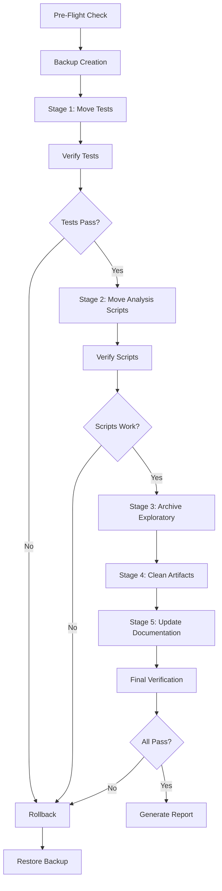

# Design Document: Project Cleanup and Organization

## Overview

This design document defines the technical architecture for reorganizing the Senior Training OS project structure. The solution implements a safe, reversible file organization system that moves test files, analysis scripts, and exploratory code to appropriate directories while preserving all functionality and maintaining project integrity.

### Goals

1. **Improve Maintainability**: Organize files into logical directories following Python project conventions
2. **Preserve Functionality**: Ensure all tests, scripts, and imports continue to work after reorganization
3. **Enable Rollback**: Provide mechanisms to safely revert changes if issues are detected
4. **Document Changes**: Create comprehensive documentation of all modifications

### Non-Goals

- Refactoring code logic or improving test quality
- Modifying the ingestion_pipeline internal structure
- Changing the behavior of any existing functionality
- Optimizing test execution performance

## Architecture

### High-Level Design

The cleanup system follows a **staged execution model** with verification checkpoints:



### Design Principles

1. **Safety First**: Every stage includes verification before proceeding
2. **Atomic Operations**: Each file move is tracked for potential rollback
3. **Idempotency**: The cleanup script can be run multiple times safely
4. **Minimal Disruption**: Preserve existing directory structures where possible
5. **Clear Audit Trail**: Document every change with justification

## Components and Interfaces

### 1. Cleanup Orchestrator

**Responsibility**: Coordinates the entire cleanup process and manages state transitions.

**Interface**:
```python
class CleanupOrchestrator:
    def __init__(self, project_root: Path, dry_run: bool = False):
        """Initialize orchestrator with project root and execution mode."""
        
    def execute(self) -> CleanupResult:
        """Execute the complete cleanup workflow."""
        
    def rollback(self) -> bool:
        """Rollback all changes using backup."""
```

**Key Methods**:
- `pre_flight_check()`: Validates project state before starting
- `create_backup()`: Creates timestamped backup of affected files
- `execute_stage(stage: Stage)`: Executes a single cleanup stage
- `verify_stage(stage: Stage)`: Verifies stage completion
- `generate_report()`: Creates CLEANUP_REPORT.md

### 2. File Mover

**Responsibility**: Handles safe file movement with import path updates.

**Interface**:
```python
class FileMover:
    def move_file(self, source: Path, destination: Path) -> MoveResult:
        """Move a file and update its imports."""
        
    def update_imports(self, file_path: Path, old_location: Path) -> bool:
        """Update import statements in a moved file."""
        
    def find_references(self, file_path: Path) -> List[Path]:
        """Find all files that import the moved file."""
```

**Import Update Strategy**:
- Parse Python AST to identify import statements
- Calculate new relative import paths based on destination
- Update both `import` and `from ... import` statements
- Handle special cases like `sys.path.insert()`

### 3. Test Verifier

**Responsibility**: Validates that tests continue to pass after reorganization.

**Interface**:
```python
class TestVerifier:
    def run_tests(self, test_path: Path = None) -> TestResult:
        """Run pytest and capture results."""
        
    def compare_results(self, before: TestResult, after: TestResult) -> bool:
        """Compare test results to ensure no regressions."""
        
    def verify_discovery(self) -> bool:
        """Verify pytest can discover all tests."""
```

**Verification Strategy**:
- Run full test suite before any changes (baseline)
- Run tests after each stage
- Compare pass/fail counts and test names
- Verify no tests were lost or duplicated

### 4. Documentation Updater

**Responsibility**: Updates references to moved files in documentation.

**Interface**:
```python
class DocumentationUpdater:
    def scan_references(self, file_patterns: List[str]) -> Dict[Path, List[Reference]]:
        """Find all references to moved files in documentation."""
        
    def update_reference(self, doc_path: Path, old_path: str, new_path: str) -> bool:
        """Update a single reference in a documentation file."""
        
    def verify_links(self) -> List[BrokenLink]:
        """Verify all updated references point to existing files."""
```

### 5. Backup Manager

**Responsibility**: Creates and manages backups for rollback capability.

**Interface**:
```python
class BackupManager:
    def create_backup(self, files: List[Path]) -> Path:
        """Create timestamped backup of specified files."""
        
    def restore_backup(self, backup_path: Path) -> bool:
        """Restore files from backup."""
        
    def cleanup_old_backups(self, keep_count: int = 3) -> None:
        """Remove old backup directories."""
```

**Backup Strategy**:
- Create `.cleanup_backup_<timestamp>/` directory
- Copy all affected files preserving directory structure
- Store metadata about original locations
- Keep last 3 backups for safety

## Data Models

### CleanupResult

```python
@dataclass
class CleanupResult:
    success: bool
    stages_completed: List[str]
    files_moved: Dict[Path, Path]  # old_path -> new_path
    files_removed: List[Path]
    files_kept: List[Path]
    test_results: TestResult
    errors: List[str]
    warnings: List[str]
    backup_path: Path
    duration_seconds: float
```

### MoveResult

```python
@dataclass
class MoveResult:
    success: bool
    source: Path
    destination: Path
    imports_updated: bool
    references_found: List[Path]
    references_updated: List[Path]
    error: Optional[str] = None
```

### TestResult

```python
@dataclass
class TestResult:
    total_tests: int
    passed: int
    failed: int
    skipped: int
    test_names: Set[str]
    duration_seconds: float
    output: str
```

### Stage

```python
class Stage(Enum):
    MOVE_TESTS = "move_tests"
    MOVE_ANALYSIS = "move_analysis"
    ARCHIVE_EXPLORATORY = "archive_exploratory"
    CLEAN_ARTIFACTS = "clean_artifacts"
    UPDATE_DOCS = "update_docs"
```

## Detailed Implementation Strategy

### Stage 1: Move Test Files

**Files to Move** (17 files):
- test_aura_search.py
- test_builders.py
- test_erp_discovery.py
- test_final_search.py
- test_ged_access.py
- test_gestao_page.py
- test_important_urls_pipeline.py
- test_important_urls.py
- test_openai.py
- test_recursive_erp.py
- test_single_url.py
- test_sitemap_modules.py
- test_skill_memory.py
- test_spa_discovery.py
- conftest.py

**Import Update Pattern**:

Many test files use this pattern:
```python
sys.path.insert(0, str(Path(__file__).parent))
```

After moving to `tests/`, this needs to be updated to:
```python
sys.path.insert(0, str(Path(__file__).parent.parent))
```

**Algorithm**:
1. For each test file in root directory:
   - Check if file already exists in tests/ (skip if duplicate)
   - Move file to tests/
   - Update `sys.path.insert()` to point to parent.parent
   - Update any relative imports
   - Track move in operation log
2. Verify pytest discovers all tests
3. Run test suite and compare with baseline

**Special Handling**:
- `conftest.py`: Check for conflicts with existing tests/conftest.py
- If conflict exists, merge fixture definitions carefully

### Stage 2: Move Analysis Scripts

**Files to Move** (5 files):
- analyze_erp_patterns.py
- analyze_sitemap_structure.py
- check_sitemap_content.py
- debug_crawler.py
- debug_erp_discovery.py

**Destination**: `scripts/analysis/`

**Algorithm**:
1. Create `scripts/analysis/` directory if not exists
2. For each analysis script:
   - Move to scripts/analysis/
   - Update imports (similar to test files)
   - Test execution with `python scripts/analysis/<script>.py`
3. Create `scripts/analysis/README.md` documenting each script

**README Template**:
```markdown
# Analysis Scripts

This directory contains scripts for debugging, analysis, and investigation.

## Scripts

### analyze_erp_patterns.py
**Purpose**: [Auto-extracted from docstring]
**Usage**: `python scripts/analysis/analyze_erp_patterns.py`
**Dependencies**: [Auto-detected]

[Repeat for each script]
```

### Stage 3: Archive Exploratory Scripts

**Files to Archive** (6 files):
- enhanced_crawler.py
- enhanced_erp_discovery.py
- fix_erp_discovery.py
- intelligent_spa_crawler.py
- investigate_sitemaps.py
- manual_important_urls.py

**Destination**: `old_but_gold/exploratory/`

**Algorithm**:
1. Create `old_but_gold/exploratory/` directory
2. For each exploratory script:
   - Analyze if functionality exists in ingestion_pipeline/
   - Move to old_but_gold/exploratory/
   - Add header comment explaining archival reason
3. Create `old_but_gold/exploratory/MIGRATION.md`

**Migration Document Template**:
```markdown
# Exploratory Scripts Migration Guide

## Archived Scripts

### enhanced_crawler.py
**Archived**: [timestamp]
**Reason**: Functionality implemented in ingestion_pipeline/crawler.py
**Migration Path**: Use `SitemapCrawler` class from ingestion_pipeline
**Key Differences**: [Auto-detected by comparing implementations]

[Repeat for each script]
```

### Stage 4: Clean Generated Artifacts

**Files to Remove** (2 files):
- erp_page_content.html
- erp_pattern_analysis.json

**Algorithm**:
1. Verify files are generated (not source files)
2. Check if files should be preserved for reference
3. If temporary: Remove
4. If useful: Move to `diagnostico_falhas/`
5. Update `.gitignore` to prevent future commits

**Gitignore Additions**:
```
# Generated artifacts
erp_page_content.html
erp_pattern_analysis.json
*_analysis.json
*_debug.html
```

### Stage 5: Update Documentation

**Files to Scan**:
- README.md
- All .md files in root
- All .md files in docs/ (if exists)
- ingestion_pipeline/README.md
- ingestion_pipeline/QUICKSTART.md

**Algorithm**:
1. Scan each markdown file for file references
2. Build reference map: {old_path: new_path}
3. For each reference:
   - Update path
   - Verify new path exists
   - Track update in log
4. Generate list of broken links (if any)

**Reference Patterns to Match**:
- Relative paths: `./test_*.py`, `test_*.py`
- Absolute paths: `/test_*.py`
- Code blocks with file paths
- Links: `[text](path)`

## Error Handling

### Error Categories

1. **Pre-flight Errors** (Block execution):
   - Git working directory not clean
   - Existing backup conflicts
   - Missing required directories
   - Python environment issues

2. **Stage Errors** (Trigger rollback):
   - File move failures
   - Import update failures
   - Test failures after move
   - Verification failures

3. **Recoverable Warnings** (Log but continue):
   - Documentation reference not found
   - Optional script execution failure
   - Gitignore update failure

### Rollback Strategy

**Trigger Conditions**:
- Any test failure after a stage
- File move operation failure
- Import update causing syntax errors
- User manual abort

**Rollback Process**:
1. Stop current stage immediately
2. Restore all files from backup
3. Verify restoration completeness
4. Run test suite to confirm restoration
5. Generate rollback report

**Rollback Verification**:
```python
def verify_rollback(backup_path: Path) -> bool:
    # Compare file checksums
    # Run test suite
    # Verify import statements
    # Check file counts
    return all_checks_pass
```

## Testing Strategy

### Pre-Cleanup Testing

**Baseline Establishment**:
1. Run complete test suite: `pytest -v`
2. Capture test count, names, and results
3. Verify main application starts: `python app.py --check`
4. Verify ingestion_pipeline imports: `python -c "import ingestion_pipeline"`
5. Store baseline in `cleanup_baseline.json`

### Post-Stage Testing

**After Each Stage**:
1. Run affected tests only (fast feedback)
2. Verify imports in moved files
3. Check for syntax errors
4. Validate file permissions

**After All Stages**:
1. Run complete test suite
2. Compare with baseline
3. Verify application startup
4. Check ingestion_pipeline independence
5. Validate documentation links

### Test Isolation

**Ingestion Pipeline Tests**:
- Must run independently: `pytest ingestion_pipeline/tests/`
- Must not conflict with root tests
- Must maintain separate conftest.py if needed

**Root Tests**:
- Must run independently: `pytest tests/`
- Must discover all moved tests
- Must not duplicate ingestion_pipeline tests

### Integration Testing

**Full System Verification**:
```bash
# Run all tests
pytest -v

# Verify no duplicate test names
pytest --collect-only | grep "test_" | sort | uniq -d

# Verify application starts
python app.py --check

# Verify ingestion_pipeline
python -m ingestion_pipeline --help
```

## Deployment and Execution

### Prerequisites

1. **Clean Git State**:
   ```bash
   git status  # Should show no uncommitted changes
   ```

2. **Virtual Environment Active**:
   ```bash
   source venv/bin/activate  # or equivalent
   ```

3. **Dependencies Installed**:
   ```bash
   pip install -r requirements.txt
   ```

### Execution Modes

**Dry Run Mode** (Recommended First):
```bash
python cleanup_project.py --dry-run
```
- Simulates all operations
- Shows what would be changed
- No actual file modifications
- Generates preview report

**Interactive Mode**:
```bash
python cleanup_project.py --interactive
```
- Prompts for confirmation at each stage
- Allows selective execution
- Can skip stages
- Provides rollback option

**Automated Mode**:
```bash
python cleanup_project.py --auto
```
- Executes all stages automatically
- Stops on first error
- Automatic rollback on failure
- Generates final report

### Execution Steps

1. **Pre-Flight**:
   ```bash
   python cleanup_project.py --dry-run
   # Review output
   ```

2. **Backup**:
   ```bash
   git add -A
   git commit -m "Pre-cleanup snapshot"
   ```

3. **Execute**:
   ```bash
   python cleanup_project.py --interactive
   # Review each stage
   # Confirm or skip
   ```

4. **Verify**:
   ```bash
   pytest -v
   python app.py --check
   ```

5. **Commit**:
   ```bash
   git add -A
   git commit -m "Project cleanup: organize tests and scripts"
   ```

### Rollback Procedure

**If Issues Detected**:
```bash
# Option 1: Use built-in rollback
python cleanup_project.py --rollback

# Option 2: Git revert
git reset --hard HEAD~1

# Option 3: Manual backup restore
python cleanup_project.py --restore-backup .cleanup_backup_<timestamp>
```

## Monitoring and Observability

### Progress Reporting

**Console Output**:
```
[1/5] Moving test files... ████████████████ 17/17 files
      ✓ test_aura_search.py → tests/test_aura_search.py
      ✓ Updated imports in test_aura_search.py
      ✓ All tests discovered
      ✓ Test suite passed (52 tests)

[2/5] Moving analysis scripts... ████████████████ 5/5 files
      ✓ analyze_erp_patterns.py → scripts/analysis/
      ...
```

### Logging

**Log Levels**:
- INFO: Normal operations
- WARNING: Recoverable issues
- ERROR: Stage failures
- DEBUG: Detailed operation traces

**Log File**: `.cleanup_<timestamp>.log`

### Metrics Collected

- Files moved per stage
- Import updates performed
- Test execution time
- Total cleanup duration
- Backup size
- Documentation updates

## Documentation Outputs

### CLEANUP_REPORT.md

**Structure**:
```markdown
# Project Cleanup Report

**Execution Date**: [timestamp]
**Duration**: [duration]
**Status**: [SUCCESS/FAILED/ROLLED_BACK]

## Summary

- Files Moved: X
- Files Archived: Y
- Files Removed: Z
- Tests Passing: A/B
- Documentation Updated: C files

## Stage 1: Move Test Files

### Files Moved
| Original Path | New Path | Status |
|--------------|----------|--------|
| test_aura_search.py | tests/test_aura_search.py | ✓ |
...

### Import Updates
- Updated sys.path.insert() in 14 files
- Updated relative imports in 3 files

### Verification
- ✓ All 17 tests discovered
- ✓ Test suite passed (52 tests)

[Repeat for each stage]

## Verification Results

### Test Suite
- Before: 52 tests, 52 passed
- After: 52 tests, 52 passed
- Status: ✓ PASS

### Application Startup
- Status: ✓ PASS

### Ingestion Pipeline
- Status: ✓ PASS

## Files Kept in Root

| File | Reason |
|------|--------|
| app.py | Main application entry point |
| capture.py | Core pipeline module |
...

## Recommendations

[Auto-generated recommendations based on findings]
```

### scripts/analysis/README.md

Auto-generated documentation of analysis scripts with:
- Purpose (from docstring)
- Usage examples
- Dependencies
- Last modified date

### old_but_gold/exploratory/MIGRATION.md

Mapping of archived scripts to current implementations with:
- Archival reason
- Migration path
- Key differences
- Usage examples

## Security Considerations

### File Safety

1. **Path Validation**:
   - Validate all paths are within project root
   - Prevent directory traversal
   - Check for symlink attacks

2. **Backup Integrity**:
   - Verify backup completeness
   - Check file permissions preserved
   - Validate checksums

3. **Import Safety**:
   - Parse AST instead of exec()
   - Validate import paths
   - Prevent code injection

### Execution Safety

1. **Dry Run First**: Always recommend dry run
2. **Git Integration**: Require clean git state
3. **Atomic Operations**: Track all changes for rollback
4. **User Confirmation**: Prompt for destructive operations

## Performance Considerations

### Optimization Strategies

1. **Parallel Processing**:
   - Move files in parallel (thread-safe)
   - Update imports concurrently
   - Scan documentation in parallel

2. **Incremental Verification**:
   - Test only affected files per stage
   - Full suite only at end
   - Cache test results

3. **Efficient Scanning**:
   - Use gitignore patterns
   - Skip binary files
   - Cache file content

### Expected Performance

- **Small Project** (<100 files): ~30 seconds
- **Medium Project** (100-500 files): ~2 minutes
- **Large Project** (500+ files): ~5 minutes

**Bottlenecks**:
- Test suite execution (largest factor)
- Import parsing (AST overhead)
- Documentation scanning (I/O bound)

## Maintenance and Evolution

### Future Enhancements

1. **Configuration File**:
   - Allow custom file patterns
   - Configurable destinations
   - Skip rules

2. **Incremental Cleanup**:
   - Resume from last stage
   - Skip completed stages
   - Partial rollback

3. **Integration**:
   - Pre-commit hook
   - CI/CD integration
   - Automated scheduling

### Extensibility Points

1. **Custom Stages**:
   ```python
   class CustomStage(Stage):
       def execute(self) -> StageResult:
           # Custom logic
   ```

2. **Custom Verifiers**:
   ```python
   class CustomVerifier(Verifier):
       def verify(self) -> bool:
           # Custom verification
   ```

3. **Custom Reporters**:
   ```python
   class CustomReporter(Reporter):
       def generate(self, result: CleanupResult) -> None:
           # Custom report format
   ```

## Conclusion

This design provides a comprehensive, safe, and reversible solution for organizing the Senior Training OS project structure. The staged execution model with verification checkpoints ensures that functionality is preserved throughout the cleanup process, while the backup and rollback mechanisms provide safety nets for recovery if issues arise.

The implementation prioritizes:
- **Safety**: Multiple verification points and rollback capability
- **Transparency**: Detailed logging and reporting
- **Maintainability**: Clear separation of concerns and extensibility
- **Reliability**: Comprehensive testing at each stage

By following this design, the project structure will be significantly improved while maintaining complete confidence in the system's continued operation.
