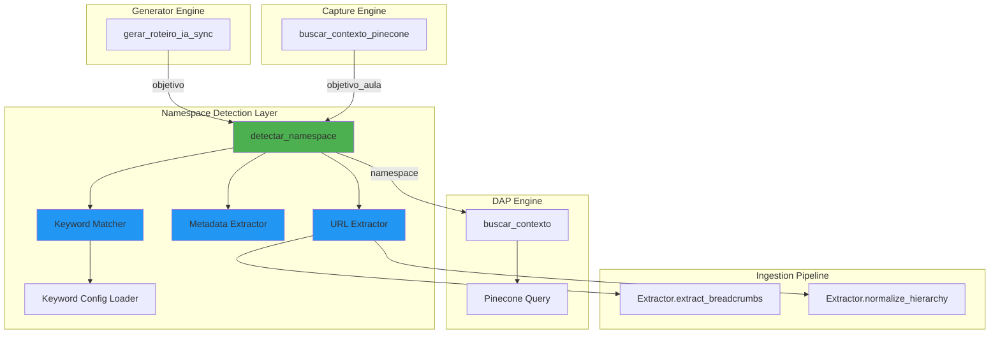
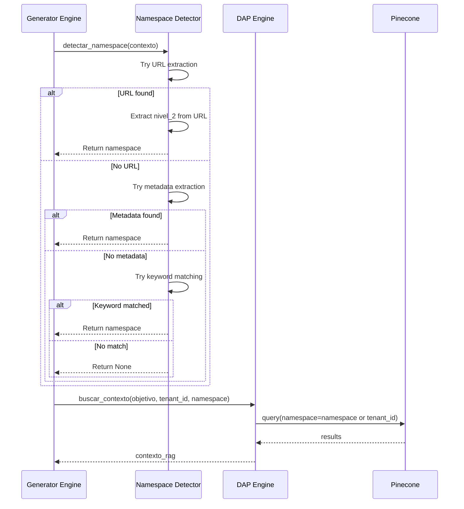

# Design Document: RAG Namespace Auto-Detection

## Overview

This design document specifies the technical implementation of automatic namespace detection for RAG (Retrieval-Augmented Generation) queries in the Senior Training OS platform. The system will extract module/theme information from available context (URLs, roteiro metadata, workflow objectives) and automatically pass the correct namespace to Pinecone queries, enabling the RAG system to find relevant module-specific web documentation.

### Problem Statement

The current RAG implementation uses a single namespace (tenant_id or "senior_default") for all queries, ignoring the module-based namespace structure created during web documentation ingestion. This results in poor retrieval accuracy because:

1. Queries search across all modules instead of the relevant module
2. Web documentation indexed by module (e.g., "hcm", "financeiro", "ged") is not leveraged
3. Generator and capture workflows cannot benefit from module-specific context

### Solution Approach

Implement a lightweight namespace detection layer that:
- Extracts namespace hints from URLs, metadata, and text using pattern matching
- Reuses existing nivel_2 extraction logic from the ingestion pipeline
- Integrates transparently into existing `buscar_contexto()` calls
- Falls back gracefully to tenant_id when detection fails
- Adds minimal latency (<10ms) with no external dependencies

## Architecture

### Component Diagram



### Data Flow



## Components and Interfaces

### 1. Namespace Detector Module (`namespace_detector.py`)

**Purpose**: Central module for namespace detection logic.

**Location**: Root directory (alongside `utils.py`, `dap_engine.py`)

**Key Functions**:

```python
def detectar_namespace(contexto: dict) -> Optional[str]:
    """Detect namespace from available context.
    
    Detection priority order:
    1. URL extraction (if 'url' key present)
    2. Metadata extraction (if 'metadata' key present)
    3. Keyword matching (if 'objetivo' or 'nome_aula' present)
    4. Return None (fallback to tenant_id)
    
    Args:
        contexto: Dictionary with optional keys:
            - url: Senior X URL string
            - metadata: Roteiro metadata dict
            - objetivo: Workflow objective string
            - nome_aula: Roteiro name string
    
    Returns:
        Normalized namespace string (lowercase kebab-case) or None
        
    Examples:
        >>> detectar_namespace({"url": "https://...senior-x/hcm/admissao"})
        'hcm'
        >>> detectar_namespace({"objetivo": "Criar pasta no GED"})
        'ged'
        >>> detectar_namespace({"metadata": {"module": "financeiro"}})
        'financeiro'
        >>> detectar_namespace({})
        None
    """
    pass


def _extrair_namespace_de_url(url: str) -> Optional[str]:
    """Extract namespace from Senior X URL using nivel_2 logic.
    
    Reuses Extractor.extract_breadcrumbs() and normalize_hierarchy()
    from ingestion_pipeline/extractor.py.
    
    Args:
        url: Senior X documentation URL
        
    Returns:
        Normalized namespace or None
        
    Examples:
        >>> _extrair_namespace_de_url("https://...senior-x/hcm/admissao")
        'hcm'
        >>> _extrair_namespace_de_url("https://...seniorxplatform/manual-do-usuario/ged")
        'ged'
    """
    pass


def _extrair_namespace_de_metadata(metadata: dict) -> Optional[str]:
    """Extract namespace from roteiro metadata.
    
    Priority order:
    1. metadata['module'] (explicit field)
    2. metadata['source_url'] (extract from URL)
    3. metadata['nome_aula'] (keyword matching)
    
    Args:
        metadata: Roteiro metadata dictionary
        
    Returns:
        Normalized namespace or None
    """
    pass


def _extrair_namespace_de_keywords(texto: str) -> Optional[str]:
    """Extract namespace from text using keyword matching.
    
    Loads keyword-to-namespace mapping from configuration and
    performs case-insensitive matching.
    
    Args:
        texto: Objective or nome_aula text
        
    Returns:
        First matched namespace or None
        
    Examples:
        >>> _extrair_namespace_de_keywords("Criar admissão no HCM")
        'hcm'
        >>> _extrair_namespace_de_keywords("Configurar contas a pagar")
        'financeiro'
    """
    pass


def _carregar_mapeamento_keywords() -> dict[str, list[str]]:
    """Load keyword-to-namespace mapping from configuration.
    
    Tries to load from:
    1. namespace_keywords.json file (if exists)
    2. NAMESPACE_KEYWORDS environment variable (JSON string)
    3. Hardcoded default mapping (fallback)
    
    Results are cached in memory for performance.
    
    Returns:
        Dictionary mapping namespace -> list of keywords
        
    Example:
        {
            "hcm": ["recursos humanos", "admissao", "folha", "rh"],
            "financeiro": ["contas a pagar", "tesouraria", "financas"],
            "ged": ["documentos", "arquivos", "pastas", "ged"]
        }
    """
    pass
```

### 2. Integration Points

#### 2.1 Generator Engine Integration

**File**: `generator_engine.py`

**Function**: `gerar_roteiro_ia_sync()`

**Modification**:

```python
def gerar_roteiro_ia_sync(nome_aula: str, objetivo: str, tenant_id: str = "senior_default") -> dict:
    # ... existing code ...
    
    # ── 1. RAG: busca contexto do manual ────────────────────────────────────
    logger.info(f"Buscando manual para: {objetivo}")
    
    # NEW: Detect namespace from objetivo
    from namespace_detector import detectar_namespace
    
    contexto_deteccao = {"objetivo": objetivo}
    namespace_detectado = detectar_namespace(contexto_deteccao)
    
    if namespace_detectado:
        logger.info(f"[Namespace] Detectado: {namespace_detectado} (fonte: objetivo)")
        contexto_rag = dap_engine.buscar_contexto(objetivo, tenant_id, namespace=namespace_detectado)
    else:
        logger.info(f"[Namespace] Não detectado, usando tenant_id: {tenant_id}")
        contexto_rag = dap_engine.buscar_contexto(objetivo, tenant_id)
    
    # ... rest of existing code ...
```

**Integration Points**:
- Line ~66: After `logger.info(f"Buscando manual para: {objetivo}")`
- Before: `contexto_rag = dap_engine.buscar_contexto(objetivo, tenant_id)`

#### 2.2 Capture Engine Integration

**File**: `capture.py`

**Function**: `_buscar_pinecone_sync()`

**Modification**:

```python
def _buscar_pinecone_sync(objetivo_aula: str) -> str:
    chave_pinecone = os.getenv("PINECONE_API_KEY")
    nome_index     = os.getenv("PINECONE_INDEX_NAME")
    if not chave_pinecone or not nome_index or not _openai_client:
        return "Nenhum contexto adicional."
    try:
        # NEW: Detect namespace from objetivo_aula
        from namespace_detector import detectar_namespace
        
        contexto_deteccao = {"objetivo": objetivo_aula}
        namespace_detectado = detectar_namespace(contexto_deteccao)
        
        if namespace_detectado:
            namespace_query = namespace_detectado
            logger.info(f"[Namespace] Detectado: {namespace_detectado} (fonte: objetivo_aula)")
        else:
            namespace_query = os.getenv("DEFAULT_TENANT_ID", "senior_default")
            logger.info(f"[Namespace] Não detectado, usando tenant_id: {namespace_query}")
        
        pc        = Pinecone(api_key=chave_pinecone)
        index     = pc.Index(nome_index)
        embedding = _gerar_embedding_openai(objetivo_aula)
        resultado = index.query(
            vector=embedding, top_k=3, include_metadata=True,
            namespace=namespace_query,  # CHANGED: was hardcoded tenant_id
        )
        # ... rest of existing code ...
```

**Integration Points**:
- Line ~60: After checking API keys
- Before: `pc = Pinecone(api_key=chave_pinecone)`

## Data Models

### Contexto Dictionary

```python
{
    "url": Optional[str],           # Senior X URL
    "metadata": Optional[dict],     # Roteiro metadata
    "objetivo": Optional[str],      # Workflow objective
    "nome_aula": Optional[str]      # Roteiro name
}
```

### Keyword Mapping Configuration

**File**: `namespace_keywords.json` (optional, created by user)

```json
{
    "hcm": [
        "recursos humanos",
        "admissao",
        "admissão",
        "folha",
        "folha de pagamento",
        "rh",
        "colaborador",
        "funcionario",
        "funcionário"
    ],
    "financeiro": [
        "contas a pagar",
        "contas a receber",
        "tesouraria",
        "financas",
        "finanças",
        "pagamento",
        "recebimento",
        "faturamento"
    ],
    "ged": [
        "documentos",
        "arquivos",
        "pastas",
        "ged",
        "gestao documental",
        "gestão documental",
        "documento eletronico",
        "documento eletrônico"
    ],
    "compras": [
        "compras",
        "requisicao",
        "requisição",
        "pedido de compra",
        "cotacao",
        "cotação",
        "fornecedor"
    ],
    "estoque": [
        "estoque",
        "inventario",
        "inventário",
        "movimentacao",
        "movimentação",
        "armazem",
        "armazém",
        "produto"
    ]
}
```

**Environment Variable Alternative**:

```bash
NAMESPACE_KEYWORDS='{"hcm":["recursos humanos","admissao"],"financeiro":["contas a pagar"]}'
```

### Hardcoded Default Mapping

```python
_DEFAULT_KEYWORD_MAPPING = {
    "hcm": ["recursos humanos", "admissao", "admissão", "folha", "rh"],
    "financeiro": ["contas a pagar", "tesouraria", "financas", "finanças"],
    "ged": ["documentos", "arquivos", "pastas", "ged"],
    "compras": ["compras", "requisicao", "requisição", "fornecedor"],
    "estoque": ["estoque", "inventario", "inventário", "armazem", "armazém"],
}
```

## Error Handling

### Exception Safety

All namespace detection functions follow these rules:

1. **Never raise exceptions** - Always return `None` on error
2. **Log warnings** - Use `logger.warning()` for detection failures
3. **Preserve existing behavior** - System continues with tenant_id fallback

### Error Scenarios

| Scenario | Behavior | Log Level |
|----------|----------|-----------|
| Invalid URL format | Return `None` | WARNING |
| Missing metadata keys | Return `None` | DEBUG |
| Keyword config file missing | Use hardcoded defaults | INFO |
| Keyword config JSON invalid | Use hardcoded defaults | WARNING |
| Empty context dict | Return `None` | DEBUG |
| Import error (extractor) | Return `None` | ERROR |

### Fallback Chain

```
detectar_namespace() returns None
    ↓
buscar_contexto() uses tenant_id parameter
    ↓
If tenant_id is None/empty, use "senior_default"
    ↓
Pinecone query executes with fallback namespace
```

## Testing Strategy

### Unit Tests

**File**: `test_namespace_detector.py`

**Test Coverage**:

1. **URL Extraction Tests** (10+ patterns):
   - `/senior-x/hcm/admissao` → `hcm`
   - `/senior-x/financeiro/contas-a-pagar` → `financeiro`
   - `/seniorxplatform/manual-do-usuario/ged` → `ged`
   - `/senior-flow/manual-do-usuario` → `senior-flow-manual`
   - `/bpm/7.0.0/configuracao` → `bpm`
   - Invalid URLs → `None`
   - URLs without module → `None`

2. **Metadata Extraction Tests** (5+ structures):
   - `{"module": "hcm"}` → `hcm`
   - `{"source_url": "...senior-x/ged/..."}` → `ged`
   - `{"nome_aula": "Criar pasta no GED"}` → `ged`
   - Empty metadata → `None`
   - Metadata without hints → `None`

3. **Keyword Matching Tests** (10+ phrases):
   - "Criar admissão no HCM" → `hcm`
   - "Configurar contas a pagar" → `financeiro`
   - "Gerenciar documentos no GED" → `ged`
   - "Processar requisição de compras" → `compras`
   - "Movimentar estoque" → `estoque`
   - Case insensitivity tests
   - Multiple keyword matches (first wins)
   - No keyword matches → `None`

4. **Priority Order Tests**:
   - URL takes precedence over metadata
   - Metadata takes precedence over keywords
   - Keywords are last resort

5. **Configuration Loading Tests**:
   - Load from JSON file
   - Load from environment variable
   - Fallback to hardcoded defaults
   - Invalid JSON handling
   - Cache behavior

6. **Error Handling Tests**:
   - Invalid input types
   - Missing keys in context
   - Malformed URLs
   - Import errors

### Integration Tests

**File**: `test_namespace_integration.py`

**Test Scenarios**:

1. **Generator Engine Integration**:
   - Generate roteiro with URL in objetivo
   - Verify namespace passed to `buscar_contexto()`
   - Verify Pinecone query uses correct namespace
   - Verify fallback when no namespace detected

2. **Capture Engine Integration**:
   - Capture workflow with module keywords in objetivo_aula
   - Verify namespace detection in `_buscar_pinecone_sync()`
   - Verify Pinecone query uses correct namespace
   - Verify fallback behavior

3. **End-to-End RAG Flow**:
   - Index web documentation in module namespace
   - Generate roteiro with module-specific objetivo
   - Verify retrieved context is from correct module
   - Compare retrieval accuracy with/without namespace detection

### Performance Tests

**Requirements**:
- Namespace detection completes in <10ms
- No external API calls or database queries
- Keyword matching uses efficient algorithms
- Configuration loaded once and cached

**Test Method**:
```python
import time

def test_performance():
    contexto = {"objetivo": "Criar admissão no HCM"}
    
    start = time.perf_counter()
    for _ in range(1000):
        namespace = detectar_namespace(contexto)
    end = time.perf_counter()
    
    avg_time_ms = (end - start) / 1000 * 1000
    assert avg_time_ms < 10, f"Detection too slow: {avg_time_ms:.2f}ms"
```

## Observability and Logging

### Log Levels

| Event | Level | Format |
|-------|-------|--------|
| Namespace detected | INFO | `[Namespace] Detectado: {namespace} (fonte: {source})` |
| No namespace detected | INFO | `[Namespace] Não detectado, usando tenant_id: {tenant_id}` |
| Fallback to tenant_id | WARNING | `[Namespace] Fallback: {reason}` |
| Configuration loaded | INFO | `[Namespace] Config carregado: {source} ({count} namespaces)` |
| Detection error | WARNING | `[Namespace] Erro na detecção: {error}` |
| Import error | ERROR | `[Namespace] Falha ao importar extractor: {error}` |

### Log Examples

```
INFO: [Namespace] Detectado: hcm (fonte: URL)
INFO: [Namespace] Detectado: financeiro (fonte: metadata.module)
INFO: [Namespace] Detectado: ged (fonte: keyword match)
INFO: [Namespace] Não detectado, usando tenant_id: senior_default
WARNING: [Namespace] Fallback: URL inválida
INFO: [Namespace] Config carregado: namespace_keywords.json (5 namespaces)
WARNING: [Namespace] Erro na detecção: Invalid URL format
```

### Metrics

Track these metrics for observability:

1. **Detection Success Rate**: % of queries with namespace detected
2. **Detection Source Distribution**: URL vs metadata vs keyword
3. **Fallback Rate**: % of queries using tenant_id fallback
4. **Average Detection Time**: Performance monitoring
5. **Configuration Reload Count**: Cache efficiency

## Implementation Plan

### Phase 1: Core Module (Day 1)

1. Create `namespace_detector.py` with core functions
2. Implement URL extraction (reuse extractor logic)
3. Implement metadata extraction
4. Implement keyword matching
5. Implement configuration loading
6. Add comprehensive logging

### Phase 2: Integration (Day 2)

1. Integrate into `generator_engine.py`
2. Integrate into `capture.py`
3. Update `dap_engine.buscar_contexto()` documentation
4. Add backward compatibility tests

### Phase 3: Configuration (Day 3)

1. Create default `namespace_keywords.json`
2. Document configuration format
3. Add environment variable support
4. Test configuration loading

### Phase 4: Testing (Day 4)

1. Write unit tests (30+ test cases)
2. Write integration tests (10+ scenarios)
3. Write performance tests
4. Run full test suite

### Phase 5: Documentation (Day 5)

1. Update README with namespace detection feature
2. Document configuration options
3. Add code examples
4. Create troubleshooting guide

## Backward Compatibility

### Compatibility Guarantees

1. **No Breaking Changes**:
   - `buscar_contexto()` signature unchanged (namespace parameter already exists)
   - Existing roteiros work without modification
   - Existing tests pass without changes

2. **Graceful Degradation**:
   - If namespace detection fails, system uses tenant_id (existing behavior)
   - If namespace_detector.py missing, system continues with tenant_id
   - If configuration invalid, system uses hardcoded defaults

3. **Opt-In Behavior**:
   - Namespace detection only activates when context hints are present
   - No namespace detection = no behavior change
   - Users can disable by not providing URL/metadata/keywords

### Migration Path

**Existing Deployments**:
1. Deploy `namespace_detector.py` (no impact)
2. Deploy updated `generator_engine.py` (transparent enhancement)
3. Deploy updated `capture.py` (transparent enhancement)
4. Optionally add `namespace_keywords.json` (improves accuracy)

**No User Action Required** - Feature activates automatically when context hints are available.

## Performance Considerations

### Optimization Strategies

1. **Lazy Loading**:
   - Import `namespace_detector` only when needed
   - Load configuration file once and cache in memory
   - Compile regex patterns once at module load

2. **Efficient Matching**:
   - Use lowercase comparison (avoid repeated `.lower()` calls)
   - Short-circuit on first match (don't check all keywords)
   - Cache normalized values

3. **Minimal Dependencies**:
   - Reuse existing `Extractor` class (no new parsing logic)
   - Use standard library only (no new packages)
   - No external API calls or database queries

### Performance Budget

| Operation | Target | Measurement |
|-----------|--------|-------------|
| URL extraction | <5ms | `time.perf_counter()` |
| Metadata extraction | <2ms | `time.perf_counter()` |
| Keyword matching | <5ms | `time.perf_counter()` |
| Configuration load | <10ms (first call) | `time.perf_counter()` |
| Total detection | <10ms | `time.perf_counter()` |

### Caching Strategy

```python
# Module-level cache for configuration
_keyword_mapping_cache: Optional[dict] = None
_keyword_mapping_mtime: Optional[float] = None

def _carregar_mapeamento_keywords() -> dict:
    global _keyword_mapping_cache, _keyword_mapping_mtime
    
    # Check if cache is valid
    if _keyword_mapping_cache is not None:
        config_file = "namespace_keywords.json"
        if os.path.exists(config_file):
            current_mtime = os.path.getmtime(config_file)
            if current_mtime == _keyword_mapping_mtime:
                return _keyword_mapping_cache
    
    # Load and cache
    mapping = _load_from_file_or_env_or_default()
    _keyword_mapping_cache = mapping
    _keyword_mapping_mtime = os.path.getmtime(config_file) if os.path.exists(config_file) else None
    
    return mapping
```

## Security Considerations

### Input Validation

1. **URL Validation**:
   - Use `urlparse()` from standard library
   - Reject malformed URLs (return `None`, don't raise)
   - No URL fetching or external requests

2. **Metadata Validation**:
   - Check dict type before accessing keys
   - Handle missing keys gracefully
   - No code execution from metadata values

3. **Keyword Validation**:
   - Sanitize input text (strip, lowercase)
   - Limit text length (prevent DoS)
   - No regex injection (use literal string matching)

### Configuration Security

1. **File Access**:
   - Read-only access to `namespace_keywords.json`
   - No write operations
   - No arbitrary file paths (fixed filename)

2. **Environment Variables**:
   - Parse JSON safely (handle exceptions)
   - Validate structure before use
   - No code execution from env vars

3. **Hardcoded Defaults**:
   - Safe fallback when external config fails
   - No sensitive data in defaults
   - Minimal attack surface

## Future Enhancements

### Phase 2 Features (Not in Initial Release)

1. **Machine Learning-Based Detection**:
   - Train classifier on historical roteiros
   - Predict namespace from objective text
   - Improve accuracy over time

2. **Multi-Namespace Queries**:
   - Detect multiple relevant modules
   - Query multiple namespaces in parallel
   - Merge and rank results

3. **Confidence Scoring**:
   - Return confidence score with namespace
   - Use high-confidence namespaces only
   - Log low-confidence detections for review

4. **Dynamic Configuration**:
   - Admin UI for keyword management
   - Per-tenant keyword customization
   - A/B testing for detection strategies

5. **Analytics Dashboard**:
   - Visualize detection success rates
   - Identify missing keywords
   - Optimize configuration based on usage

## Appendix

### A. URL Pattern Examples

| URL | nivel_1 | nivel_2 | nivel_3 | Namespace |
|-----|---------|---------|---------|-----------|
| `/senior-x/hcm/admissao` | senior-x | hcm | admissao | hcm |
| `/senior-x/financeiro/contas-a-pagar` | senior-x | financeiro | contas-a-pagar | financeiro |
| `/seniorxplatform/manual-do-usuario/ged` | seniorxplatform | ged | | ged |
| `/senior-flow/manual-do-usuario` | senior-flow | senior-flow-manual | | senior-flow-manual |
| `/bpm/7.0.0/configuracao` | bpm | bpm | configuracao | bpm |

### B. Keyword Matching Examples

| Objetivo | Matched Keyword | Namespace |
|----------|----------------|-----------|
| "Criar admissão de funcionário" | "admissao" | hcm |
| "Configurar contas a pagar no financeiro" | "contas a pagar" | financeiro |
| "Gerenciar documentos no GED" | "ged" | ged |
| "Processar requisição de compras" | "requisicao" | compras |
| "Movimentar estoque do armazém" | "estoque" | estoque |

### C. Configuration File Template

```json
{
  "_comment": "Keyword-to-namespace mapping for RAG namespace detection",
  "_format": "namespace: [list of keywords for case-insensitive matching]",
  
  "hcm": [
    "recursos humanos", "admissao", "admissão", "folha", "folha de pagamento",
    "rh", "colaborador", "funcionario", "funcionário", "ponto", "ferias", "férias"
  ],
  
  "financeiro": [
    "contas a pagar", "contas a receber", "tesouraria", "financas", "finanças",
    "pagamento", "recebimento", "faturamento", "nota fiscal", "boleto"
  ],
  
  "ged": [
    "documentos", "arquivos", "pastas", "ged", "gestao documental",
    "gestão documental", "documento eletronico", "documento eletrônico"
  ],
  
  "compras": [
    "compras", "requisicao", "requisição", "pedido de compra", "cotacao",
    "cotação", "fornecedor", "ordem de compra"
  ],
  
  "estoque": [
    "estoque", "inventario", "inventário", "movimentacao", "movimentação",
    "armazem", "armazém", "produto", "item", "material"
  ]
}
```

### D. Integration Checklist

- [ ] Create `namespace_detector.py` module
- [ ] Implement `detectar_namespace()` function
- [ ] Implement URL extraction (reuse extractor)
- [ ] Implement metadata extraction
- [ ] Implement keyword matching
- [ ] Implement configuration loading
- [ ] Add comprehensive logging
- [ ] Integrate into `generator_engine.py`
- [ ] Integrate into `capture.py`
- [ ] Create `namespace_keywords.json` template
- [ ] Write unit tests (30+ cases)
- [ ] Write integration tests (10+ scenarios)
- [ ] Write performance tests
- [ ] Update documentation
- [ ] Test backward compatibility
- [ ] Deploy to staging
- [ ] Monitor detection success rate
- [ ] Deploy to production

---

**Document Version**: 1.0  
**Last Updated**: 2025-01-29  
**Status**: Ready for Implementation
