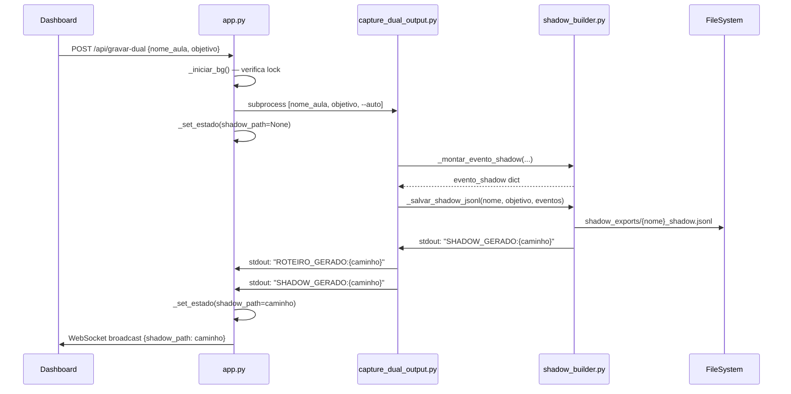

# Design Técnico — Fase 2: Integração do Sidecar Semântico

## Visão Geral

Esta fase extrai as funções de inferência semântica de `capture_dual_output.py` para um módulo puro `shadow_builder.py`, refatora os dois módulos de captura para importar desse módulo, e expõe o modo dual no dashboard via nova rota `/api/gravar-dual`.

O objetivo é eliminar duplicação de lógica sem alterar nenhum comportamento externo observável: o schema do roteiro JSON permanece intacto, o fluxo legado (`capture.py` + `/api/gravar`) não é tocado, e todos os roteiros existentes continuam válidos.

### Contexto de Dependências

```
utils.py
  └── limpar_nome()
  └── validar_roteiro()

shadow_builder.py  [NOVO — módulo puro]
  └── utc_now()
  └── _infer_capture_scope()
  └── _infer_semantic_action_from_capture()
  └── _infer_business_entity_from_capture()
  └── _infer_pattern_from_capture()
  └── _is_noise_event()
  └── _montar_evento_shadow()
  └── _salvar_shadow_jsonl()   ← emite SHADOW_GERADO: no stdout

capture_dual_output.py  [REFATORADO]
  └── importa tudo de shadow_builder
  └── remove definições locais das funções acima
  └── mantém Playwright, Gemini, OpenAI, Pinecone

capture_hybrid_shadow.py  [REFATORADO SELETIVAMENTE]
  └── importa utc_now de shadow_builder
  └── mantém infer_semantic_action_from_hints (lógica diferente: tecla, selecionar_opcao, aria_hint)
  └── mantém infer_pattern_from_hints (lógica diferente: modal_action, tree_item_open, search_debounce)
  └── mantém is_noise_event (lógica diferente: usa payload dict, não parâmetros posicionais)
  └── mantém infer_business_entity_from_hints (lógica diferente: aria_hint, title_hint, cliente, pedido)

app.py  [3 MUDANÇAS CIRÚRGICAS]
  └── estado_servidor: adiciona shadow_path: None
  └── executar_processo_bg: monitora SHADOW_GERADO: no loop de stdout
  └── nova rota POST /api/gravar-dual
```

---

## Arquitetura

### Fluxo de Dados — Modo Dual



### Fluxo Legado — Inalterado

```
POST /api/gravar → capture.py → ROTEIRO_GERADO: → auto-rebuild
```

O fluxo legado não é afetado por nenhuma mudança desta fase.

---

## Componentes e Interfaces

### 1. `shadow_builder.py` — Módulo Puro (NOVO)

**Localização:** raiz do projeto (mesmo nível de `utils.py`)

**Imports:**
```python
import json
import os
import logging
import re
from datetime import datetime, timezone
from utils import limpar_nome
```

Sem Playwright, Gemini, OpenAI, Pinecone. Sem `asyncio`. Sem `subprocess`.

**Interface pública:**

| Função | Assinatura | Descrição |
|--------|-----------|-----------|
| `utc_now` | `() -> str` | Retorna ISO 8601 UTC atual |
| `_infer_capture_scope` | `(iframe_id: str \| None) -> str` | `"shell"` ou `"module_iframe"` |
| `_infer_semantic_action_from_capture` | `(acao, label, seletor, tag, valor_input) -> str` | Classifica intenção semântica |
| `_infer_business_entity_from_capture` | `(label, seletor, tag, contexto_tela) -> str` | Identifica entidade de negócio |
| `_infer_pattern_from_capture` | `(acao, label, seletor, tag, capture_scope) -> str` | Classifica padrão de interação |
| `_is_noise_event` | `(label, seletor, acao, tag, capture_scope, valor_input) -> bool` | Filtra eventos sem valor pedagógico |
| `_montar_evento_shadow` | `(**kwargs) -> dict` | Monta o Evento_Shadow completo |
| `_salvar_shadow_jsonl` | `(nome_aula, objetivo_aula, eventos) -> str \| None` | Persiste o JSONL e emite `SHADOW_GERADO:` |

**Contrato de `_salvar_shadow_jsonl`:**
- Cria `shadow_exports/` com `os.makedirs(..., exist_ok=True)`
- Ordena `eventos` por `e.get("id_acao", 0)` antes de gravar
- Grava linha a linha com `json.dumps(evento, ensure_ascii=False)`
- Em caso de sucesso: `print(f"SHADOW_GERADO:{caminho}", flush=True)` e retorna `caminho`
- Em caso de exceção: `logger.warning(...)` e retorna `None` — sem re-raise

### 2. `capture_dual_output.py` — Refatoração de Imports

**Mudança única:** substituir as 8 definições locais por um bloco de import.

```python
# ANTES (8 funções definidas localmente)
def utc_now() -> str: ...
def _infer_capture_scope(...): ...
# ... etc

# DEPOIS
from shadow_builder import (
    utc_now,
    _infer_capture_scope,
    _infer_semantic_action_from_capture,
    _infer_business_entity_from_capture,
    _infer_pattern_from_capture,
    _is_noise_event,
    _montar_evento_shadow,
    _salvar_shadow_jsonl,
)
```

Tudo mais permanece intacto: Playwright, Gemini, OpenAI, Pinecone, `cliques_capturados`, `shadow_capturado`, `_id_acao_global`, `_lock_id`, e toda a lógica de captura.

### 3. `capture_hybrid_shadow.py` — Refatoração Seletiva

**Justificativa para manter funções locais:**

As funções `infer_*` do modo híbrido têm assinatura e lógica genuinamente diferentes:

| Aspecto | `shadow_builder.py` | `capture_hybrid_shadow.py` |
|---------|--------------------|-----------------------------|
| Assinatura | parâmetros posicionais (`acao, label, seletor, tag, ...`) | payload dict (`payload: dict`) |
| `acao == "tecla"` | não suportado | suportado com `tecla`, `Ctrl+S`, `Escape`, `Delete` |
| `acao == "selecionar_opcao"` | não suportado | retorna `"select"` |
| `aria_hint` / `title_hint` | não usa | usa para inferência |
| `modal_action` | não detecta | detecta via regex no seletor |
| `tree_item_open` | não detecta | detecta via `duplo_clique` + seletor |
| `search_debounce` | não detecta | detecta para inputs de busca |
| `cliente`, `pedido` | não detecta | detecta em `infer_business_entity_from_hints` |

**Mudança única em `capture_hybrid_shadow.py`:**

```python
# ANTES
def utc_now():
    return datetime.now(timezone.utc).isoformat()

# DEPOIS
from shadow_builder import utc_now
# (remover a definição local)
```

As funções `infer_semantic_action_from_hints`, `infer_pattern_from_hints`, `is_noise_event` e `infer_business_entity_from_hints` permanecem locais sem alteração.

### 4. `app.py` — 3 Mudanças Cirúrgicas

#### 4.1 Inicialização de `estado_servidor`

```python
# ANTES
estado_servidor = {
    "ocupado":   False,
    "mensagem":  "",
    "progresso": None,
    "erro":      "",
    "sucesso":   "",
}

# DEPOIS
estado_servidor = {
    "ocupado":   False,
    "mensagem":  "",
    "progresso": None,
    "erro":      "",
    "sucesso":   "",
    "shadow_path": None,   # NOVO
}
```

#### 4.2 Reset de `shadow_path` no início de cada tarefa

```python
def executar_processo_bg(comando, msg_executando, msg_sucesso):
    global processo_atual
    # ANTES
    _set_estado(ocupado=True, mensagem=msg_executando, progresso=None, erro="", sucesso="")
    
    # DEPOIS
    _set_estado(ocupado=True, mensagem=msg_executando, progresso=None, erro="", sucesso="", shadow_path=None)
```

#### 4.3 Monitoramento de `SHADOW_GERADO:` no loop de stdout

```python
# Dentro do loop de leitura de stdout, após o bloco PROGRESSO:
if linha_limpa.startswith("SHADOW_GERADO:"):
    shadow_path = linha_limpa.split("SHADOW_GERADO:", 1)[1].strip()
    _set_estado(shadow_path=shadow_path)
```

**Posicionamento exato:** imediatamente após o bloco `if "PROGRESSO:" in linha_limpa:`, dentro do mesmo `if linha_limpa:`.

#### 4.4 Auto-rebuild para `/api/gravar-dual`

O auto-rebuild existente usa `if "capture.py" in " ".join(comando)`. `capture_dual_output.py` não satisfaz essa condição. A condição deve ser expandida:

```python
# ANTES
if "capture.py" in " ".join(comando):

# DEPOIS
_cmd_str = " ".join(comando)
if "capture.py" in _cmd_str or "capture_dual_output.py" in _cmd_str:
```

Isso garante que o auto-rebuild da `biblioteca_acoes.json` também ocorre após uma captura dual bem-sucedida.

#### 4.5 Nova rota `POST /api/gravar-dual`

```python
@app.post("/api/gravar-dual")
async def gravar_aula_dual(req: NovaAulaReq):
    ok = _iniciar_bg(
        [sys.executable, "capture_dual_output.py", req.nome_aula, req.objetivo, "--auto"],
        "🔍 Captura Dual ativa — gerando roteiro + shadow semântico...",
        "🎯 Captura dual concluída. Roteiro e shadow prontos."
    )
    return {"status": "iniciado"} if ok else JSONResponse(status_code=400, content={"erro": "Sistema ocupado"})
```

Reutiliza `NovaAulaReq` (já definido), `_iniciar_bg` (já definido), e `JSONResponse` (já importado). Zero novas dependências.

---

## Modelos de Dados

### Evento_Shadow (estrutura imutável)

O schema do `Evento_Shadow` não muda. Documentado aqui para referência:

```json
{
  "id_acao": 1,
  "captured_at": "2024-01-01T00:00:00+00:00",
  "acao": "clique",
  "capture_scope": "shell | module_iframe",
  "is_noise": false,
  "intencao_semantica": "string",
  "semantic_action": "fill | search | confirm | delete | save | open | navigate | select | close",
  "business_entity": "pasta | documento | cliente | pedido | menu | campo | selecao | elemento",
  "business_target": "string",
  "pattern_detectado": "modal_action | toolbar_action | menu_navigation | form_fill | search_debounce | tree_item_open | table_selection | button_click | breadcrumb_navigation | unknown",
  "valor_input": "string",
  "micro_narracao": "string (max 60 chars)",
  "contexto_semantico": {
    "tela_atual": {
      "tela_id": "string",
      "url": "string",
      "iframe": "string | null",
      "scope": "string"
    }
  },
  "validacao_esperada": {
    "alvo": "string"
  },
  "elemento_alvo": {
    "descricao_visual": "string",
    "contexto_tela": "string",
    "tipo_elemento": "string",
    "confianca_captura": "alta | media | baixa",
    "label_curto": "string",
    "coordenadas_relativas": {},
    "seletor_hint": "string",
    "iframe_hint": "string | null",
    "html_hint": "string",
    "screenshot_referencia": "string | null"
  },
  "technical": {}
}
```

### Estado do Servidor (extensão)

```python
estado_servidor = {
    "ocupado":     bool,
    "mensagem":    str,
    "progresso":   int | None,
    "erro":        str,
    "sucesso":     str,
    "shadow_path": str | None,   # NOVO — caminho do JSONL gerado
}
```

O campo `shadow_path` é propagado automaticamente via WebSocket broadcast pelo mecanismo existente em `_set_estado()`.

---

## Propriedades de Correção

*Uma propriedade é uma característica ou comportamento que deve ser verdadeiro em todas as execuções válidas do sistema — essencialmente, uma declaração formal sobre o que o sistema deve fazer. Propriedades servem como ponte entre especificações legíveis por humanos e garantias de correção verificáveis por máquina.*

### Propriedade 1: `_montar_evento_shadow` produz eventos com todos os campos obrigatórios

*Para qualquer* combinação válida de inputs (`id_acao`, `acao`, `label`, `dados`, `analise`, `iframe_id`, `coords`, `screenshot_b64`, `page_title`, `page_url`, `vp_w`, `vp_h`, `valor_input`), o dict retornado por `_montar_evento_shadow` deve conter todos os campos obrigatórios do `Evento_Shadow`: `id_acao`, `captured_at`, `acao`, `capture_scope`, `is_noise`, `intencao_semantica`, `semantic_action`, `business_entity`, `business_target`, `pattern_detectado`, `valor_input`, `micro_narracao`, `contexto_semantico`, `validacao_esperada`, `elemento_alvo`, `technical`.

**Validates: Requirements 1.8**

### Propriedade 2: `_salvar_shadow_jsonl` ordena eventos por `id_acao` antes de gravar

*Para qualquer* lista de eventos com `id_acao` em ordem arbitrária, o arquivo JSONL resultante deve conter os eventos em ordem crescente de `id_acao`, independente da ordem de entrada.

**Validates: Requirements 1.5**

### Propriedade 3: `_is_noise_event` retorna `True` para breadcrumbs e ícones sem label

*Para qualquer* evento cujo seletor contenha `"breadcrumb"`, `"fa-home"` ou `"ui-breadcrumb"`, `_is_noise_event` deve retornar `True`. *Para qualquer* evento com `tag` em `{"i", "svg", "path"}` e `label` vazio ou igual ao nome da tag, `_is_noise_event` deve retornar `True`.

**Validates: Requirements 1.8**

### Propriedade 4: `_infer_semantic_action_from_capture` classifica corretamente os tipos de ação

*Para qualquer* combinação de `(acao, label, seletor, tag, valor_input)`, o valor retornado deve ser um dos valores válidos do vocabulário controlado: `"fill"`, `"search"`, `"confirm"`, `"delete"`, `"save"`, `"open"`, `"navigate"`, `"select"`, `"close"`. Nunca deve retornar `None` ou uma string fora desse conjunto.

**Validates: Requirements 1.8**

### Propriedade 5: `shadow_path` no estado é sempre `None` no início de uma nova tarefa

*Para qualquer* chamada a `executar_processo_bg`, o campo `shadow_path` no `estado_servidor` deve ser `None` imediatamente após o início da execução, antes de qualquer linha `SHADOW_GERADO:` ser processada.

**Validates: Requirements 4.10**

### Propriedade 6: `SHADOW_GERADO:` é emitido após `ROTEIRO_GERADO:` na sequência de stdout

*Para qualquer* execução bem-sucedida de `capture_dual_output.py`, na lista ordenada de linhas emitidas no stdout, o índice da linha `SHADOW_GERADO:` deve ser maior que o índice da linha `ROTEIRO_GERADO:`.

**Validates: Requirements 5.2**

---

## Tratamento de Erros

### `_salvar_shadow_jsonl` — falha silenciosa

A função captura qualquer exceção, emite `logger.warning` com o motivo, e retorna `None`. O processo `capture_dual_output.py` continua normalmente — o roteiro legado já foi salvo. O dashboard não recebe `shadow_path` (permanece `None`).

### `_iniciar_bg` — lock de tarefa única

`/api/gravar-dual` usa o mesmo `_iniciar_bg` que todas as outras rotas. Se `estado_servidor["ocupado"]` for `True`, retorna `False` e a rota responde HTTP 400. Nenhuma tarefa paralela é possível.

### Auto-rebuild — falha não-crítica

O auto-rebuild roda em daemon thread. Qualquer exceção é capturada e logada como `WARNING`. O estado do servidor não é afetado por falha no rebuild.

### `capture_dual_output.py` — falha no subprocess

Se o processo terminar com `returncode != 0`, `executar_processo_bg` chama `_set_estado(erro=...)`. O `shadow_path` permanece `None` (foi resetado no início). O dashboard exibe o erro normalmente.

---

## Estratégia de Testes

### Abordagem Dual

Testes unitários cobrem exemplos específicos e casos de borda. Testes de propriedade cobrem o espaço de inputs de forma abrangente. Ambos são necessários e complementares.

### Testes Unitários (exemplos e casos de borda)

**`shadow_builder.py`:**
- `test_importacao_sem_playwright`: importar `shadow_builder` em ambiente sem Playwright não levanta exceção
- `test_salvar_cria_diretorio`: chamar `_salvar_shadow_jsonl` com diretório inexistente cria `shadow_exports/`
- `test_salvar_emite_shadow_gerado`: capturar stdout e verificar linha `SHADOW_GERADO:{caminho}`
- `test_salvar_falha_retorna_none`: simular `PermissionError` e verificar retorno `None` sem exceção propagada
- `test_salvar_nao_emite_se_falha`: verificar que stdout não contém `SHADOW_GERADO:` quando a gravação falha

**`capture_dual_output.py`:**
- `test_imports_de_shadow_builder`: verificar que as 8 funções são importadas de `shadow_builder`
- `test_comportamento_identico_ao_anterior`: para inputs fixos, verificar que o evento gerado é idêntico ao esperado

**`capture_hybrid_shadow.py`:**
- `test_utc_now_importado_de_shadow_builder`: verificar que `utc_now` não está definido localmente
- `test_infer_semantic_action_tecla`: verificar que `acao == "tecla"` com `Ctrl+S` retorna `"save"`
- `test_infer_semantic_action_selecionar_opcao`: verificar que `acao == "selecionar_opcao"` retorna `"select"`

**`app.py`:**
- `test_estado_inicial_tem_shadow_path_none`: verificar que `estado_servidor["shadow_path"]` é `None` na inicialização
- `test_gravar_dual_sistema_ocupado`: POST `/api/gravar-dual` com estado ocupado retorna HTTP 400
- `test_gravar_dual_sistema_livre`: POST `/api/gravar-dual` com estado livre retorna `{"status": "iniciado"}`

### Testes de Propriedade (Hypothesis)

Biblioteca: `hypothesis` (já presente no projeto via `.hypothesis/`)

Configuração mínima: 100 iterações por propriedade (`@settings(max_examples=100)`).

**Propriedade 1 — Campos obrigatórios em `_montar_evento_shadow`:**
```python
# Feature: semantic-sidecar, Property 1: _montar_evento_shadow produz eventos com todos os campos obrigatórios
@given(
    id_acao=st.integers(min_value=0),
    acao=st.sampled_from(["clique", "duplo_clique", "clique_direito", "preencher_campo", "digitar_e_enter"]),
    label=st.text(max_size=120),
    seletor=st.text(max_size=200),
    tag=st.sampled_from(["button", "a", "input", "div", "span", "i", "svg"]),
    valor_input=st.text(max_size=80),
)
@settings(max_examples=100)
def test_montar_evento_shadow_campos_obrigatorios(id_acao, acao, label, seletor, tag, valor_input):
    CAMPOS_OBRIGATORIOS = {
        "id_acao", "captured_at", "acao", "capture_scope", "is_noise",
        "intencao_semantica", "semantic_action", "business_entity", "business_target",
        "pattern_detectado", "valor_input", "micro_narracao", "contexto_semantico",
        "validacao_esperada", "elemento_alvo", "technical",
    }
    evento = _montar_evento_shadow(
        id_acao=id_acao, acao=acao, label=label,
        dados={"seletor": seletor, "tag": tag, "html_snapshot": ""},
        analise={}, iframe_id=None, coords={},
        screenshot_b64=None, page_title="", page_url="",
        vp_w=1920, vp_h=1080, valor_input=valor_input,
    )
    assert CAMPOS_OBRIGATORIOS.issubset(evento.keys())
```

**Propriedade 2 — Ordenação por `id_acao`:**
```python
# Feature: semantic-sidecar, Property 2: _salvar_shadow_jsonl ordena eventos por id_acao
@given(st.lists(
    st.fixed_dictionaries({"id_acao": st.integers(min_value=0, max_value=1000)}),
    min_size=1, max_size=50
))
@settings(max_examples=100)
def test_salvar_shadow_jsonl_ordena_por_id_acao(eventos, tmp_path, monkeypatch):
    monkeypatch.chdir(tmp_path)
    caminho = _salvar_shadow_jsonl("teste", "objetivo", eventos)
    assert caminho is not None
    with open(caminho) as f:
        lidos = [json.loads(l) for l in f]
    ids = [e["id_acao"] for e in lidos]
    assert ids == sorted(ids)
```

**Propriedade 3 — `_is_noise_event` para breadcrumbs e ícones:**
```python
# Feature: semantic-sidecar, Property 3: _is_noise_event retorna True para breadcrumbs e ícones sem label
@given(
    seletor=st.one_of(
        st.just("breadcrumb"),
        st.just(".ui-breadcrumb"),
        st.just("fa-home"),
    ),
    label=st.text(max_size=50),
)
@settings(max_examples=100)
def test_is_noise_breadcrumb(seletor, label):
    assert _is_noise_event(label, seletor, "clique", "a", "shell") is True

@given(
    tag=st.sampled_from(["i", "svg", "path"]),
    label=st.sampled_from(["", "i", "svg", "path", "span", "div", "a"]),
)
@settings(max_examples=100)
def test_is_noise_icone_sem_label(tag, label):
    assert _is_noise_event(label, "algum-seletor", "clique", tag, "shell") is True
```

**Propriedade 4 — Vocabulário controlado de `_infer_semantic_action_from_capture`:**
```python
# Feature: semantic-sidecar, Property 4: _infer_semantic_action_from_capture classifica corretamente os tipos de ação
ACOES_VALIDAS = {"fill", "search", "confirm", "delete", "save", "open", "navigate", "select", "close"}

@given(
    acao=st.text(max_size=50),
    label=st.text(max_size=120),
    seletor=st.text(max_size=200),
    tag=st.sampled_from(["button", "a", "input", "div", "span"]),
    valor_input=st.text(max_size=80),
)
@settings(max_examples=100)
def test_infer_semantic_action_vocabulario_controlado(acao, label, seletor, tag, valor_input):
    resultado = _infer_semantic_action_from_capture(acao, label, seletor, tag, valor_input)
    assert resultado in ACOES_VALIDAS
```

**Propriedade 5 — `shadow_path` é `None` no início de cada tarefa:**
```python
# Feature: semantic-sidecar, Property 5: shadow_path no estado é sempre None no início de uma nova tarefa
def test_shadow_path_reset_no_inicio_da_tarefa(monkeypatch):
    shadow_path_no_inicio = []

    def mock_popen(*args, **kwargs):
        # Captura o estado no momento em que o processo seria iniciado
        shadow_path_no_inicio.append(estado_servidor.get("shadow_path"))
        raise Exception("mock — não executa")

    monkeypatch.setattr(subprocess, "Popen", mock_popen)
    # Força shadow_path para um valor não-None antes de iniciar
    _set_estado(shadow_path="algum/caminho.jsonl")
    try:
        executar_processo_bg(["echo", "test"], "msg", "ok")
    except Exception:
        pass
    assert shadow_path_no_inicio[0] is None
```

**Propriedade 6 — `SHADOW_GERADO:` após `ROTEIRO_GERADO:` no stdout:**
```python
# Feature: semantic-sidecar, Property 6: SHADOW_GERADO é emitido após ROTEIRO_GERADO na sequência de stdout
def test_shadow_gerado_apos_roteiro_gerado(tmp_path, monkeypatch):
    # Simula stdout com ambas as linhas em ordem correta
    linhas = ["PROGRESSO:50", "ROTEIRO_GERADO:roteiros_salvos/teste.json", "SHADOW_GERADO:shadow_exports/teste_shadow.jsonl"]
    idx_roteiro = next(i for i, l in enumerate(linhas) if l.startswith("ROTEIRO_GERADO:"))
    idx_shadow  = next(i for i, l in enumerate(linhas) if l.startswith("SHADOW_GERADO:"))
    assert idx_shadow > idx_roteiro
```
