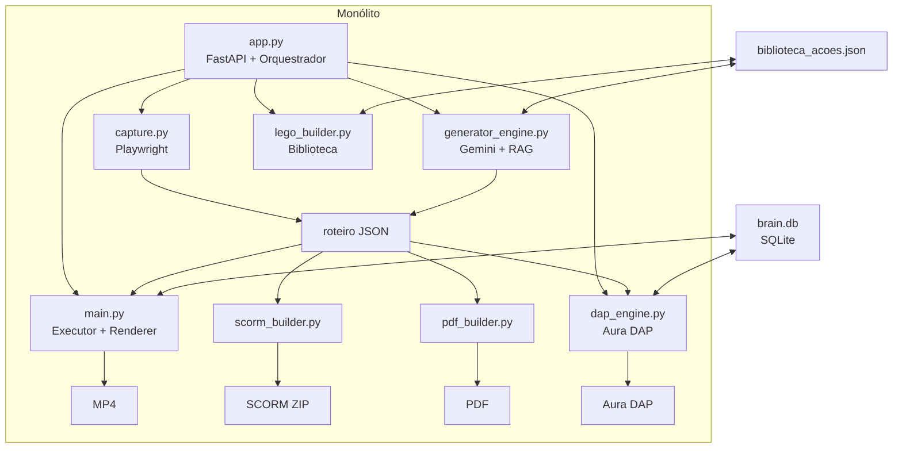
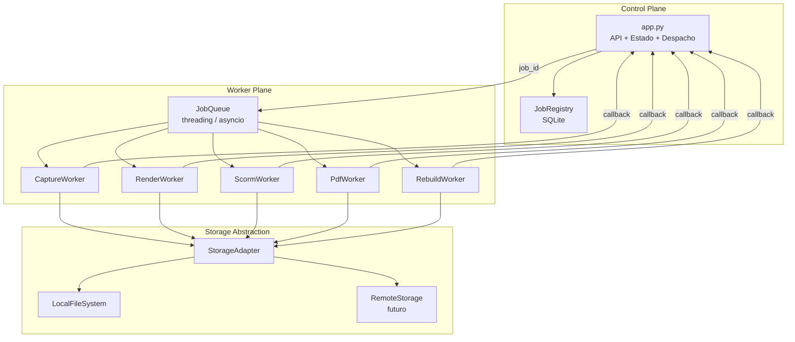

# Design Document — Senior Training OS Roadmap

## Overview

O Senior Training OS é uma plataforma de authoring de treinamentos com IA para o ecossistema Senior X ERP. O sistema transforma um workflow gravado por um especialista em múltiplos artefatos de treinamento (MP4, SCORM, PDF, Aura DAP) a partir de um único artefato central: o **roteiro**.

Este documento descreve a arquitetura e as decisões de design para as três fases do roadmap (0–360 dias), cobrindo a estabilização do monólito, a separação de plataforma e estúdio, e a productização do conhecimento operacional.

O roteiro é o contrato central e imutável do sistema. Toda evolução arquitetural deve preservar a compatibilidade entre as camadas de captura, geração, execução e entrega de artefatos.

---

## Architecture

### Estado Atual (Monólito)



### Fase 1 — Monólito Estabilizado

A Fase 1 não altera a topologia do sistema. O objetivo é congelar responsabilidades, adicionar contratos explícitos e instrumentação, sem mover código entre módulos.

```mermaid
graph TD
    subgraph Contratos Explícitos
        V[validar_roteiro\nutils.py] --> G[roteiro JSON]
        V2[validar_roteiro_ia\nutils.py] --> G
        L[limpar_nome\nutils.py] --> G
    end
    subgraph Pipeline Estabilizado
        A[app.py] -->|despacha| B[capture.py]
        A -->|despacha| C[generator_engine.py]
        A -->|despacha| D[main.py]
        B --> G
        C --> G
        G --> D
        G --> H[scorm_builder.py]
        G --> I[pdf_builder.py]
        G --> F[dap_engine.py]
    end
    subgraph Observabilidade
        VE[vision_engine.py] -->|telemetria| T[telemetria_camadas\nbrain.db]
        A -->|métricas| M[/api/metricas]
    end
```

### Fase 2 — Control Plane / Worker Plane



### Fase 3 — Núcleo Semântico

```mermaid
graph TD
    subgraph Núcleo Semântico
        B[Brain\nbrain.db]
        BIB[Biblioteca de Ações\nbiblioteca_acoes.json]
        SC[Score de Confiabilidade]
        B <--> BIB
        BIB --> SC
    end
    subgraph Renderizações
        SC --> V[Vídeo MP4]
        SC --> S[SCORM]
        SC --> P[PDF]
        SC --> D[Aura DAP]
        SC --> M[Missão GPS]
    end
    subgraph ROI
        ROI[/api/metricas\nROI Real]
        SC --> ROI
    end
```

---

## Components and Interfaces

### Módulos Centrais (Fase 1 — Responsabilidades Congeladas)

| Módulo | Responsabilidade única | Proibido |
|---|---|---|
| `app.py` | Rotas, estado, despacho de background tasks | Lógica de negócio inline |
| `capture.py` | Produzir dados brutos de captura via Playwright | Gerar artefatos |
| `generator_engine.py` | Transformar captura em roteiro via IA | Lógica de execução |
| `main.py` | Executar e renderizar roteiros | Captura ou geração |
| `vision_engine.py` | Estratégias de localização resiliente | Dependências de geração |
| `utils.py` | `limpar_nome()`, `validar_roteiro()`, `validar_roteiro_ia()` | Duplicação em outros módulos |

### Interface de Roteiro (Contrato Central)

O roteiro é o único artefato que atravessa todas as camadas. Campos obrigatórios:

```python
class RoteiroBase(BaseModel):
    metadata: Dict[str, Any]              # nome_aula, id_treinamento, gerado_por_ia, hitl_validado
    configuracao_gravacao: ConfiguracaoGravacao  # gravar_video, pasta_destino, voz_ia
    passos: List[PassoRoteiro]            # >= 2 passos, último com is_conclusao=True
```

### Interface de Job (Fase 2)

```python
class Job(BaseModel):
    job_id: str                           # UUID único
    tipo: str                             # captura | render | scorm | pdf | rebuild
    tenant_id: str
    status: Literal["pendente", "executando", "concluido", "falhou", "cancelado"]
    progresso: Optional[int]              # 0–100
    motivo_falha: Optional[str]
    criado_em: datetime
    concluido_em: Optional[datetime]
```

### Interface do Brain (Fase 2)

```python
class BrainBackend(Protocol):
    def get(self, intencao: str) -> Optional[EntradaCache]: ...
    def set(self, intencao: str, entrada: EntradaCache) -> None: ...
    def query(self, tenant_id: str, limit: int) -> List[EntradaCache]: ...
```

### Interface de Storage (Fase 2)

```python
class StorageAdapter(Protocol):
    def read(self, artifact_type: str, name: str, tenant_id: str) -> bytes: ...
    def write(self, artifact_type: str, name: str, data: bytes, tenant_id: str) -> None: ...
    def exists(self, artifact_type: str, name: str, tenant_id: str) -> bool: ...
    def list(self, artifact_type: str, tenant_id: str) -> List[str]: ...
```

### Score de Confiabilidade (Fase 3)

```python
class ScoreConfiabilidade(BaseModel):
    acao_id: str                          # intencao_semantica como chave
    taxa_sucesso: float                   # 0.0–1.0
    confianca_captura: float              # derivado do campo confianca_captura
    total_execucoes: int
    score: float                          # média ponderada dos três fatores
    requer_revisao: bool                  # score < 0.5
```

---

## Data Models

### Roteiro JSON (Schema Canônico)

```json
{
  "metadata": {
    "nome_aula": "string",
    "id_treinamento": "string (limpar_nome aplicado)",
    "gerado_por_ia": "bool",
    "hitl_validado": "bool",
    "origem": "manual | ia | captura",
    "tenant_id": "string",
    "versao": "int",
    "ingestado_dap": "bool"
  },
  "configuracao_gravacao": {
    "gravar_video": "bool",
    "pasta_destino": "string",
    "voz_ia": "string"
  },
  "passos": [
    {
      "id_passo": "int",
      "tipo_passo": "navigation | operacao | confirmation",
      "peso_narrativo": "int",
      "pause_sugerida": "float",
      "pedagogia": {
        "ancora": "string",
        "tooltip_dap": "string"
      },
      "is_conclusao": "bool",
      "alerta_instrutor": "string | null",
      "acoes_tecnicas": [
        {
          "acao": "clique | digitar_e_enter | preencher_campo | ...",
          "intencao_semantica": "string",
          "micro_narracao": "string",
          "seletor_css": "string",
          "elemento_alvo": {
            "descricao_visual": "string",
            "label_curto": "string",
            "seletor_hint": "string",
            "iframe_hint": "string | null",
            "html_hint": "string",
            "confianca_captura": "alta | media | baixa",
            "coordenadas_relativas": {}
          },
          "validacao_esperada": {
            "tipo": "elemento_visivel | estado_visual | ...",
            "alvo": "string"
          }
        }
      ]
    }
  ]
}
```

### Brain DB (brain.db)

```sql
-- Memória semântica de seletores
CREATE TABLE memoria_semantica (
    hash_intencao TEXT PRIMARY KEY,
    intencao TEXT,
    seletor TEXT,
    coords TEXT,
    iframe TEXT,
    hits INTEGER DEFAULT 0,
    falhas_consecutivas INTEGER DEFAULT 0,
    hitl_corrigido INTEGER DEFAULT 0,
    ultima_atualizacao TIMESTAMP DEFAULT CURRENT_TIMESTAMP
);

-- Telemetria por camada do vision_engine
CREATE TABLE telemetria_camadas (
    camada TEXT PRIMARY KEY,
    acertos INTEGER DEFAULT 0,
    falhas INTEGER DEFAULT 0,
    ultima_atualizacao TIMESTAMP DEFAULT CURRENT_TIMESTAMP
);
```

### Job Registry (Fase 2 — jobs.db ou tabela em brain.db)

```sql
CREATE TABLE jobs (
    job_id TEXT PRIMARY KEY,
    tipo TEXT NOT NULL,
    tenant_id TEXT NOT NULL,
    status TEXT NOT NULL DEFAULT 'pendente',
    progresso INTEGER,
    motivo_falha TEXT,
    log_execucao TEXT,
    criado_em TIMESTAMP DEFAULT CURRENT_TIMESTAMP,
    concluido_em TIMESTAMP
);
```

### Biblioteca de Ações (biblioteca_acoes.json)

```json
{
  "intencao_semantica_lowercase": {
    "acao": "clique",
    "intencao_semantica": "string",
    "elemento_alvo": { "label_curto": "...", "seletor_hint": "...", "iframe_hint": "..." },
    "_source": "nome_do_roteiro.json",
    "_versao_biblioteca": "int",
    "_score_confiabilidade": "float"
  }
}
```

### Score de Confiabilidade (Fase 3 — tabela em brain.db)

```sql
CREATE TABLE scores_confiabilidade (
    acao_id TEXT PRIMARY KEY,
    taxa_sucesso REAL DEFAULT 1.0,
    confianca_captura REAL DEFAULT 1.0,
    total_execucoes INTEGER DEFAULT 0,
    score REAL DEFAULT 1.0,
    requer_revisao INTEGER DEFAULT 0,
    ultima_atualizacao TIMESTAMP DEFAULT CURRENT_TIMESTAMP
);
```

---

## Correctness Properties

*A property is a characteristic or behavior that should hold true across all valid executions of a system — essentially, a formal statement about what the system should do. Properties serve as the bridge between human-readable specifications and machine-verifiable correctness guarantees.*

### Property 1: Rejeição de roteiro com menos de 2 passos

*Para qualquer* roteiro com menos de 2 passos, `validar_roteiro()` SHALL retornar `False`.

**Validates: Requirements 1.2.2**

---

### Property 2: Aceitação de roteiro estruturalmente válido

*Para qualquer* roteiro com N >= 2 passos onde pelo menos 50% das ações têm `seletor_hint` preenchido e no máximo 70% têm `confianca_captura == 'baixa'`, `validar_roteiro()` SHALL retornar `True`.

**Validates: Requirements 1.2.1, 1.2.2**

---

### Property 3: Idempotência do Rebuild

*Para qualquer* conjunto de roteiros em `roteiros_salvos/`, executar `construir_biblioteca()` duas vezes consecutivas SHALL produzir o mesmo `biblioteca_acoes.json` (mesmo conteúdo, mesmas chaves, mesmos valores).

**Validates: Requirements 1.3.4, 1.6**

---

### Property 4: Round-trip de serialização de roteiro

*Para qualquer* roteiro válido R, `json.loads(json.dumps(R))` SHALL produzir um objeto R' tal que `validar_roteiro(R') == validar_roteiro(R)` e todos os campos de R estejam presentes em R' com os mesmos valores.

**Validates: Requirements 1.3.5, NFR-4.3**

---

### Property 5: Bloqueio de promoção de roteiro inválido

*Para qualquer* roteiro que faça `validar_roteiro()` retornar `False`, o sistema SHALL bloquear sua promoção para a Biblioteca_de_Ações e registrar o motivo em log.

**Validates: Requirements 1.6.2**

---

### Property 6: Telemetria de camadas do Vision Engine

*Para qualquer* tentativa de localização executada pelo `vision_engine.py`, a tabela `telemetria_camadas` no `brain.db` SHALL conter um registro atualizado para a camada utilizada, com `acertos` ou `falhas` incrementado corretamente.

**Validates: Requirements 1.4.1**

---

### Property 7: Unicidade de job_id

*Para qualquer* sequência de N operações de background iniciadas, todos os `job_id` gerados SHALL ser distintos entre si.

**Validates: Requirements 2.2.1**

---

### Property 8: Round-trip de estado de job

*Para qualquer* job criado com um `job_id`, consultar o registro de jobs SHALL retornar o mesmo job com seu estado atual, sem perda de dados.

**Validates: Requirements 2.2.3**

---

### Property 9: Isolamento de tenant no Brain

*Para quaisquer* dois tenants A e B distintos, uma entrada de memória gravada para o tenant A SHALL NOT ser retornada em consultas ao Brain para o tenant B.

**Validates: Requirements 2.5.4**

---

### Property 10: Isolamento de tenant no Pinecone

*Para qualquer* requisição com `tenant_id` T, todas as operações de upsert e query ao Pinecone SHALL usar exclusivamente o namespace correspondente a T.

**Validates: Requirements 2.5.3**

---

### Property 11: Preservação de versões de roteiro

*Para qualquer* sequência de N >= 2 escritas sobre o mesmo roteiro, o sistema SHALL preservar pelo menos as 2 versões mais recentes distintas, de modo que a versão anterior possa ser restaurada.

**Validates: Requirements 2.6.1, 2.6.2**

---

### Property 12: Invariante de score de confiabilidade

*Para qualquer* ação A com qualquer histórico de execuções, `0.0 <= score(A) <= 1.0` SHALL ser sempre verdadeiro.

**Validates: Requirements 3.2.1**

---

### Property 13: Monotonicidade de score com execuções bem-sucedidas

*Para qualquer* ação A, registrar uma execução bem-sucedida SHALL resultar em `score(A, N+1) >= score(A, N)` — o score nunca decresce após um sucesso.

**Validates: Requirements 3.2.3**

---

### Property 14: Score de fluxo como função determinística das ações

*Para qualquer* roteiro R com ações A1..An, chamar o cálculo de `score(R)` duas vezes com os mesmos `[score(A1), ..., score(An)]` SHALL produzir o mesmo resultado.

**Validates: Requirements 3.2.2**

---

### Property 15: Rate limiting por IP

*Para qualquer* IP que faça mais de 20 requisições em uma janela de 60 segundos, a 21ª requisição SHALL retornar HTTP 429.

**Validates: Requirements NFR-1.4**

---

### Property 16: Tolerância a campos extras no roteiro

*Para qualquer* roteiro válido R, adicionar campos desconhecidos ao JSON SHALL não alterar o resultado de `validar_roteiro(R)`.

**Validates: Requirements NFR-4.4**

---

### Property 17: Idempotência de aplicação de defaults

*Para qualquer* roteiro já completo (todos os campos presentes), aplicar a lógica de defaults SHALL não alterar nenhum campo existente.

**Validates: Requirements NFR-4.3**

---

### Property 18: Retry com backoff em falhas de API externa

*Para qualquer* chamada a uma API externa (Gemini, OpenAI, Pinecone) que falhe na primeira tentativa, o sistema SHALL realizar pelo menos 2 tentativas adicionais com delay crescente antes de retornar erro.

**Validates: Requirements NFR-2.1**

---

## Error Handling

### Estratégia Geral

Todos os erros seguem o princípio de **fail-safe com degradação graciosa**: o sistema nunca expõe detalhes internos ao cliente e sempre registra o contexto completo em log.

### Camadas de Erro

**Erros de Validação de Roteiro**
- `validar_roteiro()` retorna `(False, motivo)` — nunca lança exceção
- O chamador é responsável por bloquear a operação e registrar o motivo
- Resposta ao cliente: HTTP 422 com mensagem legível, sem stack trace

**Erros de APIs Externas (Gemini, OpenAI, Pinecone)**
- Retry com exponential backoff: delays de 1s, 2s, 4s (configurável)
- Após esgotar tentativas: retorna `{"status": "erro", "mensagem": str(e)}`
- Modo degradado: sistema continua sem o componente falhado (sem RAG, sem self-healing)
- Log: `ERROR` com nome da API, número de tentativas e último erro

**Erros de I/O de Artefatos**
- Escrita atômica via `tempfile.mkstemp` + `os.replace()` — nunca corrompe o arquivo destino
- Em caso de falha no `os.replace()`: remove o arquivo temporário e registra `ERROR`
- Versão anterior do artefato é sempre preservada antes de qualquer sobrescrita

**Erros de Background Tasks**
- `executar_processo_bg()` captura `returncode != 0` e extrai a última linha de log como motivo
- Estado propagado via `_set_estado(erro=...)` e broadcast WebSocket
- Processo cancelado: `_set_estado(erro="Execução interrompida pelo utilizador.")`

**Erros do Brain (SQLite)**
- `_init_db()` com try/except — falha de permissão não impede importação do módulo
- Operações de leitura/escrita com try/except individuais — falha do Brain não para o pipeline
- Log: `WARNING` quando Brain indisponível, sistema continua sem self-healing

**Erros de Autenticação e Path Traversal**
- Token inválido: HTTP 401, log com IP de origem
- Path fora do diretório base: HTTP 400, log da tentativa
- Rate limit excedido: HTTP 429 com mensagem de orientação

### Formato de Log Estruturado

```python
logging.info(f"[{module}] {message}", extra={
    "timestamp": datetime.utcnow().isoformat(),
    "level": "INFO",
    "module": "generator_engine",
    "message": "Roteiro gerado com 5 passos"
})
```

Campos obrigatórios: `timestamp`, `level`, `module`, `message`.

---

## Testing Strategy

### Abordagem Dual

A estratégia combina testes unitários (exemplos concretos e casos de borda) com testes baseados em propriedades (cobertura universal via geração aleatória de inputs). Os dois são complementares e ambos são necessários.

**Testes unitários** cobrem:
- Exemplos específicos de roteiros válidos e inválidos
- Casos de borda documentados (roteiro vazio, passo sem ações, seletor frágil)
- Pontos de integração entre módulos (ex: `app.py` → `lego_builder.py`)
- Comportamento de erro estruturado (HTTP 401, 422, 429, 400)

**Testes de propriedade** cobrem:
- Invariantes universais (score em [0,1], unicidade de job_id)
- Round-trips (serialização, restauração de versão)
- Idempotência (rebuild, aplicação de defaults)
- Monotonicidade (score após sucesso)
- Isolamento (tenant no Brain e Pinecone)

### Biblioteca de Property-Based Testing

**Python**: [Hypothesis](https://hypothesis.readthedocs.io/) — biblioteca madura, integração nativa com pytest, suporte a estratégias compostas para gerar roteiros aleatórios.

```python
from hypothesis import given, settings
from hypothesis import strategies as st
```

Cada teste de propriedade deve rodar com **mínimo de 100 iterações** (`@settings(max_examples=100)`).

### Estrutura de Testes por Fase

**Fase 1 — Testes de Regressão por Camada**

```
tests/
  test_utils.py           # validar_roteiro, validar_roteiro_ia, limpar_nome
  test_lego_builder.py    # construir_biblioteca, idempotência, monotonicidade
  test_generator_engine.py # estrutura mínima do JSON gerado
  test_vision_engine.py   # telemetria de camadas, fallbacks do Brain
  test_scorm_builder.py   # geração sem erro para roteiro de referência
  test_pdf_builder.py     # geração sem erro para roteiro de referência
  properties/
    test_roteiro_props.py # Properties 1–5, 16, 17 (Hypothesis)
    test_rebuild_props.py # Property 3 (idempotência)
    test_score_props.py   # Properties 12–14 (score)
```

**Fase 2 — Testes de Jobs e Isolamento**

```
tests/
  test_job_registry.py    # ciclo de vida de jobs, unicidade de job_id
  test_storage_adapter.py # escrita atômica, path validation
  properties/
    test_job_props.py     # Properties 7–8 (job_id, round-trip)
    test_tenant_props.py  # Properties 9–10 (isolamento de tenant)
    test_versioning_props.py # Property 11 (preservação de versões)
```

**Fase 3 — Testes de Score e ROI**

```
tests/
  test_score_engine.py    # cálculo de score, marcação requer_revisao
  test_metricas_roi.py    # campos null quando sem dados
  properties/
    test_score_props.py   # Properties 12–14 (invariante, monotonicidade, determinismo)
```

### Anotação de Testes de Propriedade

Cada teste de propriedade deve referenciar a propriedade do design:

```python
# Feature: training-os-roadmap, Property 3: Idempotência do Rebuild
@given(st.lists(roteiro_strategy(), min_size=1, max_size=10))
@settings(max_examples=100)
def test_rebuild_idempotencia(roteiros):
    ...
```

### Estratégias Hypothesis para Roteiros

```python
from hypothesis import strategies as st

acao_tecnica_strategy = st.fixed_dictionaries({
    "acao": st.sampled_from(["clique", "digitar_e_enter", "preencher_campo"]),
    "intencao_semantica": st.text(min_size=1, max_size=50),
    "elemento_alvo": st.fixed_dictionaries({
        "seletor_hint": st.one_of(st.just(""), st.text(min_size=1, max_size=80)),
        "confianca_captura": st.sampled_from(["alta", "media", "baixa"]),
    }),
})

passo_strategy = st.fixed_dictionaries({
    "id_passo": st.integers(min_value=1, max_value=100),
    "is_conclusao": st.booleans(),
    "pedagogia": st.fixed_dictionaries({
        "ancora": st.text(max_size=200),
        "tooltip_dap": st.text(max_size=100),
    }),
    "acoes_tecnicas": st.lists(acao_tecnica_strategy, min_size=0, max_size=5),
})

roteiro_strategy = lambda: st.fixed_dictionaries({
    "metadata": st.fixed_dictionaries({
        "nome_aula": st.text(min_size=1, max_size=50),
        "id_treinamento": st.text(min_size=1, max_size=40),
    }),
    "configuracao_gravacao": st.fixed_dictionaries({
        "gravar_video": st.booleans(),
        "pasta_destino": st.just("videos_gerados"),
        "voz_ia": st.just("pt-BR-FranciscaNeural"),
    }),
    "passos": st.lists(passo_strategy, min_size=0, max_size=10),
})
```

### Plano de Teste Manual Mínimo por Fase

**Fase 1**
1. Gravar uma aula via `/api/gravar`, verificar que o roteiro gerado passa em `validar_roteiro()`
2. Editar o roteiro para ter 1 passo, tentar salvar via `/api/roteiros/{arquivo}`, verificar rejeição
3. Executar rebuild via `/api/rebuild-library`, executar novamente, verificar que `biblioteca_acoes.json` é idêntico
4. Verificar que `/api/metricas` retorna `self_healing_hits` e `total_memorizado` após execução do robô

**Fase 2**
1. Iniciar dois jobs simultâneos do mesmo tipo, verificar que o segundo retorna erro de conflito
2. Cancelar um job em execução, verificar que arquivos temporários são limpos
3. Criar roteiros para dois tenants distintos, verificar que consultas retornam apenas dados do tenant correto

**Fase 3**
1. Executar um fluxo 5 vezes com sucesso, verificar que `score` da ação aumenta monotonicamente
2. Forçar score < 0.5 em uma ação, verificar que `requer_revisao = true` na biblioteca
3. Verificar que `/api/metricas` retorna `null` para campos sem dados, não zero ou campo ausente
