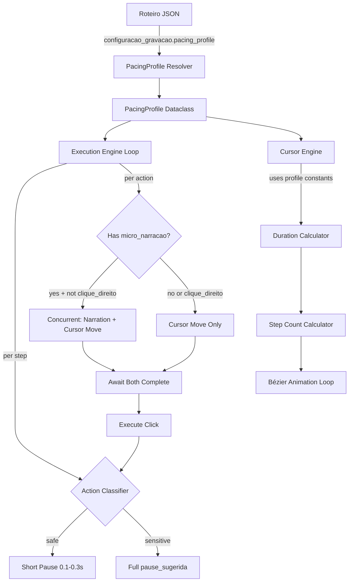

# Design Document: Video Pacing Optimization

## Overview

This design optimizes the pacing of automatically generated training videos in Senior Training OS. The current system produces videos that feel slow and robotic due to sequential narration→movement execution, excessive inter-action pauses, and overly long cursor animations. The optimization targets a ~50% reduction in total video duration while preserving screen capture quality, double-click reliability, and page load stability.

The approach modifies two core modules:
- **cursor_engine.py** — Reduced duration formula, fewer animation steps, preserved Bézier math
- **main.py** — Concurrent narration+movement, intelligent pause classification, configurable pacing profiles

### Design Decisions

1. **Pacing profiles as a data-driven configuration** rather than code branches — a single `PacingProfile` dataclass holds all constants, selected once at execution start and passed through the pipeline.
2. **Action classification as a pure function** — the sensitive/safe classification logic is extracted into a testable pure function that takes step metadata and returns a classification enum.
3. **asyncio.gather for concurrency** — narration and cursor movement run as concurrent coroutines, with the click action gated on both completing (or narration timing out at 15s).
4. **No changes to Bézier math** — the curve generation, overshoot, and jitter logic remain untouched. Only the duration and step-count constants change.

## Architecture



## Components and Interfaces

### 1. PacingProfile (New Dataclass)

**Location:** `cursor_engine.py` (shared between both modules)

```python
from dataclasses import dataclass

@dataclass(frozen=True)
class PacingProfile:
    """Immutable pacing constants resolved once per execution run."""
    name: str
    cursor_base_ms: int
    cursor_min_ms: int
    cursor_max_ms: int
    safe_pause_min: float
    safe_pause_max: float
    steps_per_pixel: float
    steps_min: int
    steps_max: int

PROFILES = {
    "fast": PacingProfile(
        name="fast",
        cursor_base_ms=600, cursor_min_ms=300, cursor_max_ms=1400,
        safe_pause_min=0.1, safe_pause_max=0.3,
        steps_per_pixel=0.06, steps_min=12, steps_max=50,
    ),
    "normal": PacingProfile(
        name="normal",
        cursor_base_ms=900, cursor_min_ms=400, cursor_max_ms=1800,
        safe_pause_min=0.2, safe_pause_max=0.5,
        steps_per_pixel=0.06, steps_min=12, steps_max=50,
    ),
    "conservative": PacingProfile(
        name="conservative",
        cursor_base_ms=1200, cursor_min_ms=500, cursor_max_ms=2500,
        safe_pause_min=0.3, safe_pause_max=0.8,
        steps_per_pixel=0.06, steps_min=20, steps_max=90,
    ),
}
```

### 2. resolve_pacing_profile (New Function)

**Location:** `cursor_engine.py`

```python
def resolve_pacing_profile(configuracao_gravacao: dict) -> PacingProfile:
    """Resolve pacing profile from roteiro config. Defaults to 'fast'."""
    profile_name = configuracao_gravacao.get("pacing_profile", "fast")
    if profile_name not in PROFILES:
        logging.warning(f"Invalid pacing_profile '{profile_name}', falling back to 'fast'")
        profile_name = "fast"
    return PROFILES[profile_name]
```

### 3. calcular_duracao_movimento (New Pure Function)

**Location:** `cursor_engine.py`

```python
def calcular_duracao_movimento(distance: float, profile: PacingProfile) -> int:
    """Calculate cursor movement duration in ms. Pure function, no side effects."""
    if distance < 3:
        return 0  # skip signal
    base = profile.cursor_base_ms * (distance / 400) ** 0.55
    clamped = max(profile.cursor_min_ms, min(profile.cursor_max_ms, base))
    randomized = clamped * random.uniform(0.92, 1.08)
    return int(max(profile.cursor_min_ms, min(profile.cursor_max_ms, randomized)))
```

### 4. calcular_passos_movimento (New Pure Function)

**Location:** `cursor_engine.py`

```python
def calcular_passos_movimento(distance: float, profile: PacingProfile) -> int:
    """Calculate animation step count. Pure function."""
    raw = distance * profile.steps_per_pixel
    return int(max(profile.steps_min, min(profile.steps_max, raw)))
```

### 5. ActionClassification (New Enum + Classifier)

**Location:** `main.py`

```python
from enum import Enum

class ActionClassification(Enum):
    SAFE = "safe"
    SENSITIVE = "sensitive"

def classificar_acao(acao_tec: dict, passo: dict) -> ActionClassification:
    """Pure function: classify action as safe or sensitive based on step metadata."""
    # Rule: double-click is always sensitive
    if acao_tec.get("acao") == "duplo_clique":
        return ActionClassification.SENSITIVE
    
    # Rule: navigation tipo_passo is sensitive
    tipo = passo.get("tipo_passo", "").lower()
    if tipo in ("navigation", "navegacao", "page_refresh"):
        return ActionClassification.SENSITIVE
    
    # Rule: pause_sugerida > 3.0 is sensitive
    pause = float(passo.get("pause_sugerida", 0))
    if pause > 3.0:
        return ActionClassification.SENSITIVE
    
    # Rule: action followed by wait_for_load_state is sensitive
    if acao_tec.get("aguarda_carregamento", False):
        return ActionClassification.SENSITIVE
    
    return ActionClassification.SAFE
```

### 6. calcular_pausa_pos_acao (New Pure Function)

**Location:** `main.py`

```python
def calcular_pausa_pos_acao(
    classification: ActionClassification,
    pause_sugerida: float,
    profile: PacingProfile,
) -> float:
    """Calculate post-action pause duration in seconds. Pure function."""
    if classification == ActionClassification.SENSITIVE:
        return pause_sugerida
    # Safe action: random pause within profile bounds
    return random.uniform(profile.safe_pause_min, profile.safe_pause_max)
```

### 7. Modified mover_cursor_humanizado

The existing function signature gains an optional `profile` parameter:

```python
async def mover_cursor_humanizado(
    page, x_fim: float, y_fim: float,
    duracao_ms: Optional[int] = None,
    profile: Optional[PacingProfile] = None,
) -> None:
```

When `profile` is provided and `duracao_ms` is None, the function uses `calcular_duracao_movimento` and `calcular_passos_movimento` with the profile constants instead of the module-level constants.

### 8. Modified Execution Loop (Concurrent Narration + Movement)

The core change in `executar_roteiro`:

```python
# Current (sequential):
#   play narration → wait for audio → move cursor → click

# New (concurrent):
#   start narration + start cursor move (asyncio.gather)
#   → wait for both → click

async def _executar_acao_com_narracao(page, acao_tec, passo, profile, ...):
    micro_voz = acao_tec.get("micro_narracao", "")
    is_clique_direito = acao_tec.get("acao") == "clique_direito"
    
    if micro_voz and not is_clique_direito:
        # Start narration (non-blocking)
        audio_task = asyncio.create_task(_play_narration(micro_voz, ...))
        # Start cursor movement (non-blocking)
        move_task = asyncio.create_task(_move_and_prepare_click(page, acao_tec, profile))
        # Wait for both, with 15s max wait for narration
        await move_task
        try:
            await asyncio.wait_for(audio_task, timeout=15.0)
        except asyncio.TimeoutError:
            pass  # proceed with click regardless
    else:
        await _move_and_prepare_click(page, acao_tec, profile)
    
    # Execute click
    await clicar_com_animacao(page, acao_tec)
```

## Data Models

### PacingProfile Constants by Profile

| Profile | base_ms | min_ms | max_ms | safe_pause_min | safe_pause_max | steps_min | steps_max |
|---------|---------|--------|--------|----------------|----------------|-----------|-----------|
| fast | 600 | 300 | 1400 | 0.1s | 0.3s | 12 | 50 |
| normal | 900 | 400 | 1800 | 0.2s | 0.5s | 12 | 50 |
| conservative | 1200 | 500 | 2500 | 0.3s | 0.8s | 20 | 90 |

### Roteiro Configuration Extension

The `configuracao_gravacao` section of the roteiro JSON gains one optional field:

```json
{
  "configuracao_gravacao": {
    "voz_ia": "pt-BR-FranciscaNeural",
    "pacing_profile": "fast"
  }
}
```

### Action Classification Decision Table

| Condition | Classification |
|-----------|---------------|
| acao == "duplo_clique" | SENSITIVE |
| tipo_passo in (navigation, navegacao, page_refresh) | SENSITIVE |
| pause_sugerida > 3.0 | SENSITIVE |
| aguarda_carregamento == true | SENSITIVE |
| None of the above | SAFE |

## Correctness Properties

*A property is a characteristic or behavior that should hold true across all valid executions of a system — essentially, a formal statement about what the system should do. Properties serve as the bridge between human-readable specifications and machine-verifiable correctness guarantees.*

### Property 1: Duration bounds hold for all distances and profiles

*For any* Euclidean distance >= 3 pixels and any valid pacing profile, the calculated movement duration (after randomization) SHALL always be within [profile.cursor_min_ms, profile.cursor_max_ms].

**Validates: Requirements 1.2, 1.3, 1.4**

### Property 2: Short-distance duration cap

*For any* distance in [3, 150) pixels using the "fast" profile, the base duration (before randomization) SHALL be <= 450ms.

**Validates: Requirements 1.5**

### Property 3: Trivial distance produces zero duration (skip signal)

*For any* distance < 3 pixels, `calcular_duracao_movimento` SHALL return 0, signaling that no animation should occur.

**Validates: Requirements 1.6**

### Property 4: Overshoot magnitude and jitter are bounded

*For any* cursor movement with distance > 60 pixels where overshoot is applied, the overshoot displacement SHALL be <= 5 pixels, and per-step jitter SHALL be <= 2 pixels in each axis.

**Validates: Requirements 1.7**

### Property 5: Step count formula correctness

*For any* distance >= 3 pixels and any valid pacing profile, the calculated step count SHALL equal `clamp(distance * profile.steps_per_pixel, profile.steps_min, profile.steps_max)`.

**Validates: Requirements 2.1, 2.2, 2.3**

### Property 6: Cubic-in-out easing is monotonic and bounded

*For any* t in [0, 1], the cubic-in-out easing function SHALL satisfy: f(0) = 0, f(1) = 1, f is monotonically non-decreasing, and f(0.5) = 0.5 (symmetry).

**Validates: Requirements 2.4**

### Property 7: Action classification correctness

*For any* action and step metadata, `classificar_acao` SHALL return SENSITIVE if and only if at least one of the following holds: (a) acao == "duplo_clique", (b) tipo_passo indicates navigation, (c) pause_sugerida > 3.0, (d) aguarda_carregamento is true. Otherwise it SHALL return SAFE.

**Validates: Requirements 4.3, 4.4, 4.5, 4.6, 4.7**

### Property 8: Safe action pause is bounded

*For any* action classified as SAFE and any valid pacing profile, the post-action pause SHALL be within [profile.safe_pause_min, profile.safe_pause_max].

**Validates: Requirements 4.1**

### Property 9: Sensitive action pause preserves pause_sugerida

*For any* action classified as SENSITIVE with any pause_sugerida value, the post-action pause SHALL equal the unmodified pause_sugerida value.

**Validates: Requirements 4.2, 7.2, 7.5**

### Property 10: Profile resolution correctness

*For any* string value in {"fast", "normal", "conservative"}, `resolve_pacing_profile` SHALL return the corresponding profile with correct constants. *For any* string not in that set (including empty), it SHALL return the "fast" profile.

**Validates: Requirements 8.1, 8.2, 8.3, 8.4, 8.5, 8.6**

### Property 11: Duration formula matches specification

*For any* distance >= 3 pixels and any valid pacing profile, the base duration (before randomization) SHALL equal `profile.cursor_base_ms * (distance / 400) ^ 0.55`, clamped to [profile.cursor_min_ms, profile.cursor_max_ms].

**Validates: Requirements 1.1**

### Property 12: Minimum inter-step delay

*For any* cursor movement animation, the computed inter-step delay SHALL be >= 8ms for every step in the sequence.

**Validates: Requirements 5.3**

## Error Handling

### Audio Failures
- If TTS generation fails, the execution engine proceeds without narration for that action (no blocking).
- If `pygame.mixer` fails to play a generated MP3, the cursor movement and click proceed immediately.
- The 15-second narration timeout prevents indefinite blocking if audio playback hangs.

### Invalid Pacing Profile
- Invalid profile values fall back to "fast" with a `logging.warning` message.
- Missing `pacing_profile` key defaults to "fast" silently (no warning).

### Cursor Movement Failures
- If `window.updateRoboCursor` JS call fails on any step, the movement continues without retry (existing behavior preserved).
- If `page.evaluate` for cursor position fails, movement starts from (0, 0) as fallback (existing behavior).

### Page Load Timeouts
- 30-second timeout on `wait_for_load_state("load")` — logs timeout and proceeds.
- Sensitive action pauses are never reduced, ensuring UI stabilization time is preserved.

### Concurrent Task Errors
- If the narration task raises an exception during concurrent execution, the cursor movement task continues unaffected.
- If the cursor movement task raises an exception, the click action is still attempted (best-effort).

## Testing Strategy

### Property-Based Tests (Hypothesis)

The feature introduces several pure functions with clear input/output contracts that are ideal for property-based testing:

- **Library:** [Hypothesis](https://hypothesis.readthedocs.io/) (already in use — `.hypothesis/` directory exists in project root)
- **Minimum iterations:** 100 per property
- **Tag format:** `# Feature: video-pacing-optimization, Property {N}: {title}`

**Target functions for PBT:**
1. `calcular_duracao_movimento(distance, profile)` — Properties 1, 2, 3, 11
2. `calcular_passos_movimento(distance, profile)` — Property 5
3. `_ease_cubic_inout(t)` — Property 6
4. `classificar_acao(acao_tec, passo)` — Property 7
5. `calcular_pausa_pos_acao(classification, pause_sugerida, profile)` — Properties 8, 9
6. `resolve_pacing_profile(config)` — Property 10
7. Inter-step delay calculation — Property 12
8. Overshoot/jitter generation — Property 4

### Unit Tests (Example-Based)

- Anchor narration remains sequential (Req 3.4)
- Right-click skips micro-narration (Req 3.5)
- Double-click inter-click interval unchanged (Req 6.1)
- Context menu follow-up within 500ms (Req 6.2)
- Default profile is "fast" when key is missing (Req 8.5)
- Audio failure does not block execution (Req 3.6)
- Page load timeout logs and proceeds (Req 7.4)

### Integration Tests

- Concurrent narration + cursor movement coordination (Req 3.1, 3.2, 3.3)
- Screen recording captures all cursor positions at 1920x1080 (Req 5.1)
- Screenshot waits 200ms after cursor movement completes (Req 5.4)
- Full roteiro execution with "fast" profile produces shorter video than "conservative"
- Page navigation waits are preserved during pacing optimization (Req 7.1, 7.3)

### Manual Validation

- Visual inspection: cursor movement looks natural and brisk at "fast" profile
- Timing comparison: record same roteiro with "fast" vs "conservative", verify ~40-50% duration reduction
- Double-click reliability: execute roteiro with double-click actions in Senior X ERP, verify all register correctly
- Context menu: verify right-click → menu item flow works within timing window
