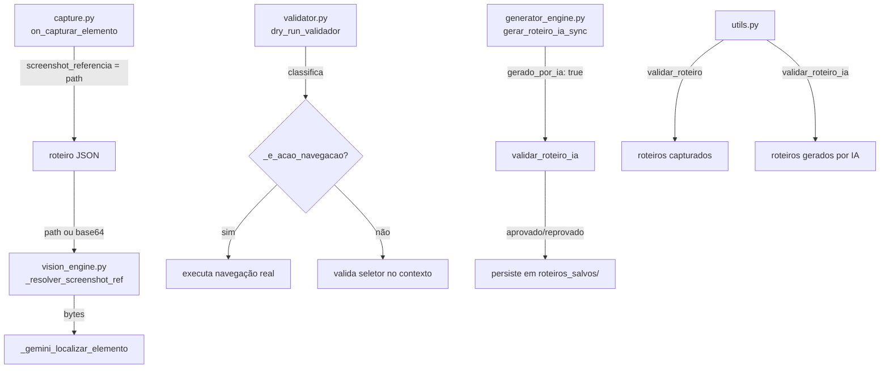

# Design Técnico — Fase 3: Melhoria de Vision e Seletores

## Overview

Esta fase resolve três problemas independentes de qualidade e resiliência no pipeline do Senior Training OS, sem alterar o schema do roteiro JSON nem quebrar roteiros existentes.

**Problema 1 — Screenshots base64 inline:** `on_capturar_elemento` em `capture.py` embute screenshots JPEG como base64 diretamente no campo `screenshot_referencia` do roteiro. Roteiros com 30+ ações podem acumular 10MB+ de base64, degradando leitura, geração de IA e processamento downstream. A solução externaliza os screenshots para disco e armazena apenas o path relativo.

**Problema 2 — Validator fora de contexto:** `validator.py` testa todos os seletores na tela inicial do Senior X, gerando falsos positivos para elementos que só existem após navegar para um módulo específico. A solução classifica ações como navegação ou validáveis e executa navegações reais antes de validar seletores dependentes.

**Problema 3 — Portão de qualidade inadequado para IA:** `validar_roteiro` em `utils.py` reprova todos os roteiros gerados por IA porque exige `seletor_hint`, que nunca está presente nesses roteiros. A solução adiciona `validar_roteiro_ia` com critérios adequados ao formato de roteiros gerados por IA.

**Restrições absolutas respeitadas:**
- Schema do roteiro JSON inalterado — `screenshot_referencia` já existia como campo livre.
- Roteiros existentes com base64 continuam funcionando via detecção automática no `vision_engine.py`.
- `validar_roteiro` original permanece inalterado.
- Nenhuma nova dependência de biblioteca.

---

## Architecture

O pipeline permanece inalterado em sua estrutura. As mudanças são cirúrgicas em três pontos:



---

## Components and Interfaces

### Requisito 1 — capture.py + vision_engine.py

**capture.py — variável global de sessão**

Problema: `on_capturar_elemento` é uma callback registrada via `expose_binding` antes de o usuário informar o nome da aula. O `nome_aula` só existe no escopo de `iniciar_esteira_de_producao`. A solução usa uma variável global de módulo `_nome_aula_sessao` definida em `capturar_cliques_na_tela()` antes de iniciar a sessão.

```python
# capture.py — adições ao topo do módulo (junto às outras globais)
_nome_aula_sessao: str = ""

# capture.py — início de capturar_cliques_na_tela()
async def capturar_cliques_na_tela():
    global _lock_id, _pending_tasks, _nome_aula_sessao
    # _nome_aula_sessao é definido pelo chamador (iniciar_esteira_de_producao)
    # antes de chamar esta função. Não há input aqui.
    ...
```

O chamador `iniciar_esteira_de_producao` define `_nome_aula_sessao = nome_aula` antes de chamar `_pipeline()`.

**capture.py — on_capturar_elemento (mudança no bloco de screenshot)**

```python
# ANTES
screenshot_b64 = base64.b64encode(screenshot_bytes).decode("utf-8")
# ...
"screenshot_referencia": screenshot_b64,

# DEPOIS
pasta_screenshots = os.path.join(
    "audios_gerados", limpar_nome(_nome_aula_sessao), "screenshots"
)
os.makedirs(pasta_screenshots, exist_ok=True)
screenshot_path = os.path.join(pasta_screenshots, f"acao_{meu_id_acao}.jpg")
try:
    with open(screenshot_path, "wb") as f_img:
        f_img.write(screenshot_bytes)
    screenshot_ref = screenshot_path
except Exception:
    screenshot_ref = base64.b64encode(screenshot_bytes).decode("utf-8")  # fallback
# ...
"screenshot_referencia": screenshot_ref,
```

**vision_engine.py — _resolver_screenshot_ref (nova função auxiliar)**

Inserida antes de `_gemini_localizar_elemento`. Detecta automaticamente se a referência é um path de arquivo ou uma string base64, sem campo adicional no roteiro.

```python
def _resolver_screenshot_ref(ref: str | None) -> bytes | None:
    """
    Resolve screenshot_referencia para bytes, independentemente do formato.
    Suporta: path relativo em disco, string base64, ou None.
    Nunca lança exceção — retorna None em caso de falha.
    """
    if not ref:
        return None
    if os.path.exists(ref):
        try:
            with open(ref, "rb") as f:
                return f.read()
        except Exception:
            return None
    try:
        return base64.b64decode(ref)
    except Exception:
        return None
```

**vision_engine.py — _gemini_localizar_elemento (mudança no consumo)**

```python
# ANTES
if screenshot_ref_b64:
    try:
        ref_bytes = base64.b64decode(screenshot_ref_b64)
        ...

# DEPOIS
if screenshot_ref_b64:
    ref_bytes = _resolver_screenshot_ref(screenshot_ref_b64)
    if ref_bytes:
        contents.append("IMAGEM 1 - REFERENCIA (estado da tela na gravacao original):")
        contents.append(types.Part.from_bytes(data=ref_bytes, mime_type="image/jpeg"))
```

O parâmetro `screenshot_ref_b64` mantém o nome atual para não alterar a assinatura da função — o nome é agora um misnomer aceitável, documentado com comentário.

---

### Requisito 2 — validator.py

**Heurística de classificação**

```python
_PALAVRAS_NAVEGACAO = [
    "menu", "breadcrumb", "fa-home", "home", "inicio", "módulo",
    "apps-menu", "menu-item", "nav-item", "sidebar",
]

def _e_acao_navegacao(acao_tec: dict) -> bool:
    """
    Classifica uma ação técnica como navegação por heurística de label/seletor.
    Não depende do campo tipo_passo — opera sobre o conteúdo do elemento_alvo.
    """
    alvo = acao_tec.get("elemento_alvo", {}) or {}
    label = (alvo.get("label_curto", "") or "").lower()
    seletor = (alvo.get("seletor_hint", "") or "").lower()
    blob = f"{label} {seletor}"
    return any(k in blob for k in _PALAVRAS_NAVEGACAO)
```

**Funções auxiliares de execução**

```python
async def _executar_navegacao(page, acao_tec: dict):
    """Executa clique real em ação de navegação e aguarda estabilidade."""
    alvo = acao_tec.get("elemento_alvo", {}) or {}
    seletor = alvo.get("seletor_hint") or alvo.get("seletor_css")
    if not seletor:
        return
    await page.locator(seletor).first.click(timeout=5000)
    await page.wait_for_load_state("networkidle", timeout=10000)

async def _validar_seletor(page, passo: dict, acao_tec: dict, resultados: dict):
    """Valida visibilidade e estado habilitado de um seletor no contexto atual."""
    id_p = passo.get("id_passo")
    alvo = acao_tec.get("elemento_alvo", {}) or {}
    seletor = alvo.get("seletor_hint") or alvo.get("seletor_css")
    if not seletor:
        return
    if acao_tec.get("acao") == "upload":
        print(f"   [Passo {id_p}] 📁 Mock de Upload em: {seletor}")
        return
    try:
        locator = page.locator(seletor).first
        await locator.wait_for(state="visible", timeout=3000)
        await locator.wait_for(state="enabled", timeout=1000)
        print(f"   [Passo {id_p}] ✅ {alvo.get('label_curto', seletor)}: {seletor}")
        resultados["validados"] += 1
    except Exception as e:
        falha = {
            "id_passo": id_p,
            "label": alvo.get("label_curto", ""),
            "seletor": seletor,
            "erro": str(e),
        }
        resultados["falhas"].append(falha)
        print(f"\n❌ [Passo {id_p}] '{alvo.get('label_curto', seletor)}' — {seletor}")
```

**dry_run_validador reescrito**

```python
async def dry_run_validador(caminho_json: str, dry_run: bool = False):
    print(f"🚀 INICIANDO VALIDAÇÃO: {caminho_json} {'(dry-run)' if dry_run else ''}")
    with open(caminho_json, "r", encoding="utf-8") as f:
        roteiro = json.load(f)

    # ... login idêntico ao atual ...

    resultados = {"validados": 0, "falhas": [], "navegacoes": 0}
    passos = roteiro.get("passos", [])

    for passo in passos:
        for acao_tec in passo.get("acoes_tecnicas", []):
            if acao_tec.get("acao") == "concluir_video":
                continue
            if _e_acao_navegacao(acao_tec) and not dry_run:
                try:
                    await _executar_navegacao(page, acao_tec)
                    resultados["navegacoes"] += 1
                except Exception as e:
                    print(f"   ⚠️ Navegação falhou (continuando): {e}")
            else:
                await _validar_seletor(page, passo, acao_tec, resultados)

    n_falhas = len(resultados["falhas"])
    print(f"\n📊 RESUMO: {resultados['validados']} validados, "
          f"{resultados['navegacoes']} navegações, {n_falhas} falha(s)")
    if resultados["falhas"]:
        print("\nSeletores com problema:")
        for f in resultados["falhas"]:
            print(f"  • Passo {f['id_passo']} | {f['label']} | {f['seletor']}")
    else:
        print("🎉 Roteiro 100% validado.")
```

**Suporte a --dry-run via CLI**

```python
if __name__ == "__main__":
    if len(sys.argv) < 2:
        print("Uso: python validator.py <caminho_do_json> [--dry-run]")
    else:
        dry = "--dry-run" in sys.argv
        asyncio.run(dry_run_validador(sys.argv[1], dry_run=dry))
```

---

### Requisito 3 — utils.py + generator_engine.py

**utils.py — validar_roteiro_ia**

```python
def validar_roteiro_ia(roteiro: dict) -> tuple[bool, str]:
    """
    Portão de qualidade para roteiros gerados por IA.
    Critérios diferentes de validar_roteiro — não verifica seletor_hint.
    Fonte canônica — não duplicar em outros módulos.
    """
    passos = roteiro.get("passos", [])
    if len(passos) < 2:
        return False, f"Apenas {len(passos)} passo(s) — roteiro insuficiente."

    tem_ancora = any(
        p.get("pedagogia", {}).get("ancora", "").strip()
        for p in passos
    )
    if not tem_ancora:
        return False, "Nenhum passo possui âncora pedagógica (ancora) preenchida."

    tem_elemento = any(
        bool(a.get("elemento_alvo"))
        for p in passos
        for a in p.get("acoes_tecnicas", [])
        if a.get("acao") != "concluir_video"
    )
    if not tem_elemento:
        return False, "Nenhuma ação técnica possui elemento_alvo definido."

    for passo in passos:
        if passo.get("is_conclusao"):
            continue
        acoes = [
            a for a in passo.get("acoes_tecnicas", [])
            if a.get("acao") != "concluir_video"
        ]
        if not acoes:
            return False, (
                f"Passo {passo.get('id_passo', '?')} não tem ações técnicas definidas."
            )

    return True, f"OK — {len(passos)} passos com conteúdo pedagógico e técnico."
```

**generator_engine.py — substituição do portão de qualidade**

```python
# Import atualizado
from utils import limpar_nome, validar_roteiro, validar_roteiro_ia

# No portão de qualidade (final de gerar_roteiro_ia_sync):
# ANTES
aprovado, motivo_qualidade = validar_roteiro(roteiro_final)

# DEPOIS
aprovado, motivo_qualidade = validar_roteiro_ia(roteiro_final)
```

O `validar_roteiro` original permanece importado e em uso em `capture.py` (via `_invocar_aura_sync`) sem alteração.

---

## Data Models

Nenhum campo novo é adicionado ao schema do roteiro JSON. O campo `screenshot_referencia` já existia como `str | None` e continua com a mesma semântica — apenas o conteúdo muda de base64 para path relativo nas novas capturas.

**Contrato de `screenshot_referencia` (formalizado):**

| Valor | Origem | Consumidor |
|---|---|---|
| `"audios_gerados/NomeAula/screenshots/acao_N.jpg"` | Captura nova (Fase 3) | `_resolver_screenshot_ref` lê do disco |
| `"<base64 JPEG>"` | Captura legada (pré-Fase 3) | `_resolver_screenshot_ref` decodifica |
| `None` / ausente | Captura sem screenshot | `_resolver_screenshot_ref` retorna `None` |

**Estrutura de diretório de screenshots:**

```
audios_gerados/
  {limpar_nome(nome_aula)}/
    screenshots/
      acao_1.jpg
      acao_2.jpg
      ...
```

**Estrutura do dict `resultados` do validator:**

```python
{
    "validados": int,       # ações com seletor encontrado e habilitado
    "falhas": [             # lista de falhas acumuladas
        {
            "id_passo": int | str,
            "label": str,
            "seletor": str,
            "erro": str,
        }
    ],
    "navegacoes": int,      # ações de navegação executadas
}
```

---

## Correctness Properties

*A property is a characteristic or behavior that should hold true across all valid executions of a system — essentially, a formal statement about what the system should do. Properties serve as the bridge between human-readable specifications and machine-verifiable correctness guarantees.*

### Property 1: _resolver_screenshot_ref retorna bytes para qualquer referência válida

*For any* string que seja um path de arquivo existente em disco, `_resolver_screenshot_ref` deve retornar os bytes do arquivo. *For any* string que seja base64 JPEG válido, deve retornar os bytes decodificados. Para `None` ou string inválida, deve retornar `None` sem lançar exceção.

**Validates: Requirements 1.6, 1.7, 1.8, 1.9**

---

### Property 2: on_capturar_elemento armazena path relativo (não base64) quando escrita bem-sucedida

*For any* nome de aula e id de ação, quando `on_capturar_elemento` processa um screenshot com sucesso, o campo `screenshot_referencia` no dict capturado deve ser um path relativo (string que não começa com `/` e não é base64 decodificável como JPEG), e o arquivo deve existir no path indicado.

**Validates: Requirements 1.1, 1.2**

---

### Property 3: lego_builder remove screenshot_referencia independentemente do formato

*For any* roteiro com `screenshot_referencia` contendo path relativo ou base64, após `construir_biblioteca`, a peça correspondente na biblioteca não deve conter o campo `screenshot_referencia`.

**Validates: Requirements 1.5**

---

### Property 4: _e_acao_navegacao classifica corretamente por palavras-chave

*For any* ação técnica cujo `label_curto` ou `seletor_hint` contenha pelo menos uma das palavras-chave de navegação definidas, `_e_acao_navegacao` deve retornar `True`. *For any* ação técnica sem nenhuma palavra-chave de navegação, deve retornar `False`.

**Validates: Requirements 2.2, 2.3, 2.9**

---

### Property 5: validar_roteiro_ia reprova roteiros com menos de 2 passos

*For any* roteiro com 0 ou 1 passo, `validar_roteiro_ia` deve retornar `(False, mensagem)` onde a mensagem descreve o número de passos insuficiente.

**Validates: Requirements 3.2**

---

### Property 6: validar_roteiro_ia reprova roteiros sem âncora pedagógica

*For any* roteiro com 2 ou mais passos onde todos os passos têm `ancora` vazia ou ausente, `validar_roteiro_ia` deve retornar `(False, mensagem)` descrevendo a ausência de âncora.

**Validates: Requirements 3.3**

---

### Property 7: validar_roteiro_ia reprova roteiros sem elemento_alvo em nenhuma ação

*For any* roteiro onde todas as ações técnicas (excluindo `concluir_video`) têm `elemento_alvo` vazio ou ausente, `validar_roteiro_ia` deve retornar `(False, mensagem)`.

**Validates: Requirements 3.4, 3.6**

---

### Property 8: validar_roteiro_ia reprova roteiros com passo não-conclusão sem ações

*For any* roteiro onde pelo menos um passo com `is_conclusao: false` (ou ausente) tem lista `acoes_tecnicas` vazia (ou contendo apenas `concluir_video`), `validar_roteiro_ia` deve retornar `(False, mensagem)` identificando o passo problemático.

**Validates: Requirements 3.5, 3.6**

---

### Property 9: validar_roteiro_ia aprova roteiros bem formados

*For any* roteiro com 2+ passos, pelo menos uma âncora pedagógica preenchida, pelo menos uma ação com `elemento_alvo` não vazio, e nenhum passo não-conclusão sem ações, `validar_roteiro_ia` deve retornar `(True, mensagem_ok)`.

**Validates: Requirements 3.1, 3.2, 3.3, 3.4, 3.5**

---

### Property 10: validar_roteiro não-regressão

*For any* roteiro que retornava `(True, ...)` de `validar_roteiro` antes desta fase, deve continuar retornando `(True, ...)` após as mudanças — a função não é modificada.

**Validates: Requirements 3.10, 3.11**

---

### Property 11: Generator_Engine persiste roteiro independentemente da validação

*For any* roteiro gerado por `gerar_roteiro_ia_sync`, independentemente do resultado de `validar_roteiro_ia` (aprovado ou reprovado), o arquivo JSON deve existir em `roteiros_salvos/` após a execução.

**Validates: Requirements 3.9**

---

## Error Handling

**capture.py — fallback de escrita de screenshot**

Se `open(screenshot_path, "wb")` lançar qualquer exceção (permissão negada, disco cheio, path inválido), o bloco `except Exception` captura silenciosamente e armazena o base64 como fallback. A captura nunca é interrompida por falha de I/O de screenshot.

**vision_engine.py — _resolver_screenshot_ref**

Todos os caminhos de erro (arquivo não encontrado, base64 inválido, I/O error) retornam `None`. O chamador `_gemini_localizar_elemento` já trata `None` como "sem imagem de referência" — comportamento idêntico ao atual quando `screenshot_ref_b64` é falsy.

**validator.py — navegação falha**

`_executar_navegacao` é envolvida em `try/except` no loop principal. Falha de navegação emite aviso e continua para o próximo passo — o validator nunca aborta por falha de navegação. Falhas de seletor são acumuladas em `resultados["falhas"]` e exibidas no resumo final.

**generator_engine.py — validar_roteiro_ia reprova**

Reprovação emite `logger.warning` e não interrompe o retorno. O roteiro é sempre persistido e retornado ao chamador com `status: "sucesso"` — a reprovação é informativa, não bloqueante.

---

## Testing Strategy

### Abordagem dual

Testes unitários cobrem exemplos específicos, casos de borda e condições de erro. Testes de propriedade cobrem invariantes universais com inputs gerados aleatoriamente. Ambos são complementares e necessários.

### Testes unitários (exemplos e casos de borda)

- `test_resolver_screenshot_ref_none`: verifica que `None` retorna `None`.
- `test_resolver_screenshot_ref_path_inexistente`: verifica que path inexistente retorna `None`.
- `test_resolver_screenshot_ref_base64_invalido`: verifica que base64 corrompido retorna `None`.
- `test_validar_roteiro_ia_interface`: verifica que a função existe em `utils` com assinatura correta.
- `test_generator_chama_validar_roteiro_ia`: verifica que `gerar_roteiro_ia_sync` chama `validar_roteiro_ia` (não `validar_roteiro`) para roteiros com `gerado_por_ia: true`.
- `test_validator_resumo_estrutura`: verifica que o dict `resultados` tem as chaves `validados`, `falhas`, `navegacoes`.

### Testes de propriedade (Hypothesis)

Biblioteca: **Hypothesis** (já presente no projeto via `.hypothesis/`).

Configuração mínima: 100 iterações por property (`@settings(max_examples=100)`).

Cada teste deve incluir comentário de rastreabilidade no formato:
`# Feature: vision-quality, Property N: <texto da property>`

**Property 1 — _resolver_screenshot_ref**
```python
# Feature: vision-quality, Property 1: _resolver_screenshot_ref retorna bytes para qualquer referência válida
@given(data=st.binary(min_size=1, max_size=1024))
def test_resolver_retorna_bytes_para_base64_valido(data, tmp_path):
    b64 = base64.b64encode(data).decode()
    assert _resolver_screenshot_ref(b64) == data

@given(data=st.binary(min_size=1, max_size=1024))
def test_resolver_retorna_bytes_para_path_valido(data, tmp_path):
    p = tmp_path / "img.jpg"
    p.write_bytes(data)
    assert _resolver_screenshot_ref(str(p)) == data
```

**Property 4 — _e_acao_navegacao**
```python
# Feature: vision-quality, Property 4: _e_acao_navegacao classifica corretamente por palavras-chave
@given(keyword=st.sampled_from(["menu", "breadcrumb", "fa-home", "home", "sidebar"]),
       prefix=st.text(max_size=10), suffix=st.text(max_size=10))
def test_acao_navegacao_detecta_palavras_chave(keyword, prefix, suffix):
    acao = {"elemento_alvo": {"label_curto": f"{prefix}{keyword}{suffix}"}}
    assert _e_acao_navegacao(acao) is True

@given(label=st.text(alphabet=st.characters(blacklist_categories=("Cs",)), max_size=30))
def test_acao_sem_palavras_chave_nao_e_navegacao(label):
    palavras = ["menu", "breadcrumb", "fa-home", "home", "inicio", "módulo",
                "apps-menu", "menu-item", "nav-item", "sidebar"]
    assume(not any(k in label.lower() for k in palavras))
    acao = {"elemento_alvo": {"label_curto": label, "seletor_hint": ""}}
    assert _e_acao_navegacao(acao) is False
```

**Properties 5–9 — validar_roteiro_ia**
```python
# Feature: vision-quality, Property 5: reprova roteiros com menos de 2 passos
@given(n=st.integers(min_value=0, max_value=1))
def test_reprova_poucos_passos(n):
    roteiro = {"passos": [{"id_passo": i} for i in range(n)]}
    ok, _ = validar_roteiro_ia(roteiro)
    assert ok is False

# Feature: vision-quality, Property 6: reprova roteiros sem âncora pedagógica
@given(n=st.integers(min_value=2, max_value=5))
def test_reprova_sem_ancora(n):
    passos = [{"id_passo": i, "pedagogia": {"ancora": ""}, "acoes_tecnicas": []} for i in range(n)]
    ok, _ = validar_roteiro_ia({"passos": passos})
    assert ok is False

# Feature: vision-quality, Property 9: aprova roteiros bem formados
@given(n=st.integers(min_value=2, max_value=5))
def test_aprova_roteiro_bem_formado(n):
    passos = [
        {
            "id_passo": i,
            "is_conclusao": False,
            "pedagogia": {"ancora": "Introdução"},
            "acoes_tecnicas": [{"acao": "clique", "elemento_alvo": {"label_curto": "Botão"}}],
        }
        for i in range(n - 1)
    ] + [{"id_passo": n, "is_conclusao": True, "pedagogia": {"ancora": "Fim"},
          "acoes_tecnicas": [{"acao": "concluir_video"}]}]
    ok, msg = validar_roteiro_ia({"passos": passos})
    assert ok is True
    assert "OK" in msg
```

**Property 10 — validar_roteiro não-regressão**
```python
# Feature: vision-quality, Property 10: validar_roteiro não-regressão
@given(n=st.integers(min_value=2, max_value=5))
def test_validar_roteiro_nao_regride(n):
    # Roteiro capturado válido: >= 50% com seletor_hint, <= 70% baixa confiança
    passos = [
        {
            "id_passo": i,
            "acoes_tecnicas": [{
                "acao": "clique",
                "elemento_alvo": {"seletor_hint": f"[data-id='{i}']", "confianca_captura": "alta"},
            }],
        }
        for i in range(n)
    ]
    ok, _ = validar_roteiro({"passos": passos})
    assert ok is True
```

**Property 3 — lego_builder remove screenshot_referencia**
```python
# Feature: vision-quality, Property 3: lego_builder remove screenshot_referencia independentemente do formato
@given(ref=st.one_of(
    st.just("audios_gerados/Aula/screenshots/acao_1.jpg"),
    st.binary(min_size=10).map(lambda b: base64.b64encode(b).decode()),
))
def test_lego_remove_screenshot_ref(ref, tmp_path):
    roteiro = {"passos": [{"acoes_tecnicas": [{
        "acao": "clique",
        "intencao_semantica": "clicar em salvar",
        "elemento_alvo": {"label_curto": "Salvar", "screenshot_referencia": ref},
    }]}]}
    # salva roteiro temporário e constrói biblioteca
    p = tmp_path / "roteiros_salvos" / "teste.json"
    p.parent.mkdir()
    p.write_text(json.dumps(roteiro), encoding="utf-8")
    resultado = construir_biblioteca(str(p.parent), str(tmp_path / "lib.json"))
    lib = json.loads((tmp_path / "lib.json").read_text())
    for peca in lib.values():
        assert "screenshot_referencia" not in peca.get("elemento_alvo", {})
```
