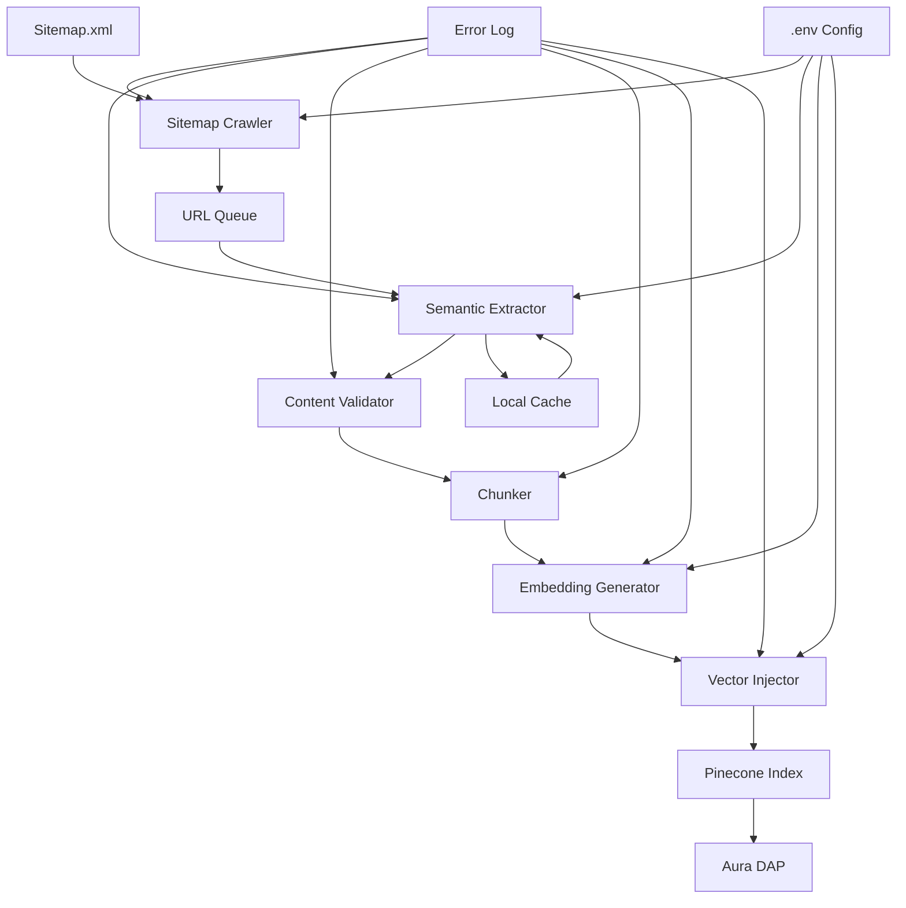

# Design Document: Web Knowledge Ingestion Pipeline (RAG)

## Overview

The Web Knowledge Ingestion Pipeline is a Python-based ETL system that automates the extraction, transformation, and injection of documentation content from the Senior documentation portal into the Pinecone vector database. This pipeline replaces the manual PDF reading workflow with an automated web extraction engine that feeds the Aura DAP (Digital Adoption Platform) with structured, searchable knowledge.

### Purpose

Enable the Training OS platform to automatically ingest and maintain up-to-date documentation knowledge from web sources, making it available for semantic retrieval during Aura DAP interactions and training generation workflows.

### Key Design Principles

1. **Resilience First**: Handle transient failures gracefully without aborting the entire pipeline
2. **Idempotency**: Support re-running the pipeline without duplicating vectors
3. **Namespace Segregation**: Isolate vectors by documentation module for scoped retrieval
4. **Quality Gates**: Validate content quality before injection to prevent pollution
5. **Observability**: Comprehensive logging and metrics for debugging and optimization

## Architecture

### High-Level Architecture



### Pipeline Stages

The pipeline executes in five sequential stages:

1. **Discovery**: Fetch and parse sitemap.xml, extract and filter documentation URLs
2. **Extraction**: Fetch HTML pages, extract clean semantic content as Markdown
3. **Processing**: Validate content quality, extract breadcrumb hierarchy, chunk content
4. **Embedding**: Generate vector embeddings using OpenAI text-embedding-3-large
5. **Injection**: Upsert vectors to Pinecone with namespace segregation and metadata

### Integration with Existing System

The pipeline integrates with the existing Training OS infrastructure:

- **Pinecone Index**: Uses the same index as `dap_engine.py` (configured via `PINECONE_INDEX_NAME`)
- **OpenAI Embeddings**: Uses the same embedding model (`text-embedding-3-large`, 3072 dimensions)
- **Namespace Convention**: Derives namespace from `nivel_2` (module name) for scoped retrieval
- **Metadata Schema**: Extends existing metadata structure with web-specific fields

**Aura DAP Integration**: The `dap_engine.py` module will be updated to accept an optional `namespace` parameter in `buscar_contexto()`, enabling module-scoped retrieval:

```python
# Current signature
def buscar_contexto(prompt_usuario: str, tenant_id: str = "senior_default") -> dict | None

# Updated signature (backward compatible)
def buscar_contexto(
    prompt_usuario: str, 
    tenant_id: str = "senior_default",
    namespace: str = None  # New parameter
) -> dict | None
```

## Components and Interfaces

### 1. Sitemap Crawler

**Responsibility**: Discover documentation URLs from sitemap.xml

**Interface**:
```python
class SitemapCrawler:
    def __init__(self, sitemap_url: str):
        """Initialize crawler with sitemap URL."""
        
    def fetch_sitemap(self) -> str:
        """Fetch sitemap XML content with retry logic."""
        
    def parse_sitemap(self, xml_content: str) -> List[str]:
        """Parse XML and extract all URLs."""
        
    def filter_urls(self, urls: List[str]) -> List[str]:
        """Filter URLs to keep only documentation pages."""
        
    def crawl(self) -> List[str]:
        """Execute full crawl: fetch, parse, filter."""
```

**URL Filtering Rules**:
- **Include**: URLs matching `/senior-x/*` or `/produto/*`
- **Exclude**: URLs containing keywords: `termos-de-uso`, `politica-privacidade`, `contato`, `home`, `sobre`

**Error Handling**:
- Retry fetch operations up to 3 times with exponential backoff (1s, 2s, 4s)
- Log fetch failures with URL and error message
- Return empty list on fatal failure (don't crash the pipeline)

### 2. Semantic Extractor

**Responsibility**: Extract clean semantic content from HTML pages and convert to Markdown

**Interface**:
```python
class SemanticExtractor:
    def __init__(self, extraction_backend: str = "crawl4ai"):
        """Initialize with Crawl4AI or Firecrawl backend."""
        
    def extract_content(self, url: str) -> Dict[str, Any]:
        """Extract content from URL and return structured data."""
        
    def extract_breadcrumbs(self, url: str) -> Dict[str, str]:
        """Parse URL path to extract hierarchy levels."""
        
    def normalize_hierarchy(self, value: str) -> str:
        """Normalize hierarchy value to lowercase kebab-case."""
```

**Output Structure**:
```python
{
    "url": str,              # Original URL
    "titulo": str,           # Page title (from <title> or <h1>)
    "markdown": str,         # Clean Markdown content
    "nivel_1": str,          # First path segment (e.g., "senior-x")
    "nivel_2": str,          # Second path segment (e.g., "hcm")
    "nivel_3": str,          # Third path segment (e.g., "admissao")
}
```

**Extraction Backend Options**:

1. **Crawl4AI** (Recommended):
   - Open-source, self-hosted
   - No API costs
   - Requires local installation
   - Configuration via `CRAWL4AI_*` env vars

2. **Firecrawl API** (Alternative):
   - Managed service
   - API-based, requires `FIRECRAWL_API_KEY`
   - Pay-per-use pricing
   - Simpler setup, no local dependencies

**Content Cleaning Strategy**:
- Remove navigation menus (elements with `role="navigation"`, `<nav>`, class containing "menu", "sidebar", "nav")
- Remove footers (elements with `<footer>`, class containing "footer")
- Remove modals (elements with `role="dialog"`, class containing "modal", "popup")
- Preserve main article content (elements with `<article>`, `<main>`, `role="main"`)

### 3. Content Validator

**Responsibility**: Validate extracted content quality before processing

**Interface**:
```python
class ContentValidator:
    def validate(self, content: Dict[str, Any]) -> Tuple[bool, str]:
        """Validate content quality. Returns (is_valid, reason)."""
        
    def check_min_length(self, markdown: str) -> bool:
        """Verify content has at least 100 characters."""
        
    def check_has_heading(self, markdown: str) -> bool:
        """Verify content contains at least one Markdown heading."""
        
    def check_link_density(self, markdown: str) -> bool:
        """Verify content is not primarily navigation links (>70%)."""
```

**Validation Rules**:
1. Markdown content length >= 100 characters
2. Content contains at least one Markdown heading (`#`, `##`, etc.)
3. Link density <= 70% (count of link characters / total characters)

**Failure Handling**:
- Log warning with URL and validation failure reason
- Skip vector injection for failed content
- Increment `skipped_low_quality` counter in summary report
- Continue processing remaining URLs

### 4. Chunker

**Responsibility**: Split Markdown content into semantic chunks for embedding

**Interface**:
```python
class Chunker:
    def __init__(self, chunk_size: int = 800, chunk_overlap: int = 100):
        """Initialize with LangChain text splitter."""
        
    def chunk_content(self, markdown: str, metadata: Dict[str, str]) -> List[Dict[str, Any]]:
        """Split content into chunks with metadata."""
```

**Chunking Strategy**:
- Use `MarkdownHeaderTextSplitter` from LangChain for semantic splitting
- Fallback to `RecursiveCharacterTextSplitter` if no headers detected
- Chunk size: ~800 tokens (approximately 3200 characters)
- Chunk overlap: ~100 tokens (approximately 400 characters)
- Preserve context by including parent heading in each chunk

**Output Structure**:
```python
[
    {
        "text": str,         # Chunk text content
        "chunk_index": int,  # Sequential index within document
        "metadata": {
            "url": str,
            "titulo": str,
            "nivel_1": str,
            "nivel_2": str,
            "nivel_3": str,
        }
    },
    ...
]
```

### 5. Embedding Generator

**Responsibility**: Generate vector embeddings using OpenAI API

**Interface**:
```python
class EmbeddingGenerator:
    def __init__(self, model: str = "text-embedding-3-large", dimensions: int = 3072):
        """Initialize with OpenAI client."""
        
    def generate_embedding(self, text: str) -> List[float]:
        """Generate embedding vector with retry logic."""
```

**Configuration**:
- Model: `text-embedding-3-large`
- Dimensions: 3072 (matches existing `dap_engine.py` configuration)
- Retry: Up to 3 attempts with exponential backoff (1s, 2s, 4s)

**Error Handling**:
- Log embedding generation failures with chunk text preview (first 100 chars)
- Skip failed chunks and continue processing
- Increment `failed_embeddings` counter in summary report

### 6. Vector Injector

**Responsibility**: Upsert vectors to Pinecone with namespace segregation

**Interface**:
```python
class VectorInjector:
    def __init__(self, index_name: str):
        """Initialize with Pinecone client."""
        
    def inject_vector(self, embedding: List[float], metadata: Dict[str, Any]) -> bool:
        """Upsert single vector to Pinecone."""
        
    def inject_batch(self, vectors: List[Dict[str, Any]]) -> Dict[str, int]:
        """Batch upsert vectors. Returns success/failure counts."""
```

**Vector ID Format**:
```
{nivel_2}_{titulo_sanitized}_{chunk_index}
```

Example: `hcm_admissao-colaborador_0`

**Namespace Derivation**:
- Namespace = `nivel_2` (module name)
- If `nivel_2` is empty, use `"senior_default"`
- Normalize to lowercase, replace spaces/special chars with underscores

**Metadata Payload**:
```python
{
    "url": str,        # Source URL
    "nivel_1": str,    # Product/platform (e.g., "senior-x")
    "nivel_2": str,    # Module (e.g., "hcm")
    "titulo": str,     # Page title
    "text": str,       # Chunk text content
}
```

**Upsert Strategy**:
- Use Pinecone's `upsert()` operation (idempotent by design)
- Batch size: 100 vectors per upsert call
- Retry: Up to 3 attempts with exponential backoff (1s, 2s, 4s)

**Error Handling**:
- Log upsert failures with vector ID and error message
- Skip failed vectors and continue processing
- Increment `failed_upserts` counter in summary report

### 7. Pipeline Orchestrator

**Responsibility**: Coordinate pipeline execution and manage state

**Interface**:
```python
class IngestionPipeline:
    def __init__(self, config: PipelineConfig):
        """Initialize pipeline with configuration."""
        
    def run(self, sitemap_url: str, incremental: bool = False) -> PipelineReport:
        """Execute full pipeline and return summary report."""
        
    def run_stage(self, stage_name: str, input_data: Any) -> Any:
        """Execute single stage with error handling."""
```

**Execution Flow**:
```python
1. Load configuration from environment variables
2. Initialize all components
3. Execute stages sequentially:
   a. Discovery: Crawl sitemap → List[URL]
   b. Extraction: Fetch pages → List[Content]
   c. Validation: Filter quality → List[ValidContent]
   d. Chunking: Split content → List[Chunk]
   e. Embedding: Generate vectors → List[Vector]
   f. Injection: Upsert to Pinecone → Report
4. Generate summary report
5. Return report
```

**Error Handling Strategy**:
- Catch exceptions at stage level, log error, continue to next item
- Track success/failure counts per stage
- Never abort entire pipeline due to single item failure
- Log all errors with context (URL, chunk index, stage name)

## Data Models

### PipelineConfig

```python
@dataclass
class PipelineConfig:
    # API Keys
    openai_api_key: str
    pinecone_api_key: str
    pinecone_index_name: str
    firecrawl_api_key: Optional[str] = None
    
    # Extraction
    extraction_backend: str = "crawl4ai"  # "crawl4ai" or "firecrawl"
    
    # Chunking
    chunk_size: int = 800
    chunk_overlap: int = 100
    
    # Embedding
    embedding_model: str = "text-embedding-3-large"
    embedding_dimensions: int = 3072
    
    # Injection
    batch_size: int = 100
    
    # Retry
    max_retries: int = 3
    retry_delays: List[int] = field(default_factory=lambda: [1, 2, 4])
    
    # Incremental
    cache_file: str = ".ingestion_cache.json"
```

### ExtractedContent

```python
@dataclass
class ExtractedContent:
    url: str
    titulo: str
    markdown: str
    nivel_1: str
    nivel_2: str
    nivel_3: str = ""
    
    def to_dict(self) -> Dict[str, str]:
        """Convert to dictionary for serialization."""
```

### Chunk

```python
@dataclass
class Chunk:
    text: str
    chunk_index: int
    metadata: Dict[str, str]
    
    def to_dict(self) -> Dict[str, Any]:
        """Convert to dictionary for serialization."""
```

### Vector

```python
@dataclass
class Vector:
    id: str
    values: List[float]
    metadata: Dict[str, str]
    namespace: str
    
    def to_pinecone_format(self) -> Dict[str, Any]:
        """Convert to Pinecone upsert format."""
```

### PipelineReport

```python
@dataclass
class PipelineReport:
    # Timing
    start_time: datetime
    end_time: datetime
    duration_seconds: float
    
    # Stage metrics
    urls_discovered: int
    urls_fetched: int
    urls_validated: int
    chunks_created: int
    embeddings_generated: int
    vectors_injected: int
    
    # Failure counts
    failed_fetches: int
    failed_validations: int
    failed_embeddings: int
    failed_upserts: int
    skipped_low_quality: int
    
    # Incremental mode
    urls_skipped_cached: int = 0
    
    def to_dict(self) -> Dict[str, Any]:
        """Convert to dictionary for logging/display."""
        
    def print_summary(self) -> None:
        """Print human-readable summary to console."""
```

## Error Handling

### Retry Strategy

All external API calls (OpenAI, Pinecone, HTTP fetches) use exponential backoff retry:

```python
def retry_with_backoff(
    func: Callable,
    max_retries: int = 3,
    delays: List[int] = [1, 2, 4],
    exceptions: Tuple = (Exception,)
) -> Any:
    """Execute function with exponential backoff retry."""
    for attempt in range(max_retries):
        try:
            return func()
        except exceptions as e:
            if attempt == max_retries - 1:
                raise
            delay = delays[attempt] if attempt < len(delays) else delays[-1]
            logger.warning(f"Attempt {attempt + 1} failed: {e}. Retrying in {delay}s...")
            time.sleep(delay)
```

### Error Categories

1. **Transient Errors** (retry):
   - Network timeouts
   - API rate limits (429)
   - Temporary service unavailability (503)

2. **Permanent Errors** (skip and continue):
   - Invalid URL (404)
   - Malformed content
   - Content validation failure
   - Parsing errors

3. **Fatal Errors** (abort pipeline):
   - Missing required environment variables
   - Invalid Pinecone index name
   - Authentication failures (401, 403)

### Logging Strategy

All errors are logged with structured context:

```python
logger.error(
    f"[{stage_name}] {error_type}: {error_message}",
    extra={
        "url": url,
        "chunk_index": chunk_index,
        "stage": stage_name,
        "error_type": type(error).__name__,
        "traceback": traceback.format_exc()
    }
)
```

## Testing Strategy

### Unit Tests

**Scope**: Test individual components in isolation with mocked dependencies

**Coverage**:
- `SitemapCrawler`: URL filtering logic, XML parsing
- `SemanticExtractor`: Breadcrumb extraction, hierarchy normalization
- `ContentValidator`: Validation rules (length, headings, link density)
- `Chunker`: Chunk size, overlap, boundary preservation
- `VectorInjector`: ID generation, namespace derivation, metadata construction

**Example**:
```python
def test_url_filtering():
    """Verify URL filtering preserves only documentation pages."""
    crawler = SitemapCrawler("https://example.com/sitemap.xml")
    urls = [
        "https://example.com/senior-x/hcm/admissao",  # Keep
        "https://example.com/termos-de-uso",          # Filter out
        "https://example.com/produto/erp/financeiro", # Keep
        "https://example.com/contato",                # Filter out
    ]
    filtered = crawler.filter_urls(urls)
    assert len(filtered) == 2
    assert "admissao" in filtered[0]
    assert "financeiro" in filtered[1]
```

### Integration Tests

**Scope**: Test pipeline stages with real dependencies (test namespace in Pinecone)

**Test Data**: Sample sitemap.xml with 5-10 representative URLs

**Test Scenarios**:
1. **Happy Path**: Process sample sitemap end-to-end, verify vectors in test namespace
2. **Error Recovery**: Inject failures at each stage, verify pipeline continues
3. **Incremental Mode**: Run twice, verify cached URLs are skipped
4. **Namespace Segregation**: Verify vectors are correctly segregated by `nivel_2`
5. **Aura DAP Integration**: Query test namespace, verify retrieval works

**Example**:
```python
def test_end_to_end_ingestion():
    """Verify full pipeline execution with sample sitemap."""
    config = PipelineConfig(
        openai_api_key=os.getenv("OPENAI_API_KEY"),
        pinecone_api_key=os.getenv("PINECONE_API_KEY"),
        pinecone_index_name=os.getenv("PINECONE_INDEX_NAME"),
    )
    pipeline = IngestionPipeline(config)
    
    # Run pipeline with test sitemap
    report = pipeline.run(
        sitemap_url="https://example.com/test-sitemap.xml",
        incremental=False
    )
    
    # Verify metrics
    assert report.urls_discovered > 0
    assert report.vectors_injected > 0
    assert report.failed_upserts == 0
    
    # Verify vectors in Pinecone
    index = Pinecone(api_key=config.pinecone_api_key).Index(config.pinecone_index_name)
    stats = index.describe_index_stats()
    assert "test_namespace" in stats["namespaces"]
```

### Property-Based Tests

This feature is **NOT suitable for property-based testing** because:

1. **External Service Integration**: The pipeline heavily depends on external services (Crawl4AI/Firecrawl, OpenAI, Pinecone) that are expensive to call 100+ times
2. **Infrastructure as Code**: The pipeline is primarily orchestration and configuration, not pure business logic
3. **Non-Deterministic Outputs**: Web content extraction and AI embeddings are non-deterministic

**Alternative Testing Strategy**:
- Use **integration tests** with representative examples (5-10 URLs)
- Use **snapshot tests** for content extraction quality
- Use **mock-based unit tests** for business logic (filtering, validation, ID generation)

## Correctness Properties

**Assessment**: Property-based testing is **NOT applicable** to this feature.

**Rationale**:
- The pipeline is primarily **infrastructure orchestration** (ETL workflow)
- Core operations involve **external service calls** (Crawl4AI, OpenAI, Pinecone) that are:
  - Expensive to run 100+ times
  - Non-deterministic (web content changes, AI model outputs vary)
  - Not pure functions with clear input/output behavior
- The pipeline is **configuration-driven** rather than algorithm-driven
- Testing strategy relies on **integration tests** with representative examples and **mock-based unit tests** for business logic

**Testing Approach**:
- **Unit tests**: Validate business logic (URL filtering, hierarchy extraction, ID generation) with mocked dependencies
- **Integration tests**: Validate end-to-end flow with sample sitemap (5-10 URLs) against test namespace
- **Snapshot tests**: Validate content extraction quality by comparing against known-good outputs

## Deployment and Operations

### Environment Variables

Required configuration in `.env`:

```bash
# OpenAI
OPENAI_API_KEY=sk-...

# Pinecone
PINECONE_API_KEY=...
PINECONE_INDEX_NAME=senior-training-os

# Extraction Backend (choose one)
# Option 1: Crawl4AI (self-hosted)
CRAWL4AI_BACKEND=playwright  # or "selenium"
CRAWL4AI_HEADLESS=true

# Option 2: Firecrawl (managed service)
FIRECRAWL_API_KEY=fc-...
```

### CLI Interface

```bash
# Basic usage
python -m ingestion_pipeline https://docs.senior.com.br/sitemap.xml

# Incremental mode (skip unchanged URLs)
python -m ingestion_pipeline https://docs.senior.com.br/sitemap.xml --incremental

# Dry-run mode (simulate without upserting)
python -m ingestion_pipeline https://docs.senior.com.br/sitemap.xml --dry-run

# List namespaces
python -m ingestion_pipeline --list-namespaces

# Delete namespace (with confirmation)
python -m ingestion_pipeline --delete-namespace hcm

# Specify extraction backend
python -m ingestion_pipeline https://docs.senior.com.br/sitemap.xml --backend firecrawl
```

### Monitoring and Observability

**Logging**:
- Structured JSON logs with timestamp, level, stage, context
- Log rotation: 10MB per file, keep last 5 files
- Log levels: INFO for progress, WARNING for recoverable errors, ERROR for failures

**Metrics**:
- Stage durations (seconds)
- Success/failure counts per stage
- Throughput (URLs/minute, chunks/minute)
- API call counts and latencies

**Alerting** (future):
- High failure rate (>20% in any stage)
- Pipeline duration exceeds threshold (>1 hour for typical sitemap)
- Pinecone quota approaching limit

### Performance Considerations

**Bottlenecks**:
1. **Content Extraction**: Slowest stage (network I/O, HTML parsing)
2. **Embedding Generation**: API rate limits (3000 requests/minute for OpenAI)
3. **Pinecone Upsert**: Batch size and network latency

**Optimization Strategies**:
1. **Parallel Extraction**: Process multiple URLs concurrently (ThreadPoolExecutor, max 10 workers)
2. **Batch Embedding**: Generate embeddings in batches of 100 chunks
3. **Batch Upsert**: Upsert vectors in batches of 100 to Pinecone
4. **Incremental Mode**: Skip unchanged URLs using content hash cache

**Expected Performance** (for typical Senior documentation sitemap with ~500 URLs):
- Discovery: ~5 seconds
- Extraction: ~10 minutes (parallel, 10 workers)
- Chunking: ~30 seconds
- Embedding: ~5 minutes (batched)
- Injection: ~2 minutes (batched)
- **Total**: ~18 minutes

### Incremental Updates

**Cache Structure** (`.ingestion_cache.json`):
```json
{
  "https://docs.senior.com.br/senior-x/hcm/admissao": {
    "content_hash": "a1b2c3d4e5f6...",
    "last_updated": "2024-01-15T10:30:00Z",
    "vector_count": 12
  },
  ...
}
```

**Incremental Logic**:
1. Fetch URL content
2. Compute SHA-256 hash of Markdown content
3. Compare with cached hash
4. If match: skip processing, log "cached"
5. If mismatch or new: process and update cache
6. After pipeline completes: persist updated cache

**Cache Invalidation**:
- Manual: Delete `.ingestion_cache.json` to force full re-ingestion
- Automatic: Cache entries older than 30 days are ignored

## Future Enhancements

### Phase 2: Advanced Features

1. **Change Detection**: Monitor sitemap for new/updated/deleted pages, trigger incremental updates
2. **Multi-Language Support**: Detect page language, use language-specific embedding models
3. **Image Extraction**: Extract and index images with vision embeddings
4. **Link Graph**: Build knowledge graph from internal links for enhanced retrieval
5. **Scheduled Execution**: Cron job or Airflow DAG for automatic daily updates

### Phase 3: Scalability

1. **Distributed Processing**: Use Celery or Ray for parallel processing across multiple workers
2. **Cloud Storage**: Store extracted content in S3 for audit and reprocessing
3. **Streaming Pipeline**: Use Kafka or RabbitMQ for event-driven architecture
4. **Monitoring Dashboard**: Grafana dashboard for real-time pipeline metrics

## Appendix

### Metadata Schema Comparison

**Current (Roteiro-based)**:
```python
{
    "aula": str,      # Training name
    "passo": int,     # Step number
    "texto": str,     # Instruction text
    "tooltip": str,   # DAP tooltip
    "seletor": str,   # CSS selector
}
```

**New (Web-based)**:
```python
{
    "url": str,       # Source URL
    "nivel_1": str,   # Product/platform
    "nivel_2": str,   # Module (used for namespace)
    "titulo": str,    # Page title
    "text": str,      # Chunk content
}
```

**Unified Schema** (for future compatibility):
```python
{
    # Common fields
    "text": str,           # Content text
    "source_type": str,    # "roteiro" or "web"
    
    # Roteiro-specific
    "aula": str,           # Optional
    "passo": int,          # Optional
    "tooltip": str,        # Optional
    "seletor": str,        # Optional
    
    # Web-specific
    "url": str,            # Optional
    "nivel_1": str,        # Optional
    "nivel_2": str,        # Optional
    "titulo": str,         # Optional
}
```

### Dependencies

**Core**:
- `python >= 3.10`
- `openai >= 1.0.0`
- `pinecone-client >= 3.0.0`
- `langchain >= 0.1.0`
- `beautifulsoup4 >= 4.12.0`
- `lxml >= 4.9.0`
- `requests >= 2.31.0`
- `python-dotenv >= 1.0.0`

**Extraction Backend**:
- Option 1: `crawl4ai >= 0.1.0` (self-hosted)
- Option 2: `firecrawl-py >= 0.1.0` (managed service)

**Development**:
- `pytest >= 7.4.0`
- `pytest-asyncio >= 0.21.0`
- `pytest-mock >= 3.11.0`
- `black >= 23.0.0`
- `mypy >= 1.5.0`

### File Structure

```
ingestion_pipeline/
├── __init__.py
├── __main__.py              # CLI entrypoint
├── config.py                # Configuration dataclasses
├── crawler.py               # SitemapCrawler
├── extractor.py             # SemanticExtractor
├── validator.py             # ContentValidator
├── chunker.py               # Chunker
├── embedder.py              # EmbeddingGenerator
├── injector.py              # VectorInjector
├── pipeline.py              # IngestionPipeline orchestrator
├── utils.py                 # Shared utilities (retry, logging)
└── tests/
    ├── test_crawler.py
    ├── test_extractor.py
    ├── test_validator.py
    ├── test_chunker.py
    ├── test_injector.py
    └── test_integration.py
```

### References

- [Crawl4AI Documentation](https://github.com/unclecode/crawl4ai)
- [Firecrawl API Documentation](https://docs.firecrawl.dev/)
- [LangChain Text Splitters](https://python.langchain.com/docs/modules/data_connection/document_transformers/)
- [OpenAI Embeddings API](https://platform.openai.com/docs/guides/embeddings)
- [Pinecone Upsert Documentation](https://docs.pinecone.io/docs/upsert-data)
